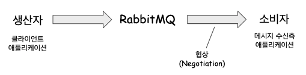
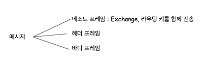
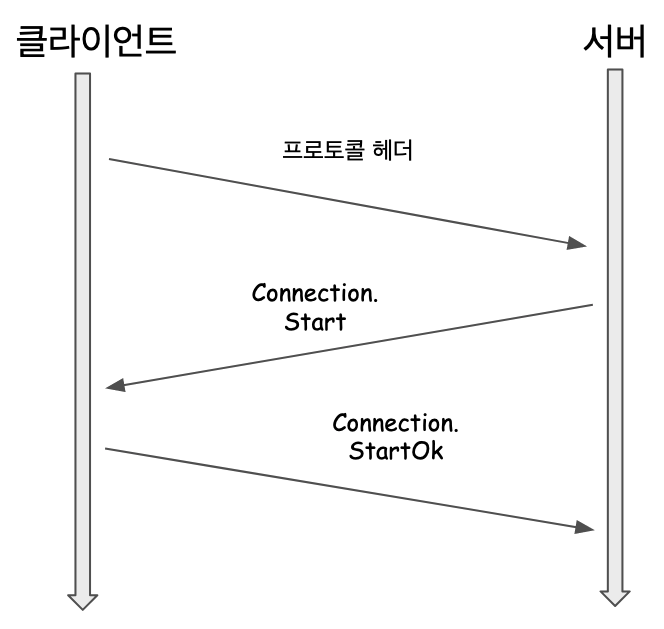

**2021/06/08 ~ 2021/06/09** 

책에 나온 용어들을 정리했다. 번역서여서인지, 외국사람들의 사고 체계가 이런 것인지는 잘 모르겠지만, 뭔가 너무 여러번 읽어야 무슨말을 하는지 이해할 수 있는 문장들이 있어서 읽는데에 시간이 조금 걸린 편이었다. 

 

**2021/06/10** 

정리하다보니... 전 직장에서 MQ를 사용했었는데, 그때 MQ 쪽 백엔드를 담당하는 부장님이 들어온지 1주일밖에 안된 입장이었던 나에게 Stomp.js의 통신 구조, 프로토콜 관련해서 세미나를 시켰었는지 등등을 알것 같았다. 

 충분한 시간 없이, 실무쪽 일만 담당하느라 프로토콜의 구조를 정확하게 알지 못하고, 사용하셨던 거였다는 생각이 들었다. 데이터 쪽의 오류는 클라이언트 쪽의 테스트 코드를 작성해서 버그를 찾아나갔는데, 커넥션 생성이나, 통신 쪽의 에러는 잡아내기 쉽지 않았었다. 

 

1장에서는 주요 개념, 2장에서는 프로토콜과 데이터프레임의 구조, 간단한 프로듀서 연동 샘플을 다루는데, 1장, 2장을 읽으면서 파악한 내용들이 서버측에서 남기는 Exception 등이 언제 발생하는지 파악하는 데에 도움이 될 것 같다는 생각이 들었다. 

 

**2021/06/13** 

다른 일을 처리하느라 공부할 시간이 많지 않았다. 주말에 시간이 남아서 해외자료들을 찾아보고 이것 저것 둘러보다 보니, 메시지 브로커의 개념, RabbitMQ, Pulsar, Kafka, ActiveMQ가 어떤 것인지 알게 되었다.  

며칠 전 까지는 RabbitMQ, ActiveMQ, GRPC 모두 RPC 통신을 하는 것으로 착각했었다. 그런데 gRpc라는 것은 말 그대로 RPC 통신을 하는 컨테이너?같은 것이고, ActiveMQ, RabbitMQ, JMS 의 경우 Spring AMQP 를 추상화하고 있는데 이 것을 기반으로 통신을 하는 것이다. 이 중 RabbitMQ는 직접 공부를 해 본 결과. [RPC 방식](https://www.rabbitmq.com/tutorials/tutorial-six-spring-amqp.html) 으로 통신할 수 있는 방식이 가능하기도 하다. 

 

## 목차

 

## 참고자료

- [RabbitMQ in Depth, 에이콘, 개빈 로이 저/홍영택 역](http://www.yes24.com/Product/Goods/62489604) 

 

## AMQF 스펙

AMQP 스펙은 네트워크 프로토콜의 정의 뿐 아니라 서버측 서비스의 동작 방식도 정의한다. 이러한 동작은 AMQ 모델에 기반한 동작이다. 예를 들면 HTTP, SMTP 프로토콜과는 달리 정의 뿐만 아니라 서버 측 서비스의 동작방식 역시 정의한다. 

 

RabbitMQ에서는 AMQP 스펙을 확장해 특정 익스체인지를 다른 익스체인지에 연결할 수 있다. 이런 방식은 메시지를 라우팅하는 데에 상당한 유연성을 제공한다. 

 

## AMQ 모델

- AMQ 모델 = Advanced Model Queing 모델 

- 참고 : https://en.wikipedia.org/wiki/AMQ  

 

메시지 브로커는 흔히 메시지의 라우팅 동작을 정의한다. 

AMQ 모델에서는 메시지 브로커를 세 가지 추상적인 컴포넌트로 논리적(개념적)으로 정의하고 있다. 

익스체인지, 큐, 바인딩 이렇게 3가지의 컴포넌트로 개념을 정의한 모델을 AMQ라고 부른다. 

 

- 익스체인지 
  - 메시지 브로커 -> 큐 
  - 메시지 전달하는 컴포넌트 
- 큐 
  - 디스크, 메모리 상의 자료구조 
  - 메시지를 저장한다. 
- 바인딩 
  - 익스체인지 -> 큐 
  - 익스체인지 -> 큐 방향의 통신을 할때 메시지를 어떤 큐에 저장할 지 정의 

RabbitMQ 는 익스체인지에서 큐로 메시지를 라우팅하는 방식이 동적이다. 

 

## AMQP의 프레임 컴포넌트

 

RabbitMQ 에서 AMQP 명령을 전송/수신할 때 필요한 인자들을 데이터 구조로 캡슐화하는데 이것을 프레임이라고 한다. 

프레임은 명령의 유형, 여러가지 인자들을 인코딩하는데 각 프레임이 서로 구분되도록 하는 효율적인 방법이다. 

흔히 열차 한칸에 비유되기도 한다. 

이렇게 열차 한칸에 비유되는 프레임은 아래와 같은 다섯개의 구성요소롤 구성됨 

- 프레임 유형 
- 채널 번호 
- 프레임 크기 (바이트) 
- 프레임 페이로드 
- 끝 바이트 표식 (ASCII 값) 

 

## RabbitMQ, 생산자, 소비자

 

RabbitMQ는 생산자와 소비자 사이에 위치해서 생산자에게서 받는 메시지를 큐에 라우팅한다. 그리고 이 큐의 데이터는 소비자에 매핑된다.  

 

**생산자** 

생산자 측의 애플리케이션은 RPC의 데이터 프레임 자료구조와 AMPQ라고 하는 RPC 계열의 통신을 RabbitMQ와 수행한다. 이때 RabbitMQ의 Producer 라이브러리로 RabbitMQ에 메시지를 전달해줄 수 있다. 생산자가 RabbitMQ에 접촉할때는 Exchange와 통신을 한다. 

 

**소비자** 

소비자 측 정리할거임 진짜로... 

 

## 메시지

RabbitMQ 기반의 통신을 할 때 메시지의 구조는 아래와 같은 모양을 가지게 된다. 

 

## 메시지 브로커

## 라우팅

라우팅이란 익스체인지가 메시지에 적용하는 동작을 의미한다. 

대표적으로 아래의 동작을 수행한다. 

- 메시지를 보낼 때 함께 전달한 데이터 속성을 검사 
- 메시지에 포함된 속성을 이용해 처리하는 것 

메시지를 보낼 때 함께 전달한 데이터 속성을 검사하거나, 메시지에 포함된 속성을 이용해 처리하는 것을 의미 

 

**라우팅 키** 

애플리케이션에서 RabbitMQ의 익스체인지에 메시지를 발행할 때 라우팅 키 속성을 이용한다. 

라우팅 키는 큐의 이름인 경우도 있고, 의미적으로 메시지를 설명하는 문자열인 경우도 있다. 

단순하게 RabbitMQ를 운용할 경우 라우팅 키를 큐의 이름으로 지정하기도 한다. 

익스체인지마다 라우팅 키를 처리하는 방식이 조금 다르다. 익스체인지마다 라우팅 키를 평가하는 기준이 다른 몇가지 경우를 정리해보면 아래와 같다. 

- 단순히 라우팅 키의 이름이 동일한지 검사하는 익스체인지 
- 라우팅 키에서 좀 더 복잡한 패턴을 추출해 검사하는 익스체인지 
- 메시지 속성에 정의한 다른 속성을 우선적으로 평가(evaluate)해서 라우팅 키를 완전히 무시하는 익스체인지 

 

## 익스체인지 (Exchange)

AMQ의 3가지 컴포넌트 중 하나이다. 

RabbitMQ 에서 적절한 목적지로 메시지를 전달하기 위해 필요한 첫번째 입력값이다. 

클라이언트 측에서 RabbitMQ로 전송한 메시지를 익스체인지가 수신한다. 그리고 익스체인지는 메시지를 보낼 위치를 결정짓는다. 

즉, 메시지에 적용할 라우팅 동작을 정의한다. 

 

## 큐

수신한 메시지를 저장하는 역할 수행 

메시지에 대해 수행할 작업을 정의하는 설정 정보를 가지고 있는다. 

큐의 설정정보에는 아래의 정보들이 정의된다. 

- 메시지에 대해 수행할 작업을 정의한다. 
- 메시지를 메모리에 보관할지 
- 메시지를 소비자에게 전달 전, 디스크에 선입선출(FIFO) 순서로 보관할지 여부 

 

## 바인딩

큐 <-> 익스체인지 의 관계 

바인딩, 바인딩 키 : 익스체인지가 어떤 큐에 메시지를 전달해야 하는지를 의미 

바인딩 키 : 큐를 익스체인지에 연결하고, 라우팅 키를 평가하는 기준 

익스체인지는 여러 종류가 있는데, 특정 익스체인지는 익스체인지에 특정 큐에만 메시지를 전달하도록 지정할 수 있도록 필터링 하는 것이 가능하다. 

익스체인지는 메시지를 큐로 전달할 때 아래의 두가지를 대조해서 맞는지 확인한다. (평가한다.) 

- 메시지의 라우팅 키
- 익스체인지의 바인딩 키

 

> 참고) 
>
> - 애플리케이션에서 RabbitMQ의 익스체인지에 메시지를 발행할 때 라우팅 키 속성을 이용한다. 
> - 라우팅 키는 큐의 이름인 경우도 있고, 의미적으로 메시지를 설명하는 문자열인 경우도 있다. 
> - 단순하게 RabbitMQ를 운용할 경우 라우팅 키를 큐의 이름으로 지정하기도 한다. 

 

## 데이터 프레임

## 마샬링

## RPC

한 컴퓨터에서 다른 컴퓨터의 프로그램 또는 프로그램의 메서드를 원격으로 실행할 수 있도록 해주는 컴퓨터간의 통신 유형 중의 한 종류 

RabbitMQ 는 AMQP 메시지 브로커로 코어 서버와 통신하는 거의 모든 부분에서 RPC 패턴으로 엄격하게 통신한다. 

RabbitMQ와 통신할 때 발생하는 RPC는 일반적인 웹 기반 API 와는 다른 부분이 많다. 

- 웹기반 API 
  - 클라이언트가 명령을 실행하고 서버가 응답하는 방식 
- AQMP 스펙 
  - 서버와 클라이언트 모두 명령을 실행할 수 있다. 
  - 즉, 클라이언트 애플리케이션 역시도, 서버 측과의 통신을 청취해야 한다. 

 

## AMPQ 의 RPC 통신 커넥션 생성 절차

**통신시작** 

- 인사말로 프로토콜 헤더를 전달한다. 
- 클라이언트 -> 서버 

 

**서버 측의 응답** 

- 서버는 클라이언트의 인사말에 대해 화답한다. 
- Connection.Start 를 클라이언트에게 전달한다. 

 

**클라이언트 측의 응답** 

- 클라이언트는 Connection.StartOk 응답 프레임으로 서버에 응답한다. 

(아래의 그림은 이런 절차를 그림으로 요약한 것이다. 책에 나와있는 내용을 직접 그림) 

흔히 이러한 절차를 start, tune, open 이라고 부른다. 

 

 

## 메서드프레임, 컨텐츠 헤더 프레임, 바디 프레임

