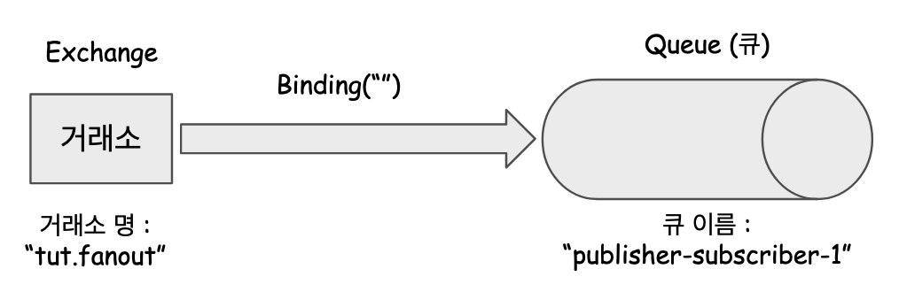

# 3.1. Fanout 기반 단일 큐 Publisher, Subscriber 모델구현

Publiser, Subscriber 는 [여기](https://github.com/gosgjung/must-learn/blob/develop/MQ/RabbitMQ/2-RabbitMQ%EC%9D%98-%EC%97%AC%EB%9F%AC%EA%B0%80%EC%A7%80-%EC%A0%84%EC%86%A1%EB%AA%A8%EB%8D%B8%EB%93%A4.md) 에서 정리했듯이 `direct` , `topic` , `headers` , `fanout`  타입의 익스체인지를 사용해서 표현하는 것이 가능하다.<br>


<br>

오늘 정리하는 예제에서는 Fanout 기반으로 Publisher, Subscriber 모델을 구현해보려 한다. RabbitMQ의 생산자, 소비자는 여러가지 언어로 구현할 수 있는데, 오늘 정리할 예제는 Java 기반의 스프링 애플리케이션이다. 내일 또는 차주 중으로 kotlin 기반의 스프링 애플리케이션으로도 구현해놓을 예정이다.<br>

<br>

## 의존성 추가

```xml
<dependencies>
  <dependency>
    <groupId>org.springframework.amqp</groupId>
    <artifactId>spring-rabbit-test</artifactId>
    <scope>test</scope>
  </dependency>
  <!-- ... -->
  <dependency>
    <groupId>com.fasterxml.jackson.core</groupId>
    <artifactId>jackson-databind</artifactId>
    <version>2.12.1</version>
  </dependency>
</dependencies>

```


## Overview

직접 구현해볼 익스체인지와 큐간의 관계는 아래와 같다.



<br>


## 생산자, 소비자 공통 설정

여기서 다뤄볼 application.yml 과 RabbitConfig, PubSubsConfig 는 Producer, Consumer 에 동일하게 적용된다. <br>

> Consumer, Producer 를 한 프로젝트에 모아두고 사용하는 것 역시 가능하다. 이렇게 되면 개발 버전에서 확인할 때마다 profile을 바꿔가면서 jar로 패키징을 여러번 해야 한다. 또는 Intellij 의 Runtime Envirent 등에 spring.profile 값을 다르게 입력해주어 두번실행시키면 된다. 내 경우는 복잡시러운건 귀찮아해서 그냥 같은코드 베이스로 생산자, 소비자 프로젝트를 하나씩 만들었다.<br>

<br>

### application.yml

```yaml
spring:
  profiles:
    active: publisher-subscriber-test1
---
# 제일 처음 연습해본 예제. Publish 를 직접 화면에서 클릭해서 넣어야 한다는 단점이 있다.
spring:
  config:
    activate:
      on-profile: default-exchange-test1
  rabbitmq:
    host: 접속주소
    port: 5671
    username: mqadmin
    password: 비밀번호
    ssl:
      enabled: true
    listener:
      simple:
        acknowledge-mode: manual
---
# Publisher / Subscriber 기반 프로필 (1)
spring:
  config:
    activate:
      on-profile: publisher-subscriber-test1
  rabbitmq:
    host: 접속주소
    port: 5671
    username: mqadmin
    password: 비밀번호
    ssl:
      enabled: true
    listener:
      simple:
        acknowledge-mode: manual
```

<br>

### RabbitConfig

rabbitTemplate 과 MessageConverter 를 Bean으로 등록해주었다.<br>

```java
package io.study.rabbitmq.tutorial_producer.config;

import org.springframework.amqp.core.Queue;
import org.springframework.amqp.rabbit.connection.ConnectionFactory;
import org.springframework.amqp.rabbit.core.RabbitTemplate;
import org.springframework.amqp.support.converter.Jackson2JsonMessageConverter;
import org.springframework.amqp.support.converter.MessageConverter;
import org.springframework.context.annotation.Bean;
import org.springframework.context.annotation.Configuration;

@Configuration
public class RabbitConfig {

    @Bean
    public RabbitTemplate rabbitTemplate(ConnectionFactory connectionFactory, MessageConverter messageConverter){
        RabbitTemplate rabbitTemplate = new RabbitTemplate(connectionFactory);
        rabbitTemplate.setMessageConverter(messageConverter);
        return rabbitTemplate;
    }

    @Bean
    public MessageConverter converter(){
        return new Jackson2JsonMessageConverter();
    }
}
```

<br>

### PubSubsConfig

```java
package io.study.rabbitmq.tutorial_producer.config.models;

import io.study.rabbitmq.tutorial_producer.producer.PubSubsProducer1;
import org.springframework.amqp.core.Binding;
import org.springframework.amqp.core.BindingBuilder;
import org.springframework.amqp.core.FanoutExchange;
import org.springframework.amqp.core.Queue;
import org.springframework.context.annotation.Bean;
import org.springframework.context.annotation.Configuration;
import org.springframework.context.annotation.Profile;

// Publisher, Subscriber 패턴은 브로드캐스팅의 형태와 유사한 형태
// 가장 보편적인 브로드캐스팅 방식의 익스체인지는 Fanout 익스체인지이다.
@Profile({"publisher-subscriber-test1"})
@Configuration
public class PubSubsConfig {

    public static final String EXCHANGE_NAME_FANOUT_TUT1 = "tut.fanout";
    public static final String QUEUE_PUBLISHER_SUBSCRIBER1 = "publisher-subscriber-1";

    @Bean
    public Queue queuePublisherSubscriber1(){
        return new Queue(QUEUE_PUBLISHER_SUBSCRIBER1);
    }

    @Bean
    public FanoutExchange fanout(){
        return new FanoutExchange(EXCHANGE_NAME_FANOUT_TUT1);
    }

    @Bean
    public Binding binding(Queue queue, FanoutExchange fanoutExchange){
        return BindingBuilder.bind(queue).to(fanoutExchange);
    }

}
```

<br>

## 생산자 코드

생산자 프로젝트는 [github 프로젝트](https://github.com/gosgjung/rabbitmq-tutorial)에서 rabbit-mq-producer 에 해당한다.<br>

<br>

### PublisherConfig

1초에 한번씩 원하는 동작을 수행하려고 `@Scheduled` 를 사용할 예정인데, 애플리케이션 전역적으로 해당 Schedule 기능을 키는 `@EnableScheduling`  을 별도의 설정파일에 따로 두기로 했고, 이름을 잘 짓지는 못했지만, 일단 PublisherConfig.java 로 클래스의 이름을 지어주었다.

```java
package io.study.rabbitmq.tutorial_producer.config;

import org.springframework.context.annotation.Configuration;
import org.springframework.context.annotation.Profile;
import org.springframework.scheduling.annotation.EnableScheduling;

@Profile("publisher-subscriber-test1")
@Configuration
@EnableScheduling
public class PublisherConfig {
}
```

<br>

### PubSubsProducer1

생산자 코드 이다. 생산자는 큐에 직접적으로 접근하지 못하고 Exchange에 메시지를 위탁하여 쌓아둔다. 아래 코드를 보면 `FanoutExchange` 로 메시지를 쌓아두는 것을 확인할 수 있다. FanoutExchange를 여러 개 두어야 하는 상황이 올 수 있다. 이 경우 Bean 의 이름과 바인딩이 각각 다른 FanoutExchange 타입의 Bean을 여러개 생성해두고, @Qualifier 를 통해 특정 `FanoutExchange` Bean 객체를 생산자 로직에서 지정해주면 된다.<br>

```java
package io.study.rabbitmq.tutorial_producer.producer;

import org.springframework.amqp.core.FanoutExchange;
import org.springframework.amqp.rabbit.core.RabbitTemplate;
import org.springframework.beans.factory.annotation.Autowired;
import org.springframework.context.annotation.Profile;
import org.springframework.scheduling.annotation.Scheduled;
import org.springframework.stereotype.Service;

import java.util.concurrent.atomic.AtomicInteger;

@Profile("publisher-subscriber-test1")
@Service
public class PubSubsProducer1 {

    private final RabbitTemplate rabbitTemplate;
    private final FanoutExchange fanoutExchange;

    AtomicInteger dots = new AtomicInteger(0);
    AtomicInteger count = new AtomicInteger(0);

    @Autowired
    public PubSubsProducer1(RabbitTemplate rabbitTemplate, FanoutExchange fanoutExchange){
        this.rabbitTemplate = rabbitTemplate;
        this.fanoutExchange = fanoutExchange;
    }

    public void send(){
        StringBuilder builder = new StringBuilder("Hello");

        if(dots.getAndIncrement() == 3){
            dots.set(1);
        }

        for(int i=0; i<dots.get(); i++){
            builder.append(".");
        }

        builder.append(count.incrementAndGet());
        String message = builder.toString();
        // Publisher, Subscriber 모델은 브로드캐스팅 모델이므로 라우팅키가 무의미하다. 따라서 routingKey 를 공백문자("")로 지정.
        rabbitTemplate.convertAndSend(fanoutExchange.getName(), "", message);
        System.out.println(" [x] Sent '" + message + "'");
    }
}
```

<br>

## 소비자측 코드

### PubSubsConsumer1

 `publisher-subscriber-1` 라는 이름의 큐에 메시지가 있을 때마다 소비하는 로직이다.<br> `publisher-subscriber-1` 은 PubSubsConfig.java 내에 상수 `QUEUE_PUBLISHER_SUBSCRIBER_1` 로 지정해두었다.<br>

```java
package io.study.rabbitmq.tutorial_consumer.consumer;

import io.study.rabbitmq.tutorial_consumer.config.models.PubSubsConfig;
import org.springframework.amqp.core.Message;
import org.springframework.amqp.rabbit.annotation.RabbitListener;
import org.springframework.context.annotation.Profile;
import org.springframework.stereotype.Service;
import org.springframework.util.StopWatch;

@Profile("publisher-subscriber-test1")
@Service
public class PubSubsConsumer1 {

    @RabbitListener(queues = {PubSubsConfig.QUEUE_PUBLISHER_SUBSCRIBER1})
    public void receive1(final Message in) throws InterruptedException {
        System.out.println("in >>> " + String.valueOf(in));
        System.out.println("in.getBody() >>> " + in.getBody().toString());
    }

    public void receive(String in, int receiver) throws InterruptedException{
        StopWatch watch = new StopWatch();
        watch.start();
        System.out.println("instance " + receiver + " [x] Received '" + in + "'");
        doWork(in);
        watch.stop();
        System.out.println("instance " + receiver + " [x] Done in " + watch.getTotalTimeSeconds() + "s");
    }

    private void doWork(String in) throws InterruptedException {
        for(char ch : in.toCharArray()){
            if(ch == '.'){
                Thread.sleep(1000);
            }
        }
    }
}
```

<br>

