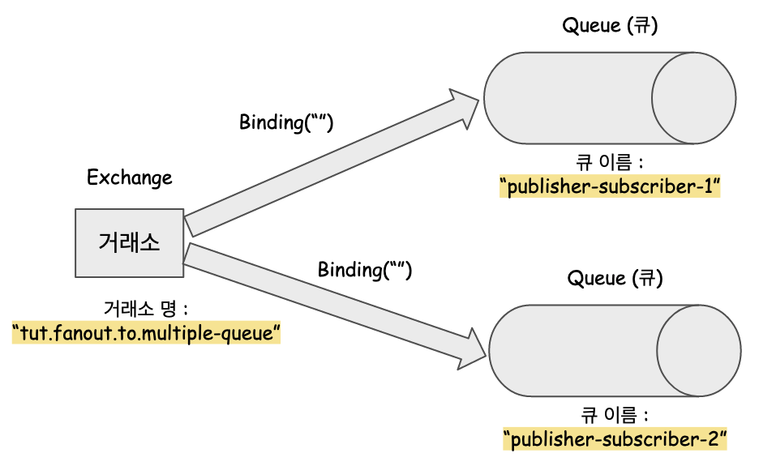

# 3.2. Fanout 기반 브로드캐스팅 Publisher, Subscriber 모델 구현

이번에 확인해 볼 예제는 Fanout 기반의 익스체인지로 여러개의 큐에 브로드 캐스팅을 하는 예제를 확인해볼 예정이다. 이전 문서에서도 정리했었지만, 브로드캐스팅 모델, 즉, Publisher, Subscriber 모델을 구현하는 것은 fanout 익스체인지 말고도, direct 익스체인지로도 구현 가능하다.<br>

<br>

[이전 예제 설명 문서](https://github.com/gosgjung/must-learn/blob/develop/MQ/RabbitMQ/3.1-Fanout%EA%B8%B0%EB%B0%98-%EB%8B%A8%EC%9D%BC-%ED%81%90-Publisher-Subscriber-%EB%AA%A8%EB%8D%B8%EA%B5%AC%ED%98%84.md) 에서도 정리했듯이 Publisher, Subscriber 모델은 `direct` , `topic` , `headers` , `fanout`  타입의 익스체인지를 이용해서 표현하는 것이 가능하다. 아래 그림은 Publisher, Subscriber 모델을 이용해 익스체인지와 큐와의 관계를 설정했을 때의 모양을 그림으로 표현한 것이다.<br>

<br>


<br>

## 참고자료

- [예제 깃헙](https://github.com/gosgjung/rabbitmq-tutorial)
  - [생산자 코드](https://github.com/gosgjung/rabbitmq-tutorial/tree/main/rabbit-mq-producer)
  - [소비자 코드](https://github.com/gosgjung/rabbitmq-tutorial/tree/main/rabbit-mq-consumer)
- [이전 예제 설명 문서](https://github.com/gosgjung/must-learn/blob/develop/MQ/RabbitMQ/3.1-Fanout%EA%B8%B0%EB%B0%98-%EB%8B%A8%EC%9D%BC-%ED%81%90-Publisher-Subscriber-%EB%AA%A8%EB%8D%B8%EA%B5%AC%ED%98%84.md)

<br>

## Overview



<br>

## 생산자, 소비자 공통 설정

이전 예제와 비교했을 때 크게 달라진 부분은 스프링 프로필을 추가해주었다는 것이다. 새로 추가한 프로필의 이름은 `publisher-subscriber-broadcast1` 이다.<br>

<br>

### application.yml

```yaml
spring:
  profiles:
    active: publisher-subscriber-broadcast1
#    active: publisher-subscriber-test1
---
# 제일 처음 연습해본 예제. Publish 를 직접 화면에서 클릭해서 넣어야 한다는 단점이 있다.
spring:
  config:
    activate:
      on-profile: default-exchange-test1
  rabbitmq:
    host: 접속주소
    port: 5671
    username: mqadmin
    password: 비밀번호
    ssl:
      enabled: true
    listener:
      simple:
        acknowledge-mode: manual
---
# Publisher / Subscriber 기반 프로필 (1)
spring:
  config:
    activate:
      on-profile: publisher-subscriber-test1
  rabbitmq:
    host: 접속주소
    port: 5671
    username: mqadmin
    password: 비밀번호
    ssl:
      enabled: true
    listener:
      simple:
        acknowledge-mode: manual
---
# Publisher /Subscriber 기반 프로필 (2) : 2 개 이상의 큐에 메시지 전달하기
spring:
  config:
    activate:
      on-profile: publisher-subscriber-broadcast1
  rabbitmq:
    host: 접속주소
    port: 5671
    username: mqadmin
    password: 비밀번호
    ssl:
      enabled: true
    listener:
      simple:
        acknowledge-mode: manual
---
# 토픽 기반 모델 프로필 (1)
spring:
  config:
    activate:
      on-profile: topic-test1
  rabbitmq:
    host: 접속주소
    port: 5671
    username: mqadmin
    password: 비밀번호
    ssl:
      enabled: true
    listener:
      simple:
        acknowledge-mode: manual
```

<br>

### RabbitConfig

예제로 사용하는 모든 프로필들을 추가해주었다. ( `publisher-subscriber-test1` , `publisher-subscriber-broadcast1` )

```java
package io.study.rabbitmq.tutorial_consumer.config;

import org.springframework.amqp.rabbit.connection.ConnectionFactory;
import org.springframework.amqp.rabbit.core.RabbitTemplate;
import org.springframework.amqp.support.converter.Jackson2JsonMessageConverter;
import org.springframework.amqp.support.converter.MessageConverter;
import org.springframework.context.annotation.Bean;
import org.springframework.context.annotation.Configuration;
import org.springframework.context.annotation.Profile;

@Profile({"publisher-subscriber-test1", "publisher-subscriber-broadcast1"})
@Configuration
public class RabbitConfig {

    @Bean
    public RabbitTemplate rabbitTemplate(ConnectionFactory connectionFactory, MessageConverter messageConverter){
        RabbitTemplate rabbitTemplate = new RabbitTemplate(connectionFactory);
        rabbitTemplate.setMessageConverter(messageConverter);
        return rabbitTemplate;
    }

    @Bean
    public MessageConverter converter(){
        return new Jackson2JsonMessageConverter();
    }
}
```

<br>

### PubSubsBroadCastConfig1

클래스 명 뒤에 1을 붙여서 어중간하게 만든 것에 대해 죄책감이 느껴지지만, 스터디 용도의 프로젝트 인지라, 뒤에 100 이 붙을 때까지 다양한 케이스를 실험해볼것 같아서 이렇게 이름을 붙였다.<br>

- 프로필이 `publisher-subscriber-broadcast1` 일때에만 동작하는 설정이다. <br>
- 각 Queue 인스턴스를 구별하기 위해 `Bean` 이름을 지정해주었다. <br>
- 사용하려는 `fanout` 익스체인지의 이름도 따로 지정해주어 명확하게 명시하였다.<br>

<br>

```java
package io.study.rabbitmq.tutorial_consumer.config.models;

import org.springframework.amqp.core.Binding;
import org.springframework.amqp.core.BindingBuilder;
import org.springframework.amqp.core.FanoutExchange;
import org.springframework.amqp.core.Queue;
import org.springframework.beans.factory.annotation.Qualifier;
import org.springframework.context.annotation.Bean;
import org.springframework.context.annotation.Configuration;
import org.springframework.context.annotation.Profile;

@Profile("publisher-subscriber-broadcast1")
@Configuration
public class PubSubsBroadCastConfig1 {
    public static final String EXCHANGE_FANOUT_TO_MULTIPLE_QUEUE = "tut.fanout.to.multiple-queue";
    public static final String QUEUE_PUBLISHER_SUBSCRIBER1 = "publisher-subscriber-1";
    public static final String QUEUE_PUBLISHER_SUBSCRIBER2 = "publisher-subscriber-2";
    public static final String BEAN_FANOUT_TO_MULTIPLE_QUEUE = "fanoutToMultipleQueue";

    @Bean(name = "readQueue1")
    public Queue queuePublisherSubscriber1(){
        return new Queue(QUEUE_PUBLISHER_SUBSCRIBER1);
    }

    @Bean(name = "readQueue2")
    public Queue queuePublisherSubscriber2(){
        return new Queue(QUEUE_PUBLISHER_SUBSCRIBER2);
    }

    @Bean(name = BEAN_FANOUT_TO_MULTIPLE_QUEUE)
    public FanoutExchange fanout(){
        return new FanoutExchange(EXCHANGE_FANOUT_TO_MULTIPLE_QUEUE);
    }

    @Bean(name = "binding1")
    public Binding binding1(@Qualifier("readQueue1") Queue queue,
                            @Qualifier(BEAN_FANOUT_TO_MULTIPLE_QUEUE) FanoutExchange fanoutExchange){
        return BindingBuilder.bind(queue).to(fanoutExchange);
    }

    @Bean(name = "binding2")
    public Binding binding2(@Qualifier("readQueue2") Queue queue,
                            @Qualifier(BEAN_FANOUT_TO_MULTIPLE_QUEUE) FanoutExchange fanoutExchange){
        return BindingBuilder.bind(queue).to(fanoutExchange);
    }
}
```

<br>

## 생산자 코드

생산자 프로젝트는 github 프로젝트에서 [rabbit-mq-producer](https://github.com/gosgjung/rabbitmq-tutorial/tree/main/rabbit-mq-producer) 에 해당한다.<br>

<br>

### PublisherConfig

1초에 한번씩 원격에 있는 Exchange에 요청을 보내는 생산자 로직을 따로 작성할 예정인데, `@EnableScheduling` 어노테이션을 어디에 추가할지 굉장히 애매해서 PublisherConfig 라는 설정을 두어서 `@EnableScheduling` 을 적용해주었다.<br>

```java
package io.study.rabbitmq.tutorial_producer.config;

import org.springframework.context.annotation.Configuration;
import org.springframework.context.annotation.Profile;
import org.springframework.scheduling.annotation.EnableScheduling;

@Profile({"publisher-subscriber-test1", "publisher-subscriber-broadcast1"})
@Configuration
@EnableScheduling
public class PublisherConfig {
}
```

<br>

### PubSubsProducerBroadcast1

아래는 생산자 코드이다.

```java
package io.study.rabbitmq.tutorial_consumer.producer;

import org.springframework.amqp.core.FanoutExchange;
import org.springframework.amqp.rabbit.core.RabbitTemplate;
import org.springframework.beans.factory.annotation.Autowired;
import org.springframework.beans.factory.annotation.Qualifier;
import org.springframework.context.annotation.Profile;
import org.springframework.scheduling.annotation.Scheduled;
import org.springframework.stereotype.Service;

import java.util.concurrent.atomic.AtomicInteger;

import static io.study.rabbitmq.tutorial_consumer.config.models.PubSubsBroadCastConfig1.BEAN_FANOUT_TO_MULTIPLE_QUEUE;

@Profile("publisher-subscriber-broadcast1")
@Service
public class PubSubsProducerBroadcast1 {
    private final RabbitTemplate rabbitTemplate;
    private final FanoutExchange fanoutExchange;

    AtomicInteger dots = new AtomicInteger(0);
    AtomicInteger count = new AtomicInteger(0);

    @Autowired
    public PubSubsProducerBroadcast1(RabbitTemplate rabbitTemplate,
                                     @Qualifier(BEAN_FANOUT_TO_MULTIPLE_QUEUE) FanoutExchange fanoutExchange){
        this.rabbitTemplate = rabbitTemplate;
        this.fanoutExchange = fanoutExchange;
    }

    @Scheduled(fixedDelay = 1000, initialDelay = 500)
    public void send(){
        StringBuilder builder = new StringBuilder("Hello");

        if(dots.getAndIncrement() == 3){
            dots.set(1);
        }

        for(int i=0; i<dots.get(); i++){
            builder.append(".");
        }

        builder.append(count.incrementAndGet());
        String message = builder.toString();
        // Publisher, Subscriber 모델은 브로드캐스팅 모델이므로 라우팅키가 무의미하다. 따라서 routingKey 를 공백문자("")로 지정.
        rabbitTemplate.convertAndSend(fanoutExchange.getName(), "", message);
        System.out.println(" 프로듀서가 메시지를 보냅니다. ['" + message + "']");
    }
}
```

<br>

## 소비자 측 코드

생산자 프로젝트는 github 프로젝트에서 [rabbit-mq-consumer](https://github.com/gosgjung/rabbitmq-tutorial/tree/main/rabbit-mq-consumer) 에 해당한다.<br>

@RabbitListener 내에 모든 큐를 지정해도 되는데, 각각의 큐에 메시지가 실제로 오는지 출력해봐야 해서 아래와 같이 구성했다.<br>

```java
package io.study.rabbitmq.tutorial_consumer.consumer;

import io.study.rabbitmq.tutorial_consumer.config.models.PubSubsBroadCastConfig1;
import org.springframework.amqp.core.Message;
import org.springframework.amqp.rabbit.annotation.RabbitListener;
import org.springframework.context.annotation.Profile;
import org.springframework.stereotype.Service;

@Profile("publisher-subscriber-broadcast1")
@Service
public class PubSubsConsumerBroadcast1 {

    // @RabbitListener(queues = {PubSubsBroadCastConfig1.QUEUE_PUBLISHER_SUBSCRIBER1, PubSubsBroadCastConfig1.QUEUE_PUBLISHER_SUBSCRIBER2})
    public void receive(final Message in) throws InterruptedException {
        System.out.println("메시지(Message) >>> " + String.valueOf(in));
        System.out.println("메시지 바디(Message.Body) >>> " + in.getBody().toString());
    }

    @RabbitListener(queues = PubSubsBroadCastConfig1.QUEUE_PUBLISHER_SUBSCRIBER1)
    public void receive1(final Message in) throws InterruptedException {
        System.out.println("[1번 큐] 메시지(Message) >>> " + String.valueOf(in));
    }

    @RabbitListener(queues = PubSubsBroadCastConfig1.QUEUE_PUBLISHER_SUBSCRIBER2)
    public void receive2(final Message in) throws InterruptedException {
        System.out.println("[2번 큐] 메시지(Message) >>> " + String.valueOf(in));
    }
}
```

<br>

## 출력결과

### 생산자 측 결과화면

```plain
 프로듀서가 메시지를 보냅니다. ['Hello.1']
 프로듀서가 메시지를 보냅니다. ['Hello..2']
 프로듀서가 메시지를 보냅니다. ['Hello...3']
 프로듀서가 메시지를 보냅니다. ['Hello.4']
 프로듀서가 메시지를 보냅니다. ['Hello..5']
 프로듀서가 메시지를 보냅니다. ['Hello...6']
 프로듀서가 메시지를 보냅니다. ['Hello.7']
 프로듀서가 메시지를 보냅니다. ['Hello..8']
 프로듀서가 메시지를 보냅니다. ['Hello...9']
 프로듀서가 메시지를 보냅니다. ['Hello.10']
 프로듀서가 메시지를 보냅니다. ['Hello..11']
 프로듀서가 메시지를 보냅니다. ['Hello...12']
 프로듀서가 메시지를 보냅니다. ['Hello.13']
```

<br>

### 소비자 측 결과화면

```plain
[2번 큐] 메시지(Message) >>> (Body:'"Hello.1"' MessageProperties [headers={__TypeId__=java.lang.String}, contentType=application/json, contentEncoding=UTF-8, contentLength=0, receivedDeliveryMode=PERSISTENT, priority=0, redelivered=false, receivedExchange=tut.fanout.to.multiple-queue, receivedRoutingKey=, deliveryTag=1, consumerTag=amq.ctag-iTleATvxRMEnEyP8G5gANg, consumerQueue=publisher-subscriber-2])
[1번 큐] 메시지(Message) >>> (Body:'"Hello.1"' MessageProperties [headers={__TypeId__=java.lang.String}, contentType=application/json, contentEncoding=UTF-8, contentLength=0, receivedDeliveryMode=PERSISTENT, priority=0, redelivered=false, receivedExchange=tut.fanout.to.multiple-queue, receivedRoutingKey=, deliveryTag=1, consumerTag=amq.ctag-UuWK1e8zM7PBSESLlK2C_Q, consumerQueue=publisher-subscriber-1])
[1번 큐] 메시지(Message) >>> (Body:'"Hello..2"' MessageProperties [headers={__TypeId__=java.lang.String}, contentType=application/json, contentEncoding=UTF-8, contentLength=0, receivedDeliveryMode=PERSISTENT, priority=0, redelivered=false, receivedExchange=tut.fanout.to.multiple-queue, receivedRoutingKey=, deliveryTag=2, consumerTag=amq.ctag-UuWK1e8zM7PBSESLlK2C_Q, consumerQueue=publisher-subscriber-1])
[2번 큐] 메시지(Message) >>> (Body:'"Hello..2"' MessageProperties [headers={__TypeId__=java.lang.String}, contentType=application/json, contentEncoding=UTF-8, contentLength=0, receivedDeliveryMode=PERSISTENT, priority=0, redelivered=false, receivedExchange=tut.fanout.to.multiple-queue, receivedRoutingKey=, deliveryTag=2, consumerTag=amq.ctag-iTleATvxRMEnEyP8G5gANg, consumerQueue=publisher-subscriber-2])
[2번 큐] 메시지(Message) >>> (Body:'"Hello...3"' MessageProperties [headers={__TypeId__=java.lang.String}, contentType=application/json, contentEncoding=UTF-8, contentLength=0, receivedDeliveryMode=PERSISTENT, priority=0, redelivered=false, receivedExchange=tut.fanout.to.multiple-queue, receivedRoutingKey=, deliveryTag=3, consumerTag=amq.ctag-iTleATvxRMEnEyP8G5gANg, consumerQueue=publisher-subscriber-2])
[1번 큐] 메시지(Message) >>> (Body:'"Hello...3"' MessageProperties [headers={__TypeId__=java.lang.String}, contentType=application/json, contentEncoding=UTF-8, contentLength=0, receivedDeliveryMode=PERSISTENT, priority=0, redelivered=false, receivedExchange=tut.fanout.to.multiple-queue, receivedRoutingKey=, deliveryTag=3, consumerTag=amq.ctag-UuWK1e8zM7PBSESLlK2C_Q, consumerQueue=publisher-subscriber-1])
[1번 큐] 메시지(Message) >>> (Body:'"Hello.4"' MessageProperties [headers={__TypeId__=java.lang.String}, contentType=application/json, contentEncoding=UTF-8, contentLength=0, receivedDeliveryMode=PERSISTENT, priority=0, redelivered=false, receivedExchange=tut.fanout.to.multiple-queue, receivedRoutingKey=, deliveryTag=4, consumerTag=amq.ctag-UuWK1e8zM7PBSESLlK2C_Q, consumerQueue=publisher-subscriber-1])
[2번 큐] 메시지(Message) >>> (Body:'"Hello.4"' MessageProperties [headers={__TypeId__=java.lang.String}, contentType=application/json, contentEncoding=UTF-8, contentLength=0, receivedDeliveryMode=PERSISTENT, priority=0, redelivered=false, receivedExchange=tut.fanout.to.multiple-queue, receivedRoutingKey=, deliveryTag=4, consumerTag=amq.ctag-iTleATvxRMEnEyP8G5gANg, consumerQueue=publisher-subscriber-2])
[1번 큐] 메시지(Message) >>> (Body:'"Hello..5"' MessageProperties [headers={__TypeId__=java.lang.String}, contentType=application/json, contentEncoding=UTF-8, contentLength=0, receivedDeliveryMode=PERSISTENT, priority=0, redelivered=false, receivedExchange=tut.fanout.to.multiple-queue, receivedRoutingKey=, deliveryTag=5, consumerTag=amq.ctag-UuWK1e8zM7PBSESLlK2C_Q, consumerQueue=publisher-subscriber-1])
[2번 큐] 메시지(Message) >>> (Body:'"Hello..5"' MessageProperties [headers={__TypeId__=java.lang.String}, contentType=application/json, contentEncoding=UTF-8, contentLength=0, receivedDeliveryMode=PERSISTENT, priority=0, redelivered=false, receivedExchange=tut.fanout.to.multiple-queue, receivedRoutingKey=, deliveryTag=5, consumerTag=amq.ctag-iTleATvxRMEnEyP8G5gANg, consumerQueue=publisher-subscriber-2])
[1번 큐] 메시지(Message) >>> (Body:'"Hello...6"' MessageProperties [headers={__TypeId__=java.lang.String}, contentType=application/json, contentEncoding=UTF-8, contentLength=0, receivedDeliveryMode=PERSISTENT, priority=0, redelivered=false, receivedExchange=tut.fanout.to.multiple-queue, receivedRoutingKey=, deliveryTag=6, consumerTag=amq.ctag-UuWK1e8zM7PBSESLlK2C_Q, consumerQueue=publisher-subscriber-1])
[2번 큐] 메시지(Message) >>> (Body:'"Hello...6"' MessageProperties [headers={__TypeId__=java.lang.String}, contentType=application/json, contentEncoding=UTF-8, contentLength=0, receivedDeliveryMode=PERSISTENT, priority=0, redelivered=false, receivedExchange=tut.fanout.to.multiple-queue, receivedRoutingKey=, deliveryTag=6, consumerTag=amq.ctag-iTleATvxRMEnEyP8G5gANg, consumerQueue=publisher-subscriber-2])
[1번 큐] 메시지(Message) >>> (Body:'"Hello.7"' MessageProperties [headers={__TypeId__=java.lang.String}, contentType=application/json, contentEncoding=UTF-8, contentLength=0, receivedDeliveryMode=PERSISTENT, priority=0, redelivered=false, receivedExchange=tut.fanout.to.multiple-queue, receivedRoutingKey=, deliveryTag=7, consumerTag=amq.ctag-UuWK1e8zM7PBSESLlK2C_Q, consumerQueue=publisher-subscriber-1])
[2번 큐] 메시지(Message) >>> (Body:'"Hello.7"' MessageProperties [headers={__TypeId__=java.lang.String}, contentType=application/json, contentEncoding=UTF-8, contentLength=0, receivedDeliveryMode=PERSISTENT, priority=0, redelivered=false, receivedExchange=tut.fanout.to.multiple-queue, receivedRoutingKey=, deliveryTag=7, consumerTag=amq.ctag-iTleATvxRMEnEyP8G5gANg, consumerQueue=publisher-subscriber-2])
[1번 큐] 메시지(Message) >>> (Body:'"Hello..8"' MessageProperties [headers={__TypeId__=java.lang.String}, contentType=application/json, contentEncoding=UTF-8, contentLength=0, receivedDeliveryMode=PERSISTENT, priority=0, redelivered=false, receivedExchange=tut.fanout.to.multiple-queue, receivedRoutingKey=, deliveryTag=8, consumerTag=amq.ctag-UuWK1e8zM7PBSESLlK2C_Q, consumerQueue=publisher-subscriber-1])
[2번 큐] 메시지(Message) >>> (Body:'"Hello..8"' MessageProperties [headers={__TypeId__=java.lang.String}, contentType=application/json, contentEncoding=UTF-8, contentLength=0, receivedDeliveryMode=PERSISTENT, priority=0, redelivered=false, receivedExchange=tut.fanout.to.multiple-queue, receivedRoutingKey=, deliveryTag=8, consumerTag=amq.ctag-iTleATvxRMEnEyP8G5gANg, consumerQueue=publisher-subscriber-2])
[1번 큐] 메시지(Message) >>> (Body:'"Hello...9"' MessageProperties [headers={__TypeId__=java.lang.String}, contentType=application/json, contentEncoding=UTF-8, contentLength=0, receivedDeliveryMode=PERSISTENT, priority=0, redelivered=false, receivedExchange=tut.fanout.to.multiple-queue, receivedRoutingKey=, deliveryTag=9, consumerTag=amq.ctag-UuWK1e8zM7PBSESLlK2C_Q, consumerQueue=publisher-subscriber-1])
[2번 큐] 메시지(Message) >>> (Body:'"Hello...9"' MessageProperties [headers={__TypeId__=java.lang.String}, contentType=application/json, contentEncoding=UTF-8, contentLength=0, receivedDeliveryMode=PERSISTENT, priority=0, redelivered=false, receivedExchange=tut.fanout.to.multiple-queue, receivedRoutingKey=, deliveryTag=9, consumerTag=amq.ctag-iTleATvxRMEnEyP8G5gANg, consumerQueue=publisher-subscriber-2])
[1번 큐] 메시지(Message) >>> (Body:'"Hello.10"' MessageProperties [headers={__TypeId__=java.lang.String}, contentType=application/json, contentEncoding=UTF-8, contentLength=0, receivedDeliveryMode=PERSISTENT, priority=0, redelivered=false, receivedExchange=tut.fanout.to.multiple-queue, receivedRoutingKey=, deliveryTag=10, consumerTag=amq.ctag-UuWK1e8zM7PBSESLlK2C_Q, consumerQueue=publisher-subscriber-1])
[2번 큐] 메시지(Message) >>> (Body:'"Hello.10"' MessageProperties [headers={__TypeId__=java.lang.String}, contentType=application/json, contentEncoding=UTF-8, contentLength=0, receivedDeliveryMode=PERSISTENT, priority=0, redelivered=false, receivedExchange=tut.fanout.to.multiple-queue, receivedRoutingKey=, deliveryTag=10, consumerTag=amq.ctag-iTleATvxRMEnEyP8G5gANg, consumerQueue=publisher-subscriber-2])
[2번 큐] 메시지(Message) >>> (Body:'"Hello..11"' MessageProperties [headers={__TypeId__=java.lang.String}, contentType=application/json, contentEncoding=UTF-8, contentLength=0, receivedDeliveryMode=PERSISTENT, priority=0, redelivered=false, receivedExchange=tut.fanout.to.multiple-queue, receivedRoutingKey=, deliveryTag=11, consumerTag=amq.ctag-iTleATvxRMEnEyP8G5gANg, consumerQueue=publisher-subscriber-2])
[1번 큐] 메시지(Message) >>> (Body:'"Hello..11"' MessageProperties [headers={__TypeId__=java.lang.String}, contentType=application/json, contentEncoding=UTF-8, contentLength=0, receivedDeliveryMode=PERSISTENT, priority=0, redelivered=false, receivedExchange=tut.fanout.to.multiple-queue, receivedRoutingKey=, deliveryTag=11, consumerTag=amq.ctag-UuWK1e8zM7PBSESLlK2C_Q, consumerQueue=publisher-subscriber-1])
[1번 큐] 메시지(Message) >>> (Body:'"Hello...12"' MessageProperties [headers={__TypeId__=java.lang.String}, contentType=application/json, contentEncoding=UTF-8, contentLength=0, receivedDeliveryMode=PERSISTENT, priority=0, redelivered=false, receivedExchange=tut.fanout.to.multiple-queue, receivedRoutingKey=, deliveryTag=12, consumerTag=amq.ctag-UuWK1e8zM7PBSESLlK2C_Q, consumerQueue=publisher-subscriber-1])
[2번 큐] 메시지(Message) >>> (Body:'"Hello...12"' MessageProperties [headers={__TypeId__=java.lang.String}, contentType=application/json, contentEncoding=UTF-8, contentLength=0, receivedDeliveryMode=PERSISTENT, priority=0, redelivered=false, receivedExchange=tut.fanout.to.multiple-queue, receivedRoutingKey=, deliveryTag=12, consumerTag=amq.ctag-iTleATvxRMEnEyP8G5gANg, consumerQueue=publisher-subscriber-2])
[1번 큐] 메시지(Message) >>> (Body:'"Hello.13"' MessageProperties [headers={__TypeId__=java.lang.String}, contentType=application/json, contentEncoding=UTF-8, contentLength=0, receivedDeliveryMode=PERSISTENT, priority=0, redelivered=false, receivedExchange=tut.fanout.to.multiple-queue, receivedRoutingKey=, deliveryTag=13, consumerTag=amq.ctag-UuWK1e8zM7PBSESLlK2C_Q, consumerQueue=publisher-subscriber-1])
[2번 큐] 메시지(Message) >>> (Body:'"Hello.13"' MessageProperties [headers={__TypeId__=java.lang.String}, contentType=application/json, contentEncoding=UTF-8, contentLength=0, receivedDeliveryMode=PERSISTENT, priority=0, redelivered=false, receivedExchange=tut.fanout.to.multiple-queue, receivedRoutingKey=, deliveryTag=13, consumerTag=amq.ctag-iTleATvxRMEnEyP8G5gANg, consumerQueue=publisher-subscriber-2])
```

<br>


