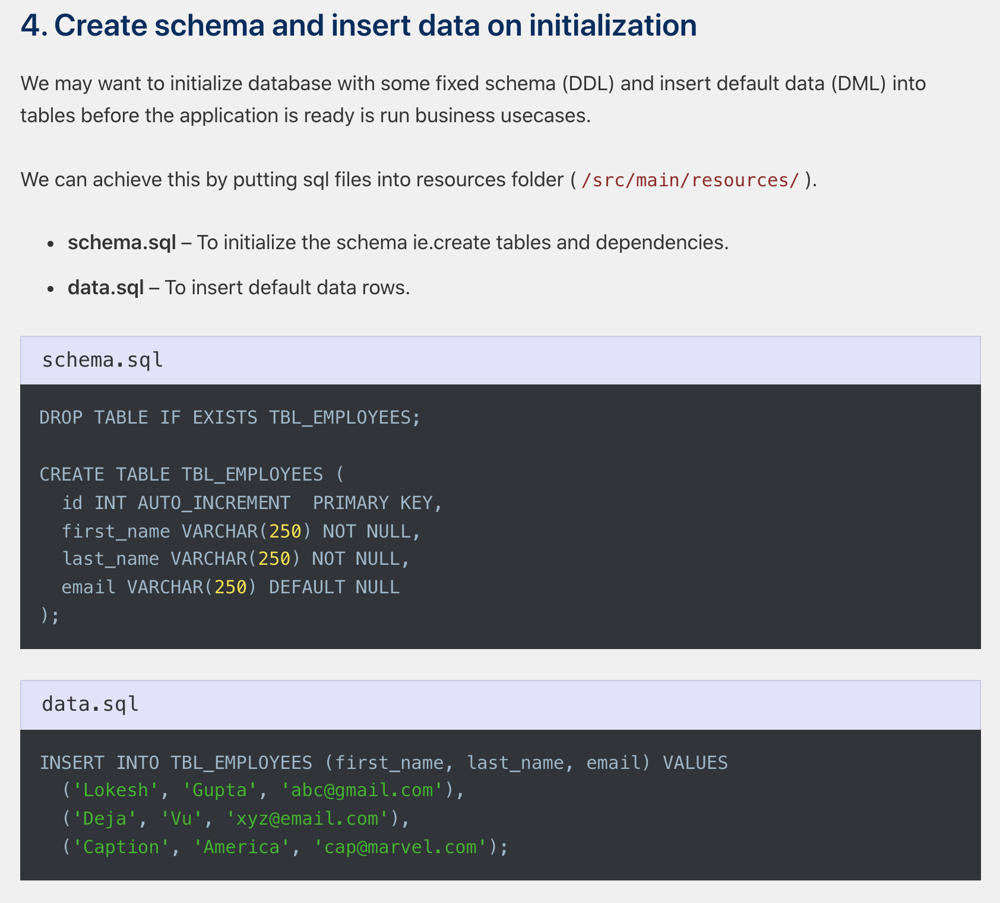

# 테스트 환경에 맞는 가상 DB 구축하기

오늘부터는 테스트 시 h2에 스키마(schema) 생성하거나 데이터를 자동으로 insert 하는 방식에 대해 정리해보려고 한다. 전 회사에서 슬로우 쿼리 관련 이슈가 있었는데, 보안 문제로 데이터 접근이 제한되어 있었기에 이때 가상 테스트 환경에 데이터를 넣어서 테스트해보는 과정을 거쳤였다. 이때 도커 기반의 MariaDB를 사용했는데, 워낙 특수한 MySQL 쿼리를 사용하기에 쿼리가 H2와 호환되지 SQL이 매우 많았던 문제로 인해 도커를 직접 DB환경을 구동해서 테스트 환경에 특정된 DB를 사용했었다. 워낙 개발 인력들의 in/out 이 많은 서비스였기에 모든 개발자 분들이 테이블을 모두 알고 있는 경우는 없었고, 갑자기 다른 업무에 투입되는 경우가 빈번해서, 모르는 것에 대해서는 확실하게 모른다고 하는 분들이 많았던것 같다. 이때 이 슬로쿼리 문제가 그랬다. 아무도 모르는 문제였고 나한테 왔었다.  

일을 하다보면 누군가가 시켜서 일을 하게 되는 경우가 많지만, 아무도 나를 믿지 않는 경우가 많다. 그리고, 아무도 그렇게 자세하게 이슈를 파악하는 경우는 많지 않다. 그렇기에 테스트코드를 만들어 놓아야 배포에 확신도 생긴다. 

오늘 정리하려는 내용은... 쉽게 설명해보면 이렇다. 

- 도커 DB를 띄운다.
  - 테스트가 끝난 후에 컨테이너를 종료 시키면 PC에서 없어지는 DB인데, 도커로 구동되는 DB이다. 
- 그리고 이 DB에 접속하는 애플리케이션 로딩시 애플리케이션이 이 DB에 스키마,테이블 DDL, 데이터 INSERT 를 하는 테스트를 위한 데이터 초기화 기능을 하는 컴포넌트 구현

 

테스트로 사용할 데이터들을 주입해야 했는데, 이때 사용한 것이 아래의 내용들이다. 이제보니 1년 반 전쯤이 되어버려서 기억이 가물가물하지만, 하나 하나 떠올려가며 자료조사를 하면서... 정리를 시작했다. 

 

@Sql 말고도, Flyway, Liquibase 를 사용하는 방법 역시 있다. 이것도 정리 예정이다. 아자 화이팅!!!

 

## 참고자료

- [Initialize Database Using Basic SQL Scripts](https://docs.spring.io/spring-boot/docs/current/reference/html/howto.html#howto.data-initialization.using-basic-sql-scripts)
- [Quick Guide on Loading initial Data with Spring Boot](https://www.baeldung.com/spring-boot-data-sql-and-schema-sql)
- [Spring Boot with H2 Database](https://howtodoinjava.com/spring-boot2/h2-database-example/)
- [스프링 4.1 @Sql 사용하기](https://javacan.tistory.com/entry/spring41-AtSql-annotation-intro)

 

## 스프링 부트의 기본 설정

Spring Boot with H2 Database

- https://howtodoinjava.com/spring-boot2/h2-database-example/

 

스프링 부트에서는 단순히 src/test/resources 디렉터리 내에 아래의 파일들을 두면 자동으로 데이터를 생성한다.

- schema.sql
  - Schema 를 초기화하기 위해 사용한다.
  - ex) create table
- data.sql
  - database 에 row 들을 insert 하는 sql 들을 정의한 sql 파일이다.

 

위의 [Spring Boot with H2 Database](https://howtodoinjava.com/spring-boot2/h2-database-example/) 에서는 아래와 같이 schema.sql, data.sql 의 역할에 대해 설명하고 있다.

## 커스텀 설정

실무에서는 사용하는 테이블도 많고, 서비스 부서별로 다른 디렉터리를 사용하는 경우가 많다. 따라서 위의 기본설정은 실무에서는 거의 쓰지 못한다. 

 

여러가지 방법을 사용할 수 있다.

- jpa 속성값 걸정
  - jpa의 application.yml 의 `spring.jpa.hibernate.ddl-auto` 속성에 대한 값을 정의하는 것으로도 해결가능하다.
  - Application.yml 에 test 프로필만 잘 선언해두었다면 사용하는 것도 좋은 선택이 되지 않을까 싶다.
- jpa 속성값을 none 으로 두고, @Sql 어노테이션 활용
  - @Sql, @SqlConfig, @SqlGroup 애노테이션을 사용하는 방식이다. @Sql, @SqlConfig, @SqlGroup 으로 따로 컴포넌트를 만들어서 커스텀하게 컴포넌트 스캔이 되도록 구성하는 방식으로 init.sql, schema.sql을 선택해서 사용할 수도 있다.
  - 개인적으로는 이 방법이 더 괜찮은 테스트 방법이라고 생각하고 있다.
  - 개발단계에서는 위의 jpa 속성값 설정 방식이 좋은방법이 될 수 있다.
    - 다만, 개발팀 내부에서 모든 소스들을 JPA로 하기로 결정했다면... 좋은 선택
  - 운영단계에 접어든 개발환경의 경우 원하는 테스트 환경을 컴포넌트로 직접 정의해서 사용하는 경우가 많다. 차라리 명시적으로 선언해서 실수를 미연에 방지할 수 있도록 @Sql, @SqlConfig, @SqlGroup 을 컴포넌트로 관리하는 것도 좋은 선택중 하나가 될수 있다.

 

내일 또 정리 예정

 

