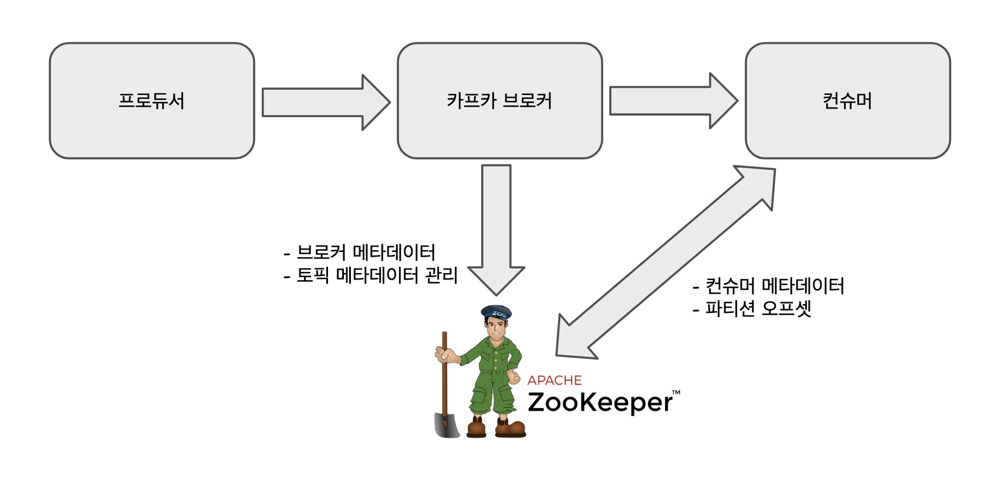

# 카프카 기본 개념들 요약

 

## 주키퍼

아파치 카프카는 주키퍼를 사용한다. 주로 컨슈머 클라이언트, 카프카 클러스터에 관련된 메타데이터(환경설정 정보)를 저장하기 위해 주키퍼를 사용한다. 

주키퍼가 주로 수행하는 역할은 아래와 같다. 

- 카프카 브로커, 토픽에 관련된 메타데이터 관리
- 컨슈머에 관련된 메타데이터들 관리
- 파티션 오프셋 관리

글로 표현하는 것보다, 학습효과를 높이려면 역시 그림과 함께 보면 나중에 기억하기 쉬울 듯 하다. 그래서 그림을 직접 그려봤다. 아래 그림은 직접 그린 그림. 

## 주키퍼 앙상블

> 이번 프로젝트 범위에서는 앙상블을 구성하지 않을 것 같다. 프로젝트 목적에도 부합하지 않고 프로젝트 범위에도 부합하지 않는다. 더 중요한 것은 1인 개발 체제에서는 도저히 시간 자체가 나지를 않는다. 추후 고도화 시에 앙상블과, 카프카 클러스터링을 도입하게 될 것 같다. 나중에 고도화 시에 적용할 수도 있기에 미리 정리해두었다. 

 

주키퍼는 주로 카프카 브로커, 토픽, 컨슈머 등에 관련된 메타데이터 들을 통합, 관리하는데에 사용된다. 주키퍼를 클러스터화 한 것을 **앙상블(ensemble)** 이라고 부른다. 그냥 클러스터링 했다고 하면 되지 앙상블이라는 말을 써서 괜한 상상을 하게 했나 하는 그런 불만이 새로 접하는 사람들에게 생길수도 있겠다하는 생각이 들기도 한다. 

몽고DB에 샤드 클러스터링을 적용해본 경험이 있는 사람들이라면 구성서버(Config Server)를 떠올리면 될 것 같다. 스프링 클라우드에서도 구성서버와 관련된 개념을 제공하고 있다. 이런 기능들을 보면 대부분의 인프라들이 클라우드를 지원하려 노력하는 중이라는 것을 느끼게 되는 것 같다. 

하나의 주키퍼 앙상블은 여러 개의 서버(노드)를 멤버로 가질 수 있다. 이렇게 구성된 여러개의 서버에서 하나의 서버에만 서비스가 집중되지 않도록 주키퍼는 요청을 분산시킨다. 그리고 한 서버에서 처리한 결과를 다른 서버와 동기화(=복제)해서 데이터의 안전성을 보장한다. 

만약 클라이언트와 현재 연결된 서버중 하나가 문제가 생기면 대기중인 주키퍼 서버 중에서 하나를 자동 선정해서 새로 선택된 서버가 해당 서비스를 이어받아 처리한다. 

앙상블은 홀수개의 서버(3,5,...)를 멤버로 갖는다. 앙상블의 서버 중 과반수가 작동 가능하면 언제든 요청 처리가 가능하기 때문이다. 데이터 쓰기를 하는 서버를 리더(leader)라고 부르고, 나머지 대기 서버는 팔로어(follower)라고 부른다. 

 

> 주키퍼 앙상플은 다섯 개의 서버 노드를 갖도록 구성하는 것이 좋은 선택이다. 그리고 서버가 너무 많으면 오히려 성능이 저하될 수 있어서 노드를  다섯개보다 많게 구성하는 것은 바람직하지 않다. 

 

## 분산 커밋 로그, 분산 스트리밍 플랫폼

## 메시지, 배치

**메시지** 

카프카에서는 데이터의 기본 단위를 메시지(message)라고 부른다. 데이터베이스의 row(행) 또는 record(레코드)에 비유된다. 

카프카는 메시지를 바이트 배열의 데이터로 간주하고 특정 형식/의미는 없다. 

 메시지에는 '키(key)' 라는 개념의 메타 데이터가 포함될 수 있다. (키 역시도 바이트 배열이고 특별한 의미를 갖지 않는다.) 

메시지는 토픽으로 분류된 파티션에 수록(저장)된다. 이때 수록할 파티션을 결정할 때 일관된 해시 값으로 키를 생성한다. 해시는 항상 고유한 값을 생성하는 것을 보장하기에, 항상 같은 킷값으로는 항상 같은 파티션에 수록된다. 

**배치** 

카프카는 효율성을 위해 여러 개의 메시지를 모아 배치(batch) 형태로 파티션에 수록한다. 따라서 네트워크로부터 매번 각 메시지를 받아서 처리하는 데에 따른 부담을 줄일 수 있다. 

이때 대기시간(latency), 처리량(throughput) 간의 트레이드오프가 생길 수 있다. 배치의 크기가 크면 클수록 단위 시간당 처리될 수 있는 메시지는 많아지지만, 각 메시지의 전송 시간은 더 길어진다. 

배치에는 데이터 압축이 적용되기 때문에 효율적인 데이터 전송과 저장 능력을 제공한다. 

 

## 스키마

카프카는 메시지를 단순히 바이트 배열로 처리하지만, 내용을 이해하기 쉽도록 메시지의 구조를 나타내는 **스키마(schema)**를 사용할 수 있다. 

가장 간단한 방법으로는 JSON,XML 방식이 있다. 하지만, 강력한 데이터 타입에 대한 지원이 부족하고 스키마 버전 간의 호환성이 떨어진다. 이런 이유로 많은 개발자들이 Avro 를 선호한다.  

**Avro** 

Avro 는 하둡을 위해 개발된 직렬화(serialization) 프레임워크다. Avro 는 데이터를 직렬화하는 형식을 제공하며,메시지와는 별도로 스키마를 별도로 유지 관리한다. 다라서 스키마가 변경되더라도 애플리케이션의 코드를 추가하거나 변경할 필요가 없다. 또한 강력한 데이터 타입을 지원하고, 스키마 신구버전 간의 호환성도 제공한다. 

 

**공유리포지터리** 

카프카에서는 잘 정의된 스키마를 공유 리포지터리(repository)에 저장하여 사용한다. 따라서 애플리케이션 변경 없이 메시지를 처리할 수 있다. 

 

카프카에서는 일관된 데이텨 형식이 중요하다. 메시지 쓰기와 읽기 작업을 분리해서 실행할 수 있으려면 일관된 데이터 형식이 중요하기 때문이다. 만약 쓰기와 읽기 작업이 하나로 합쳐져 있으면, 구버전과 신버전의 데이터 형식을 병행 처리하기 위해 메시지 구독(읽기) 애플리케이션이 먼저 업데이트 되어야 한다. 그 다음에 발행(쓰기) 애플리케이션이 업데이트 되어야 한다. 카프카는 공유 리포지터리를 사용하기 때문에, 애플리케이션 변경없이 메시지를 처리할 수 있다.

 

## 토픽, 파티션

**토픽** 

토픽은 메시지를 분류하는 단위다. 예를 들면 데이터베이스의 테이블이나 파일시스템의 폴더,디렉터리와 비슷한 느낌의 개념이다. 

**파티션** 

깃헙의 커밋 로그를 떠올려보자. 커밋 로그는 여러개가 있는데 이 중 커밋 로그 하나는 파티션 하나와 비슷한 느낌의 개념이다. 

메시지는 파티션에 추가되는 형태로만 수록되고, 맨 앞에서 제일 끝까지의 순서로 읽힌다. 대개 하나의 토픽은 여러 개의 파티션을 갖지만, 메시지 처리 순서는 토픽이 아닌 파티션별로 유지 관리 된다. 

카프카를 클러스터로 구축하면 각 파티션은 서로 다른 서버에 분산될 수 있다. 즉 하나의 토픽, 파티션을 여러개의 서버에 분산해서 수평적으로 확장할 수 있는데, 이렇게 하면 단일 서버로 처리할 때보다 훨씬 성능이 우수하다. 

아래 그림은 토픽,파티션,메시지의 관계를 표현한 그림이다. (이미지 출처 : https://kafka.apache.org/documentation/ ) 

그림을 자세히 보면 Topic 에는 여러개의 파티션, p1, p2, p3, p4 가 있다. 

- p1 에는 네개의 파란 사각형이 있다. 하나 하나의 파란 사각형은 메시지를 의미한다. 즉, 메시지 하나는 파티션에 추가될 수 있고, 파티션의 맨 끝에 추가된다.
- p2 에는 네개의 보라색 사각형이 있다. 하나 하나의 보라색 사각형은 메시지를 의미한다. 즉, 메시지 하나는 파티션에 추가될 수 있고, 파티션의 맨 끝에 추가된다.
- p3 에는 네개의 주황색 사각형이 있다. 하나 하나의 주황색 사각형은 메시지를 의미한다. 즉, 메시지 하나는 파티션에 추가될 수 있고, 파티션의 맨 끝에 추가된다.
- p4 에는 네개의 살구색 사각형이 있다. 하나 하나의 살구색 사각형은 메시지를 의미한다. 즉, 메시지 하나는 파티션에 추가될 수 있고, 파티션의 맨 끝에 추가된다.

 

## 스트림

카프카와 같은 브로커 시스템의 데이터를 이야기할 때 스트림이라는 용어가 자주 사용되게 된다. 대부분 스트림은 파티션의 갯수와 상관 없이 하나의 토픽 데이터로 간주되고, 데이터를 쓰는 프로듀서(producer)로부터 컨슈머(consumer)로 이동되는 연속적인 데이터를 나타낸다. 

카프카 스트림즈(Kafka Streams), 아파치 Samza, Storm 과 같은 프레임워크에서 실시간으로 메시지를 처리할 때 사용하는 방식이 Stream 이다. (실시간이 아닌 오프라인으로 처리하도록 설계된 프레임워크인 하둡의 처리방식과 대비되는 방식이다) 

 

## 프로듀서, 컨슈머

**프로듀서** 

새로운 메시지를 생성한다. 메시지는 특정 토픽으로 생성되고, 기본적으로 프로듀서는 메시지가 어떤 파티션에 수록되는지 관여하지 않는다. 발행/구독 시스템에서 보통 Publisher 또는 작성자라고 부른다. 

가끔 프로듀서가 특정 파티션을 직접 선택해서 메시지를 쓰는 경우가 있다. 이때는 메시지 키와 파티셔너(partitioner)를 사용한다. 파티셔너는 해시를 이용해 키의 해시값을 생성하기 때문에 특정 파티션에 대응시켜서 특정 키에 대한 메시지가 항상 같은 파티션에 저장될 수 있도록 보장해준다. 

프로듀서는 나름의 커스텀 파티셔너를 갖고 다른 규칙에 따라 메시지가 파티션에 메시지가 파티션에 대응되게 할 수 도 있다. 

**컨슈머** 

메시지를 읽은 역할을 한다. 하나 이상의 토픽을 구독해서 메시지가 생성된 순서로 읽는다. 메시지의 오프셋을 유지하고 있기에 메시지의 위치를 알 수 있다. 발행/구독 시스템에서 보통 Subscriber 도는 독자라고도 한다. 

메시지의 오프셋(offset)은 지속적으로 증가하는 정숫값이며, 메시지가 생성될 때 카프카가 추가해준다. 파티션에 수록된 각 메시지는 고유한 오프셋을 가진다. 그리고 주키퍼(Zookeeper), 카프카에서는 각 파티션에서 마지막에 읽은 메시지를 가지고 있기 때문에 컨슈머가 메시지 읽기를 중단했다가 다시 시작하더라도 언제든 그 다음 메시지부터 읽을 수 있다. 

컨슈머는 하나의 파티션만 소유할 수도 있고, 여러개의 파티션을 소비하는 것도 가능하다. 이렇게 각 컨슈머가 특정 파티션에 대응되는 것을 파티션 소유권(ownership)이라고 한다. 

이미지 출처 : https://kafka.apache.org/081/documentation.html 

파티션 소유권의 개념을 이용하면 다량의 메시지를 갖는 토픽을 소비하기 위해 컨슈머를 수평적으로 확장할 수 있다. 

한 컨슈머가 자신의 파티션 메시지를 읽는데 실패하더라도 같은 그룹의 다른 컨슈머가 파티션 소유권을 재조정 받은 후 실패한 컨슈머의 파티션 메시지를 대신 읽을 수 있다. 

 

## 브로커와 클러스터

## 다중 클러스터

## 카프카의 장점

### 다중 프로듀서

### 다중 컨슈머

### 디스크 기반의 보존 (retention)

### 확장성

### 고성능

