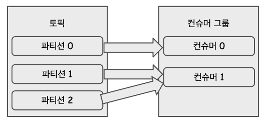
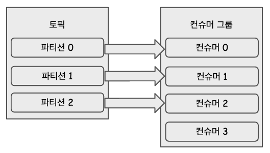

# 카프카 프로듀서,컨슈머


## 카프카 프로듀서

프로듀서는 카프카 브로커로 데이터를 전송할 때 사용된다. 프로듀서를 이용해 카프카(클러스터)에 데이터를 전송할 때 아래의 두가지 방식으로 보낼 수 있다.

- 프로듀서 쉘 스크립트 활용
  - kafka/bin/000.sh 와 같이 이름지어진 쉘스크립트들을 이용해 CLI로 데이터를 전송할 수 있다.
  - 코드 작성전 테스트로 보내보는 경우에 사용할 수 있는 방법이다.
- 프로그래밍 언어로 카프카 클러스터에 데이터 전송
  - 프로그래밍 언어(Java, C 등)로 데이터를 카프카 클러스터에 전송할 때 사용하는 방식이다.
  - 일반적으로 이 방식을 많이 사용한다.

<br>

프로듀서 애플리케이션으로 데이터를 전송할 때는 카프카 프로듀서 라이브러리 아래 그림과 같은 내부적으로 파티셔너, 배치 생성 등의 절차를 거친다. 아래 그림에는 이 내용들을 요약해두었다.


## 프로듀서 애플리케이션 예제 작성

### 의존성 추가

```groovy
plugins {
    id 'java'
}

group 'io.study'
version '1.0-SNAPSHOT'

repositories {
    mavenCentral()
}

dependencies {
    implementation 'org.apache.kafka:kafka-clients:2.8.1'
    implementation 'org.slf4j:slf4j-simple:1.7.30'

    testImplementation 'org.junit.jupiter:junit-jupiter-api:5.6.0'
    testRuntimeOnly 'org.junit.jupiter:junit-jupiter-engine'
}

test {
    useJUnitPlatform()
}
```

<br>

추가한 의존성은 아래의 두가지다

```groovy
implementation 'org.apache.kafka:kafka-clients:2.8.1'
implementation 'org.slf4j:slf4j-simple:1.7.30'
```

<br>

### 샘플 프로듀서 Java 애플리케이션 1 - 메시지 킷값 없이 메시지 값만 전송

```java
import java.util.Properties;

import org.apache.kafka.clients.producer.KafkaProducer;
import org.apache.kafka.clients.producer.ProducerConfig;
import org.apache.kafka.clients.producer.ProducerRecord;
import org.apache.kafka.common.serialization.StringSerializer;
import org.slf4j.Logger;
import org.slf4j.LoggerFactory;

public class SampleProducer01 {
	private final static Logger logger = LoggerFactory.getLogger(SampleProducer01.class);
	private final static String TOPIC_NAME = "test";
	private final static String BOOTSTRAP_SERVERS = "ec2-gosgjung-hotmail:9092";

	public static void main(String [] args){
		Properties config = new Properties();
		config.put(ProducerConfig.BOOTSTRAP_SERVERS_CONFIG, BOOTSTRAP_SERVERS);
		config.put(ProducerConfig.KEY_SERIALIZER_CLASS_CONFIG, StringSerializer.class.getName());
		config.put(ProducerConfig.VALUE_SERIALIZER_CLASS_CONFIG, StringSerializer.class.getName());

		KafkaProducer<String, String> producer = new KafkaProducer<String, String>(config);

		String msgValue = "테스트 메시지";
		ProducerRecord<String, String> record = new ProducerRecord<>(TOPIC_NAME, msgValue);
		producer.send(record);
		logger.info("{}", record);

		producer.flush();
		producer.close();
	}
}
```

<br>

### 카프카 서버에 토픽 생성해두기

`test` 라는 이름의 토픽을 아래와 같이 추가해주자. 로컬 PC에서 아래와 같이 카프카 CLI 로 토픽 생성 요청을 한다.

```bash
$ bin/kafka-topics.sh --bootstrap-server ec2-gosgjung-hotmail:9092 --create --topic test --partitions 3
Created topic test.
```

<br>

### 카프카 프로듀서 애플리케이션 구동

위에서 작성한 SampleProducer01.java 파일을 실행시키자.


<br>

실행시켜보면 아래와 같은 메시지가 나타나는데, 메시지 키를 지정하지 않았기에 메시지 키가 null 로 지정되었음을 확인 가능하다.<br>

```plain

# ... 중략 ...

[main] INFO SampleProducer01 - ProducerRecord(topic=test, partition=null, headers=RecordHeaders(headers = [], isReadOnly = true), key=null, value=테스트 메시지, timestamp=null)

# ... 중략 ...

```

위의 코드를 인텔리제이에서 Run Application 한 후에 카프카가 설치된 EC2에서 메시지를 확인해보면 아래와 같다.<br>

### 컨슈머 CLI 로 메시지 적재 확인

컨슈머는 보통 애플리케이션으로 구현하는 것이 대부분이다. 하지만, 사람이 직접 CLI로 확인해보고 싶을 경우가 있다. 이런 경우에 kafka 설치 디렉터리 내의 `bin/kafka-console-consumer.sh` 를 활용하게 된다. 컨슈머 CLI 로 방금 전 생성한 메시지를 확인하려면 아래와 같이 명령어를 내려주면 된다.<br>

```bash
$ bin/kafka-console-consumer.sh --bootstrap-server ec2-gosgjung-hotmail:9092 --topic test --from-beginning
테스트 메시지
테스트 메시지
테스트 메시지
```

<br>

### 프로듀서의 여러가지 종류별 예제

#### (1) 메시지 키가 있는 데이터를 전송하는 프로듀서

예를 들면 아래와 같은 키/밸류를 지정해서 ProducerRecord 객체를 생성헤 데이터를 전달하는 것을 메시지 키를 지정해 데이터를 전송하는 방식이라고 이야기한다.

```java
import java.util.Properties;

import org.apache.kafka.clients.producer.KafkaProducer;
import org.apache.kafka.clients.producer.ProducerConfig;
import org.apache.kafka.clients.producer.ProducerRecord;
import org.apache.kafka.common.serialization.StringSerializer;
import org.slf4j.Logger;
import org.slf4j.LoggerFactory;

public class SampleProducer02 {
	private final static Logger logger = LoggerFactory.getLogger(SampleProducer01.class);
	private final static String TOPIC_NAME = "test";
	private final static String BOOTSTRAP_SERVERS = "ec2-gosgjung-hotmail:9092";

	public static void main(String [] args){
		Properties config = new Properties();
		config.put(ProducerConfig.BOOTSTRAP_SERVERS_CONFIG, BOOTSTRAP_SERVERS);
		config.put(ProducerConfig.KEY_SERIALIZER_CLASS_CONFIG, StringSerializer.class.getName());
		config.put(ProducerConfig.VALUE_SERIALIZER_CLASS_CONFIG, StringSerializer.class.getName());

		KafkaProducer<String, String> producer = new KafkaProducer<String, String>(config);

		String msgKey = "샘플2-메시지";
		String msgValue = "테스트 메시지";
		ProducerRecord<String, String> record = new ProducerRecord<>(TOPIC_NAME, msgKey ,msgValue);
		producer.send(record);
		logger.info("{}", record);

		producer.flush();
		producer.close();
	}
}
```

바로 앞전에 살펴본 예제와 비교했을 때 달라진 코드는 아래와 같다.

```java
// ... 중략 ...

String msgKey = "샘플2-메시지";
String msgValue = "테스트 메시지";
ProducerRecord<String, String> record = new ProducerRecord<>(TOPIC_NAME, msgKey ,msgValue);
producer.send(record);

// ... 중략 ...
```

<br>

위의 코드를 인텔리제이에서 Run Application 한 후에 카프카가 설치된 EC2 또는 로컬 개발 PC에서 메시지를 확인해보면 아래와 같다.<br>

아래는 로컬 개발 PC에서 카프카 컨슈머 CLI를 실행시킨 결과다.<br>

**메시지 확인**<br>

```bash
$ bin/kafka-console-consumer.sh --bootstrap-server ec2-gosgjung-hotmail:9092 --topic test --property print.key=true --property key.separator="-" --from-beginning
null-테스트 메시지
null-테스트 메시지
null-테스트 메시지
샘플2-메시지-테스트 메시지
```

<br>

#### (2) 파티션 번호를 지정해서 데이터를 전송하기

파티션 번호를 지정해서 데이터를 전송하는 예제는 아래와 같다. 실제 업무를 할때 파티션 번호를 직접 지정하는 경우가 있을지는 장담하지 못하겠다. 일단은 ProducerRecord의 다양한 버전의 생성자들 (오버로딩된 생성자들)을 살펴보면서 카프카 프로듀서의 여러가지 메시지 전송방식을 테스트 해보자.

```java
import java.util.Properties;

import org.apache.kafka.clients.producer.KafkaProducer;
import org.apache.kafka.clients.producer.ProducerConfig;
import org.apache.kafka.clients.producer.ProducerRecord;
import org.apache.kafka.common.serialization.StringSerializer;
import org.slf4j.Logger;
import org.slf4j.LoggerFactory;

public class SampleProducer03 {
	private final static Logger logger = LoggerFactory.getLogger(SampleProducer01.class);
	private final static String TOPIC_NAME = "test";
	private final static String BOOTSTRAP_SERVERS = "ec2-gosgjung-hotmail:9092";

	public static void main(String [] args) {
		Properties config = new Properties();
		config.put(ProducerConfig.BOOTSTRAP_SERVERS_CONFIG, BOOTSTRAP_SERVERS);
		config.put(ProducerConfig.KEY_SERIALIZER_CLASS_CONFIG, StringSerializer.class.getName());
		config.put(ProducerConfig.VALUE_SERIALIZER_CLASS_CONFIG, StringSerializer.class.getName());

		KafkaProducer<String, String> producer = new KafkaProducer<String, String>(config);

		String msgKey = "샘플3-메시지";
		String msgValue = "테스트 메시지";
		int partitionNumber = 0;

		ProducerRecord<String, String> record = new ProducerRecord<>(TOPIC_NAME, partitionNumber, msgKey, msgValue);
		producer.send(record);
		logger.info("{}", record);

		producer.flush();
		producer.close();
	}
}
```

위 코드에서 메시지 키를 지정해 데이터를 전송하는 부분만을 요약한 코드는 아래와 같다.

```java
KafkaProducer<String, String> producer = new KafkaProducer<String, String>(config);

String msgKey = "샘플2-메시지";
String msgValue = "테스트 메시지";
int partitionNumber = 0;

ProducerRecord<String, String> record = new ProducerRecord<>(TOPIC_NAME, partitionNumber, msgKey, msgValue);
producer.send(record);
logger.info("{}", record);
```

<br>

위의 코드를 인텔리제이에서 Run Application 한 후에 카프카가 설치된 EC2에서 메시지를 확인해보면 아래와 같다.

**메시지 확인**<br>

```bash
$ bin/kafka-console-consumer.sh --bootstrap-server ec2-gosgjung-hotmail:9092 --topic test --property print.key=true --property key.separator="-" --from-beginning
null-테스트 메시지
null-테스트 메시지
null-테스트 메시지
샘플2-메시지-테스트 메시지
샘플3-메시지-테스트 메시지
샘플2-메시지-테스트 메시지
```

<br>

#### (3) 커스텀 파티셔너를 가지는 프로듀서

프로듀서 사용환경에 따라 가끔 특정 데이터에 대한 레코드는 특정 파티션으로 보내는 경우가 있다. 이 경우 위에서 본것처럼 생성자에 파티션 번호를 지정하기도 하고, 커스텀 파티셔너를 직접 만들어 사용한다. 커스텀 파티셔너는 인터페이스 Partitioner를 implements 한 클래스를 의미한다. 아래는 커스텀 파티셔너의 예이다.<br>

예제의 시나리오는 이렇다. 

> 카프카 브로커로 메시지 전송시 메시지 키가 `샘플4-메시지` 인 경우에 대해 파티션 번호를 0 으로 지정해준 후 전송해준다.

<br>

**CustomPartioner.java**<br>

파티셔너의 코드는 아래와 같다. 인터페이스 Partitioner 를 implements 했다.

```java
import java.util.List;
import java.util.Map;

import org.apache.kafka.clients.producer.Partitioner;
import org.apache.kafka.common.Cluster;
import org.apache.kafka.common.InvalidRecordException;
import org.apache.kafka.common.PartitionInfo;
import org.apache.kafka.common.utils.Utils;

public class CustomPartioner implements Partitioner {
	@Override
	public int partition(String topic, Object key, byte[] keyBytes, Object value, byte[] valueBytes, Cluster cluster) {
		if(keyBytes == null){
			throw new InvalidRecordException("Need Message Key");
		}

		// 메시지의 키가 "샘플4-메시지" 일 경우 0번 파티션으로 지정되도록 0을 리턴
		if(((String)key).equals("샘플4-메시지")){
			return 0;
		}

		List<PartitionInfo> partitions = cluster.partitionsForTopic(topic);
		int numPartitions = partitions.size();
		return Utils.toPositive(Utils.murmur2(keyBytes)) % numPartitions;
	}

	@Override
	public void close() {

	}

	@Override
	public void configure(Map<String, ?> configs) {

	}
}
```

위 코드에서 파티션 메시지 키가 `샘플4-메시지` 일 경우에 대해 파티션번호를 0으로 리턴하는 코드는 아래와 같다.

```java
@Override
public int partition(String topic, Object key, byte[] keyBytes, Object value, byte[] valueBytes, Cluster cluster) {
	// ...
  
  // 메시지의 키가 "샘플4-메시지" 일 경우 0번 파티션으로 지정되도록 0을 리턴
  if(((String)key).equals("샘플4-메시지")){
    return 0;
  }
  
  // ...
}
```

<br>

**SampleProducer04.java**<br>

파티셔너를 직접 지정해서 메시지를 보내는 프로듀서 코드의 전체 코드이다.

```java
import java.util.Properties;

import org.apache.kafka.clients.producer.KafkaProducer;
import org.apache.kafka.clients.producer.ProducerConfig;
import org.apache.kafka.clients.producer.ProducerRecord;
import org.apache.kafka.common.serialization.StringSerializer;
import org.slf4j.Logger;
import org.slf4j.LoggerFactory;

public class SampleProducer04 {
	private final static Logger logger = LoggerFactory.getLogger(SampleProducer01.class);
	private final static String TOPIC_NAME = "test";
	private final static String BOOTSTRAP_SERVERS = "ec2-gosgjung-hotmail:9092";

	public static void main(String [] args) {
		Properties config = new Properties();
		config.put(ProducerConfig.BOOTSTRAP_SERVERS_CONFIG, BOOTSTRAP_SERVERS);
		config.put(ProducerConfig.KEY_SERIALIZER_CLASS_CONFIG, StringSerializer.class.getName());
		config.put(ProducerConfig.VALUE_SERIALIZER_CLASS_CONFIG, StringSerializer.class.getName());
		config.put(ProducerConfig.PARTITIONER_CLASS_CONFIG, CustomPartioner.class);

		KafkaProducer<String, String> producer = new KafkaProducer<String, String>(config);

		String msgKey = "샘플4-메시지";
		String msgValue = "테스트 메시지";

		ProducerRecord<String, String> record = new ProducerRecord<>(TOPIC_NAME, msgKey, msgValue);
		producer.send(record);
		logger.info("{}", record);

		producer.flush();
		producer.close();
	}
}
```

위 코드에서 프로듀서에 파티셔너를 직접 지정해주는 부분만을 추려보면 아래와 같다.

```java
public class SampleProducer04 {
	private final static Logger logger = LoggerFactory.getLogger(SampleProducer01.class);
	private final static String TOPIC_NAME = "test";
	private final static String BOOTSTRAP_SERVERS = "ec2-gosgjung-hotmail:9092";

	public static void main(String [] args) {
		Properties config = new Properties();
    
    // ...
    // 바로 여기다.
		config.put(ProducerConfig.PARTITIONER_CLASS_CONFIG, CustomPartioner.class);

		KafkaProducer<String, String> producer = new KafkaProducer<String, String>(config);
    // ...
    
		ProducerRecord<String, String> record = new ProducerRecord<>(TOPIC_NAME, msgKey, msgValue);
		producer.send(record);
    
		// ...
	}
}
```

<br>

위의 코드를 인텔리제이에서 Run Application 한 후에 카프카가 설치된 EC2에서 메시지를 확인해보면 아래와 같다.<br>

**출력결과**<br>

```bash
$ bin/kafka-console-consumer.sh --bootstrap-server ec2-gosgjung-hotmail:9092 --topic test --property print.key=true --property key.separator="-" --from-beginning
null-테스트 메시지
null-테스트 메시지
null-테스트 메시지
샘플2-메시지-테스트 메시지
샘플3-메시지-테스트 메시지
샘플4-메시지-테스트 메시지
샘플2-메시지-테스트 메시지
```


<br>

#### (4) 브로커로 정상 전송되었는지 여부를 체크하는 프로듀서

KafkaProducer 클래스의 send() 메서드는 Future 객체를 반환한다. 이 Future 객체는 RecordeMetadata 의 비동기 결과를 표현하는 역할을 한다. 이 비동기 결과 값에는 ProducerRecord 가 카프카 브로커에 정상적으로 적재되었는지 여부에 대한 정보가 포함되어 있다. 

**SampleProducer05.java**<br>

```java
import java.util.Properties;
import java.util.concurrent.ExecutionException;

import org.apache.kafka.clients.producer.KafkaProducer;
import org.apache.kafka.clients.producer.ProducerConfig;
import org.apache.kafka.clients.producer.ProducerRecord;
import org.apache.kafka.clients.producer.RecordMetadata;
import org.apache.kafka.common.serialization.StringSerializer;
import org.slf4j.Logger;
import org.slf4j.LoggerFactory;

public class SampleProducer05 {
	private final static Logger logger = LoggerFactory.getLogger(SampleProducer01.class);
	private final static String TOPIC_NAME = "test";
	private final static String BOOTSTRAP_SERVERS = "ec2-gosgjung-hotmail:9092";

	public static void main(String [] args) {
		Properties config = new Properties();
		config.put(ProducerConfig.BOOTSTRAP_SERVERS_CONFIG, BOOTSTRAP_SERVERS);
		config.put(ProducerConfig.KEY_SERIALIZER_CLASS_CONFIG, StringSerializer.class.getName());
		config.put(ProducerConfig.VALUE_SERIALIZER_CLASS_CONFIG, StringSerializer.class.getName());

		KafkaProducer<String, String> producer = new KafkaProducer<String, String>(config);

		String msgKey = "샘플5-메시지";
		String msgValue = "테스트 메시지";

		ProducerRecord<String, String> record = new ProducerRecord<>(TOPIC_NAME, msgKey, msgValue);
		try {
			RecordMetadata recordMetadata = producer.send(record).get();
			logger.info("{}", recordMetadata.toString());
		} catch (InterruptedException | ExecutionException e) {
			e.printStackTrace();
		}

		producer.flush();
		producer.close();
	}
}
```

위 코드에서 Future 객체를 이용해 send의 결과가 정상임을 받을 때까지 기다렸다가 반환하는 로직의 부분만 추려보면 아래와 같다.

```java
public class SampleProducer05 {
  
  	// ...
  
		ProducerRecord<String, String> record = new ProducerRecord<>(TOPIC_NAME, msgKey, msgValue);
		try {
			RecordMetadata recordMetadata = producer.send(record).get();
			logger.info("{}", recordMetadata.toString());
		} catch (InterruptedException | ExecutionException e) {
			e.printStackTrace();
		}

		producer.flush();
		producer.close();
	}
}
```

위의 코드는 동기방식으로 데이터를 기다렸다가 받아서 처리를 시작하는데, 이렇게 하면 의도치 않게 병목현상을 유발할 수 있다. 이렇게 동기 방식으로 데이터를 기다렸다가 받는 방식말고, 비동기방식으로 결과를 확인하려 할 때 Callback 인터페이스를 implements 하는 방식으로 사용가능하다. 예를 들면 아래와 같은 코드이다.

**ProducerCallback.java**<br>

직접 implements해서 클래스를 만들어보자<br>

```java
import org.apache.kafka.clients.producer.Callback;
import org.apache.kafka.clients.producer.RecordMetadata;
import org.slf4j.Logger;
import org.slf4j.LoggerFactory;

public class ProducerCallback implements Callback {
	private final static Logger logger = LoggerFactory.getLogger(ProducerCallback.class);

	@Override
	public void onCompletion(RecordMetadata metadata, Exception exception) {
		if(exception != null){
			logger.error(exception.getMessage(), exception);
		}
		else{
			logger.info("프로듀서 콜백 :: " + metadata.toString());
		}
	}
}
```

<br>

**프로듀서 코드 - SampleProducer05.java**<br>

```java
import java.util.Properties;
import java.util.concurrent.ExecutionException;

import org.apache.kafka.clients.producer.KafkaProducer;
import org.apache.kafka.clients.producer.ProducerConfig;
import org.apache.kafka.clients.producer.ProducerRecord;
import org.apache.kafka.clients.producer.RecordMetadata;
import org.apache.kafka.common.serialization.StringSerializer;
import org.slf4j.Logger;
import org.slf4j.LoggerFactory;

public class SampleProducer05 {
	private final static Logger logger = LoggerFactory.getLogger(SampleProducer01.class);
	private final static String TOPIC_NAME = "test";
	private final static String BOOTSTRAP_SERVERS = "ec2-gosgjung-hotmail:9092";

	public static void main(String [] args) {
		Properties config = new Properties();
		config.put(ProducerConfig.BOOTSTRAP_SERVERS_CONFIG, BOOTSTRAP_SERVERS);
		config.put(ProducerConfig.KEY_SERIALIZER_CLASS_CONFIG, StringSerializer.class.getName());
		config.put(ProducerConfig.VALUE_SERIALIZER_CLASS_CONFIG, StringSerializer.class.getName());

		KafkaProducer<String, String> producer = new KafkaProducer<String, String>(config);

		String msgKey = "샘플5-메시지";
		String msgValue = "테스트 메시지";

		ProducerRecord<String, String> record = new ProducerRecord<>(TOPIC_NAME, msgKey, msgValue);
		producer.send(record, new ProducerCallback());
    
    // ...

		producer.flush();
		producer.close();
	}
}

```

위의 코드를 인텔리제이에서 Run Application 한 후에 카프카가 설치된 EC2에서 컨슈머 CLI로 메시지를 확인해보면 아래와 같다.<br>

**출력결과**<br>

```java
bin/kafka-console-consumer.sh --bootstrap-server ec2-gosgjung-hotmail:9092 --topic test --property print.key=true --property key.separator="-" --from-beginning
null-테스트 메시지
null-테스트 메시지
null-테스트 메시지
샘플2-메시지-테스트 메시지
샘플3-메시지-테스트 메시지
샘플4-메시지-테스트 메시지
샘플2-메시지-테스트 메시지
샘플5-메시지-테스트 메시지
샘플5-메시지-테스트 메시지
샘플5-메시지-테스트 메시지
샘플5-메시지-테스트 메시지
```

<br>

## 프로듀서의 주요 옵션

프로듀서 애플리케이션을 실행할 때 설정하는 옵션들은 필수 옵션이 있고, 선택 옵션도 있다. 

### 필수 옵션

- `bootstrap.servers` : 쉽게 설명하면, 프로듀서가 데이터를 전송할 목적지이다. 이 목적지라는 것은 카프카 클러스터 내에 구성된 카프카 브로커들의 리스트를 말한다. 브로커가 어려개이면 여러개의 브로커를 , 로 구분하여 기술하면 된다.
- `key.serializer` : 레코드의 메시지 키를 직렬화하는 클래스. 이종의 기기간 통신이기에 직렬화 방식이 맞아야 한다. 직렬화 하는 Serializer 의 종류는 여러가지가 있는데, 이 글의 최 하단부에 참고자료로 정리해둘 예정이다.
- `value.serializer`: 레커드의 메시지 값을 직렬화하는 클래스. 메시지에 대한 값 역시 이종의 기기간 통신에 사용되는 것이기에 이종의 기기에서 보내준 값을 직렬화해서 같은 값으로 바꿔줘야 한다. 직렬화하는 Serializer 의 종류는 이 글의 최 하단부에 정리해두었다.

<br>

### 선택 옵션

- `acks`
  - 프로듀서가 전송한 데이터가 브로커 들에 정상적으로 저장되었는지 전송 성공 여부를 확인할 때 사용하는 옵션
  - 0,1,-1(all) 중 하나의 값이다.
  - 설정값에 따라 데이터의 유실 가능성이 달라진다.
  - 0 
    - 프로듀서가 전송한 즉시 브로커에 데이터가 저장되었는지와 상관 없이 성공으로 판정된다.
  - -1, all
    - 리더파티션 (토픽의 min, insync, replicas 갯수에 해당하는 리더 파티션들), 팔로워 파티션에 데이터가 저장되면 성공한 것으로 판정된다.
    - acks, min, insync, replicas 옵션은 다음문서에서 따로 문서로 정리 예정
- `buffer.memory`
  - 브로커로 전송할 데이터를 배치로 모을 때 지정하는 버퍼의 메모리 사이즈
  - 기본값은 32MB(33554432)
- `retries`
  - 프로듀서가 브로커로부터 에러를 받고 난 후 재전송을 시도하는 횟수를 지정
  - 기본값 : 2147483647
- `batch.size`
  - 배치로 전송할 레코드의 최대 용량
  - 너무 작게 설정하면 프로듀서가 브로커로 더 자주 보내게 된다. (네트워크 부담 가중)
  - 너무 크게 설정하면 메모리를 더 많이 사용하게 된다. 
  - 기본값 : 16384
- `linger.ms`
  - 배치를 전송하기 전 까지 기다리는 최소 시간
  - 기본값 : 16384
- `partitioner.class`
  - 레코드를 파티션에 적용할 때 적용하는 파티션 클래스
  - 기본값 : org.apache.kafka.clients.producer.internals.DefaultPartitioner
- `enable.idempotence`
  - 멱등성 프로듀서로 동작할지 여부 설정
  - 멱등성 프로듀서에 대해서는 다음 문서에서 정리 예정
  - 가본값 : false
- `transactional.id`
  - 프로듀서가 레코드를 전송할 때 레코드를 트랜잭션 단위로 묶을지 여부를 설정
  - 프로듀서의 고유한 트랜잭션 아이디를 설정할 수 있다.
  - 이 값을 설정하면 트랜잭션 프로듀서로 동작한다.
  - 자세한 내용은 다음 문서에서 정리 예정
  - 기본값: null

<br>

## 카프카 컨슈머

카프카 브로커로부터 데이터를 구독하는 카프카 컨슈머는 실행하는 방법이 두가지다.

- CLI 를 이용해 구독하는 방식 
  - `bin/kafka-console-consumer.sh` 파일이 컨슈머 쉘스크립트이다.
  - 커맨드 라인에서 데이터를 바로 확인해보고 싶을 때 사용하는 방식이다.
- 컨슈머 애플리케이션을 직접 구현해서 구독하는 방식
  - Java, C++, C#, python 등의 코드를 이용해서 컨슈머 애플리케이션을 직접 구현하는 것이 가능하다.
  - 주로 쓰이는 방식이다. 

<br>

애플리케이션으로 컨슈머를 구현했을때 컨슈머 애플리케이션과 카프카 클러스터간 통신을 하는 구조를 그림으로 표현해보면 아래와 같다.


<br>

카프카 컨슈머는 주로 토픽의 파티션으로부터 데이터를 가져가는 역할을 수행하는데, 컨슈머를 운영하는 방법은 크게 두가지가 있다.

- 여러 개의 컨슈머로 구성된 컨슈머 그룹을 운영 
- 토픽의 특정 파티션만 구독하는 컨슈머를 운영

<br>

## 컨슈머 애플리케이션 예제 작성

### 의존성 추가

```groovy
plugins {
    id 'java'
}

group 'io.study'
version '1.0-SNAPSHOT'

repositories {
    mavenCentral()
}

dependencies {
    implementation 'org.apache.kafka:kafka-clients:2.8.1'
    implementation 'org.slf4j:slf4j-simple:1.7.30'

    testImplementation 'org.junit.jupiter:junit-jupiter-api:5.6.0'
    testRuntimeOnly 'org.junit.jupiter:junit-jupiter-engine'
}

test {
    useJUnitPlatform()
}
```

<br>

### 샘플 컨슈머 Java 애플리케이션 1 - 단순 예제

```java
package consumer;

import java.time.Duration;
import java.util.Arrays;
import java.util.Properties;

import org.apache.kafka.clients.consumer.ConsumerConfig;
import org.apache.kafka.clients.consumer.ConsumerRecord;
import org.apache.kafka.clients.consumer.ConsumerRecords;
import org.apache.kafka.clients.consumer.KafkaConsumer;
import org.apache.kafka.common.serialization.StringDeserializer;
import org.slf4j.Logger;
import org.slf4j.LoggerFactory;

public class SampleConsumer {
	private final static Logger logger = LoggerFactory.getLogger(SampleConsumer.class);
	private final static String TOPIC_NAME = "test";
	private final static String BOOTSTRAP_SERVERS = "ec2-gosgjung-hotmail:9092";
	private final static String GROUP_ID = "test-group";

	public static void main(String [] args){
		Properties config = new Properties();
		config.put(ConsumerConfig.BOOTSTRAP_SERVERS_CONFIG, BOOTSTRAP_SERVERS);
		config.put(ConsumerConfig.GROUP_ID_CONFIG, GROUP_ID);
		config.put(ConsumerConfig.KEY_DESERIALIZER_CLASS_CONFIG, StringDeserializer.class.getName());
		config.put(ConsumerConfig.VALUE_DESERIALIZER_CLASS_CONFIG, StringDeserializer.class.getName());

		KafkaConsumer<String, String> consumer = new KafkaConsumer<String, String>(config);
		consumer.subscribe(Arrays.asList(TOPIC_NAME));

		while(true){
			ConsumerRecords<String, String> records = consumer.poll(Duration.ofSeconds(1));
			for(ConsumerRecord<String, String> record : records){
				logger.info("레코드 : {} ", record);
			}
		}

	}
}
```

위의 코드를 인텔리제이에서 Run Application 한 후에 카프카가 설치된 로컬 PC 또는 EC2에서 프로듀서 CLI로 메시지를 아무거나 전송해보면 결과가 아래와 같다.<br>

**프로듀서 CLI에서 결과 확인**<br>

```bash
$ bin/kafka-console-producer.sh --bootstrap-server ec2-gosgjung-hotmail:9092 --topic test
>테스트메시지:컨슈머테스트용도
```

<br>

위의 명령어에 대한 컨슈머 애플리케이션에서의 로그는 아래와 같이 나타난다.

```plain
// ... 중략 ...
[main] INFO consumer.SampleConsumer - 레코드 : ConsumerRecord(topic = test, partition = 1, leaderEpoch = 0, offset = 1, CreateTime = 1632215838874, serialized key size = -1, serialized value size = 43, headers = RecordHeaders(headers = [], isReadOnly = false), key = null, value = 테스트메시지:컨슈머테스트용도)
// ... 중략 ...
```

<br>

### 컨슈머 종류별 예제

#### (1) commitSync()

비명시 오프셋 커밋, 즉, 자동 커밋 옵션을 끄고 커밋을 프로그램 로직 상에서 명시적으로 이루어지도록 소비가 도니 시점에 commitSync() 메서드를 호출하는 예제이다. commitSync() 에 아무 인자값을 지정하지 않으면 가장 마지막 레코드의 오프셋을 기준으로 커밋 된다.

```java
package consumer;

import java.time.Duration;
import java.util.Arrays;
import java.util.Properties;

import org.apache.kafka.clients.consumer.ConsumerConfig;
import org.apache.kafka.clients.consumer.ConsumerRecord;
import org.apache.kafka.clients.consumer.ConsumerRecords;
import org.apache.kafka.clients.consumer.KafkaConsumer;
import org.apache.kafka.common.serialization.StringDeserializer;
import org.slf4j.Logger;
import org.slf4j.LoggerFactory;

public class SampleConsumer02_CommitSync {
	private final static Logger logger = LoggerFactory.getLogger(SampleConsumer01.class);
	private final static String TOPIC_NAME = "test";
	private final static String BOOTSTRAP_SERVERS = "ec2-gosgjung-hotmail:9092";
	private final static String GROUP_ID = "test-group";

	public static void main(String [] args){
		Properties config = new Properties();
		config.put(ConsumerConfig.BOOTSTRAP_SERVERS_CONFIG, BOOTSTRAP_SERVERS);
		config.put(ConsumerConfig.GROUP_ID_CONFIG, GROUP_ID);
		config.put(ConsumerConfig.KEY_DESERIALIZER_CLASS_CONFIG, StringDeserializer.class.getName());
		config.put(ConsumerConfig.VALUE_DESERIALIZER_CLASS_CONFIG, StringDeserializer.class.getName());
		config.put(ConsumerConfig.ENABLE_AUTO_COMMIT_CONFIG, false);	// 비동기 커밋 옵션을 OFF 했다.

		KafkaConsumer<String, String> consumer = new KafkaConsumer<String, String>(config);
		consumer.subscribe(Arrays.asList(TOPIC_NAME));

		while(true){
			ConsumerRecords<String, String> records = consumer.poll(Duration.ofSeconds(1));
			for(ConsumerRecord<String, String> record : records){
				logger.info("레코드 : {} ", record);
			}
			consumer.commitSync();	// 소비가 완료된 것에 대해 카프카 브로커에 소비했음을 통보하는 commitSync() 메서드를 호출한다.
		}

	}
}
```

위 예제에서 commitSync() 를 수행하고 있는 부분만을 추려보면 아래와 같다.

```java
public class SampleConsumer02_CommitSync {
	private final static Logger logger = LoggerFactory.getLogger(SampleConsumer01.class);
  // ...
	private final static String GROUP_ID = "test-group";

	public static void main(String [] args){
		Properties config = new Properties();
		// ...
    // 자동(비명시) 커밋 옵션을 OFF 했다.
		config.put(ConsumerConfig.ENABLE_AUTO_COMMIT_CONFIG, false);

		KafkaConsumer<String, String> consumer = new KafkaConsumer<String, String>(config);
		consumer.subscribe(Arrays.asList(TOPIC_NAME));

		while(true){
			ConsumerRecords<String, String> records = consumer.poll(Duration.ofSeconds(1));
			for(ConsumerRecord<String, String> record : records){
				logger.info("레코드 : {} ", record);
			}
      
      // 소비가 완료된 것에 대해 카프카 브로커에 소비했음을 통보하는 commitSync() 메서드를 호출한다.
			consumer.commitSync();
		}

	}
}
```

<br>

#### (2) commitSync(Map<K,V> currentOffset)

commitSync() 메서드에 아무 인자가 없으면 가장 마지막 레코드의 오프셋을 기준으로 커밋된다.<br>

하지만 commitSync(currentOffset) 메서드를 사용하면, 개별 레코드 단위로 직접 지정해 매번 오프셋을 커밋할 수 있다. 이렇게 하기 위해 `파티션:OffsetMetada`  의 형식의 Map을 인자로 해서 비동기 커밋을 수행하게 된다. <br>

commitSync 메서드의 파라미터의 인자로 사용되는 currentOffset이라는 현재 오프셋정보를 가지고 있는 변수는 아래와 같은 형식이다.<br>

> Map\<TopicPartition, OffsetAndMetadata\> currentOffset
>
> - TopicPartion
>   - 토픽의 파티션 정보를 담고 있는다.
>   - TopicPartition 객체를 생성하는 방식은 현재 record 토픽명, 현재 레코드의 파티션 정보를 지정해 객체를 생성하는 방식이다.
>   - 예를 들면 아래와 같이 객체를 생성한다.
>   - `new TopicPartition(record.topic(), record.partition())`
> - OffsetAndMetadata
>   - Offset 과 메타데이터 정보를 가지고 있는 객체이다.
>   - OffsetAndMeta 데이터에 주로 지정하는 offset은 주로 다음에 읽어들일  record의 offset 위치이다. 그래서 아래 예제에서도 아래와 같이 초기화 했다.
>   - `new OffsetAndMetadata(record.offset() +1, null)`

<br>

예제는 아래와 같다<br>

**SampleConsumer02_CommitSync_CurrentOffset.java**<br>

```java
package consumer;

import java.time.Duration;
import java.util.Arrays;
import java.util.HashMap;
import java.util.Map;
import java.util.Properties;

import org.apache.kafka.clients.consumer.ConsumerConfig;
import org.apache.kafka.clients.consumer.ConsumerRecord;
import org.apache.kafka.clients.consumer.ConsumerRecords;
import org.apache.kafka.clients.consumer.KafkaConsumer;
import org.apache.kafka.clients.consumer.OffsetAndMetadata;
import org.apache.kafka.common.TopicPartition;
import org.apache.kafka.common.serialization.StringDeserializer;
import org.slf4j.Logger;
import org.slf4j.LoggerFactory;

public class SampleConsumer02_CommitSync_CurrentOffset {
	private final static Logger logger = LoggerFactory.getLogger(SampleConsumer01.class);
	private final static String TOPIC_NAME = "test";
	private final static String BOOTSTRAP_SERVERS = "ec2-gosgjung-hotmail:9092";
	private final static String GROUP_ID = "test-group";

	public static void main(String [] args){
		Properties config = new Properties();
		config.put(ConsumerConfig.BOOTSTRAP_SERVERS_CONFIG, BOOTSTRAP_SERVERS);
		config.put(ConsumerConfig.GROUP_ID_CONFIG, GROUP_ID);
		config.put(ConsumerConfig.KEY_DESERIALIZER_CLASS_CONFIG, StringDeserializer.class.getName());
		config.put(ConsumerConfig.VALUE_DESERIALIZER_CLASS_CONFIG, StringDeserializer.class.getName());

		// 비동기 커밋 옵션을 OFF 했다.
		config.put(ConsumerConfig.ENABLE_AUTO_COMMIT_CONFIG, false);

		KafkaConsumer<String, String> consumer = new KafkaConsumer<String, String>(config);
		consumer.subscribe(Arrays.asList(TOPIC_NAME));

		while(true){
			ConsumerRecords<String, String> records = consumer.poll(Duration.ofSeconds(1));
			Map<TopicPartition, OffsetAndMetadata> currentOffset = new HashMap<>();

			for(ConsumerRecord<String, String> record : records){
				logger.info("레코드 : {} ", record);

				// 오프셋 데이터를 직접 생성했다.
				currentOffset.put(
					new TopicPartition(record.topic(), record.partition()),
					new OffsetAndMetadata(record.offset() + 1, null)
				);
			}
			consumer.commitSync(currentOffset);	// 소비가 완료된 것에 대해 카프카 브로커에 소비했음을 통보하는 commitSync() 메서드를 호출한다.
		}

	}
}
```

- `config.put(ConsumerConfig.ENABLE_AUTO_COMMIT_CONFIG, false);` 

  - 명시적으로 오프셋 커밋을 수행할 때는  `ENABLE_AUTO_COMMIT_CONFIG` 옵션을 false 로 설정해야 한다.

- commitSync() 메서드에 전달할 파라미터의 값은 아래와 같이 초기화 했다.

  - 	currentOffset.put(
      	  new TopicPartition(record.topic(), record.partition()),
      	  new OffsetAndMetadata(record.offset() + 1, null)
      	);

  - 키는  TopicPartition 객체, 값은  OffsetAndMetadata 객체이다.

- 이렇게 TopicPartion : OffsetAndMetadata 로 이루어진 키/값 쌍을 Map 객체로 해서 Map\<K, V\> 에 넣어서 commitSync() 파라미터로 전달해주면, 특정 토픽, 파티션의 오프셋이 매번 커밋되게 된다.

<br>

#### (3) 비동기 오프셋 커밋 :  commitAsync()

아래는 비동기 오프셋 커밋을 하는 가장 단순한 형태의 commitAsync() 메서드를 사용하는 예제이다. 비동기 커밋은 커밋 응답을 기다리는 동안 데이터 처리가 일시적으로 중단되지 않는다는 장점이 있다. 따라서 더 많은 데이터를 처리하고 싶다면 비동기 오프셋을 사용하면 된다. 비동기 오프셋 커밋은 commitAsync() 메서드로 사용가능하다.

```java
package consumer;

import java.time.Duration;
import java.util.Arrays;
import java.util.Properties;

import org.apache.kafka.clients.consumer.ConsumerConfig;
import org.apache.kafka.clients.consumer.ConsumerRecord;
import org.apache.kafka.clients.consumer.ConsumerRecords;
import org.apache.kafka.clients.consumer.KafkaConsumer;
import org.apache.kafka.common.serialization.StringDeserializer;
import org.slf4j.Logger;
import org.slf4j.LoggerFactory;

public class SampleConsumer03_CommitAsync {
	private final static Logger logger = LoggerFactory.getLogger(SampleConsumer01.class);
	private final static String TOPIC_NAME = "test";
	private final static String BOOTSTRAP_SERVERS = "ec2-gosgjung-hotmail:9092";
	private final static String GROUP_ID = "test-group";

	public static void main(String [] args){
		Properties config = new Properties();
		config.put(ConsumerConfig.BOOTSTRAP_SERVERS_CONFIG, BOOTSTRAP_SERVERS);
		config.put(ConsumerConfig.GROUP_ID_CONFIG, GROUP_ID);
		config.put(ConsumerConfig.KEY_DESERIALIZER_CLASS_CONFIG, StringDeserializer.class.getName());
		config.put(ConsumerConfig.VALUE_DESERIALIZER_CLASS_CONFIG, StringDeserializer.class.getName());

		// 자동 커밋(비명시 커밋) 옵션을 OFF 했다.
		config.put(ConsumerConfig.ENABLE_AUTO_COMMIT_CONFIG, false);

		KafkaConsumer<String, String> consumer = new KafkaConsumer<String, String>(config);
		consumer.subscribe(Arrays.asList(TOPIC_NAME));

		while(true){
			ConsumerRecords<String, String> records = consumer.poll(Duration.ofSeconds(1));

			for(ConsumerRecord<String, String> record : records){
				logger.info("레코드 : {} ", record);
			}
			consumer.commitAsync();	// 소비가 완료된 것에 대해 카프카 브로커에 소비했음을 통보하는 commitSync() 메서드를 호출한다.
		}

	}
}
```

<br>

위 코드에서 비동기 커밋을 하는 부분만을 추려보면 아래와 같다.

```java
public class SampleConsumer03_CommitAsync {
	private final static Logger logger = LoggerFactory.getLogger(SampleConsumer01.class);
	private final static String TOPIC_NAME = "test";
	private final static String BOOTSTRAP_SERVERS = "ec2-gosgjung-hotmail:9092";
	private final static String GROUP_ID = "test-group";

	public static void main(String [] args){
		Properties config = new Properties();
		// ...
		// 자동 커밋(비명시 커밋) 옵션을 OFF 했다.
		config.put(ConsumerConfig.ENABLE_AUTO_COMMIT_CONFIG, false);

		KafkaConsumer<String, String> consumer = new KafkaConsumer<String, String>(config);
		consumer.subscribe(Arrays.asList(TOPIC_NAME));

		while(true){
			ConsumerRecords<String, String> records = consumer.poll(Duration.ofSeconds(1));

			for(ConsumerRecord<String, String> record : records){
				logger.info("레코드 : {} ", record);
			}
			consumer.commitAsync();	// 비동기적으로 커밋 수행
		}

	}
}
```

<br>

#### (4) 비동기 오프셋 커밋 : commintAsync(), 콜백을 사용해보기

```java
package consumer;

import java.time.Duration;
import java.util.Arrays;
import java.util.Map;
import java.util.Properties;

import org.apache.kafka.clients.consumer.ConsumerConfig;
import org.apache.kafka.clients.consumer.ConsumerRecord;
import org.apache.kafka.clients.consumer.ConsumerRecords;
import org.apache.kafka.clients.consumer.KafkaConsumer;
import org.apache.kafka.clients.consumer.OffsetAndMetadata;
import org.apache.kafka.clients.consumer.OffsetCommitCallback;
import org.apache.kafka.common.TopicPartition;
import org.apache.kafka.common.serialization.StringDeserializer;
import org.slf4j.Logger;
import org.slf4j.LoggerFactory;

public class SampleConsumer04_CommitAsyncCallback {
	private final static Logger logger = LoggerFactory.getLogger(SampleConsumer01.class);
	private final static String TOPIC_NAME = "test";
	private final static String BOOTSTRAP_SERVERS = "ec2-gosgjung-hotmail:9092";
	private final static String GROUP_ID = "test-group";

	public static void main(String [] args){
		Properties config = new Properties();
		config.put(ConsumerConfig.BOOTSTRAP_SERVERS_CONFIG, BOOTSTRAP_SERVERS);
		config.put(ConsumerConfig.GROUP_ID_CONFIG, GROUP_ID);
		config.put(ConsumerConfig.KEY_DESERIALIZER_CLASS_CONFIG, StringDeserializer.class.getName());
		config.put(ConsumerConfig.VALUE_DESERIALIZER_CLASS_CONFIG, StringDeserializer.class.getName());

		// 자동 커밋(비명시 커밋) 옵션을 OFF 했다.
		config.put(ConsumerConfig.ENABLE_AUTO_COMMIT_CONFIG, false);

		KafkaConsumer<String, String> consumer = new KafkaConsumer<String, String>(config);
		consumer.subscribe(Arrays.asList(TOPIC_NAME));

		while(true){
			ConsumerRecords<String, String> records = consumer.poll(Duration.ofSeconds(1));

			for(ConsumerRecord<String, String> record : records){
				logger.info("레코드 : {} ", record);
			}
			// 소비가 완료된 것에 대해 카프카 브로커에 소비했음을 통보하는 commitAsync() 메서드를 호출한다.
			// 비동기 커밋인 commitAsync 메서드에 대한 Callback 을 지정해주었다.
			consumer.commitAsync(new OffsetCommitCallback() {
				@Override
				public void onComplete(Map<TopicPartition, OffsetAndMetadata> offsets, Exception exception) {
					if(exception != null){
						System.out.println("커밋 실패");
						logger.error("커밋 실패한 offsets = {}", offsets, exception);
					}
					else
						System.out.println("커밋 성공");
				}
			});
		}

	}
}
```

위의 코드에서 콜백을 사용하는 주요 코드의 내용은 아래와 같다.

```java
// ...

		while(true){
			ConsumerRecords<String, String> records = consumer.poll(Duration.ofSeconds(1));

			for(ConsumerRecord<String, String> record : records){
				logger.info("레코드 : {} ", record);
			}
			// 소비가 완료된 것에 대해 카프카 브로커에 소비했음을 통보하는 commitAsync() 메서드를 호출한다.
			// 비동기 커밋인 commitAsync 메서드에 대한 Callback 을 지정해주었다.
			consumer.commitAsync(new OffsetCommitCallback() {
				@Override
				public void onComplete(Map<TopicPartition, OffsetAndMetadata> offsets, Exception exception) {
					if(exception != null){
						System.out.println("커밋 실패");
						logger.error("커밋 실패한 offsets = {}", offsets, exception);
					}
					else
						System.out.println("커밋 성공");
				}
			});
		}

// ...
```

<br>

#### (5) 리밸런스 리스너를 가진 컨슈머

**리밸런스**는 컨슈머 그룹에서 컨슈머가 추가/제거될 때 파티션을 컨슈머에 재할당하는 과정을 의미한다.<br>

poll() 메서드로 반환받은 데이터를 모두 처리하기 전에 리밸런스가 발생하면 데이터를 중복처리하게 될 가능성이 발생한다. (poll 메서드로 받은 데이터 중 일부를 처리했지만 커밋하지 않았기 때문)<br>

리밸런스 발생시 데이터를 중복 처리하지 않게 하기 위해서는 리밸런스 발생시 처리한 데이터를 기준으로 커밋을 시도해야 한다.<br>

리밸런스 시점을 파악해서 리밸런싱 발생시 처리하던 데이터를 기준으로 커밋을 수행할 수 있도록 카프카에서는 ConsumerREbalanceListener 인터페이스를 지언하고 있다. ConsumerRebalanceListener 인터페이스는 onPartitionAssigned() 메서드, onPartitionRevoked() 메서드를 가지고 있다.

- onPartitionAssigned()
  - 리밸런스가 끝난 뒤 파티션이 할당완료 되면 호출되는 메서드
- onPartitionRevoked()
  - 리밸런스가 시작되기 직전에 호출되는 메서드
  - 마지막으로 처리한 레코드를 기준으로 커밋을 하기 위해서는 리밸런스가 시작하기 직전에 커밋을 하면 되기 때문에  onPartitionRevoked() 메서드에 커밋을 구현해 처리하면 된다.

아래는 리밸런싱 리스너를 사용해 작성한 예제다.<br>

```java
package consumer;

import java.time.Duration;
import java.util.Arrays;
import java.util.Collection;
import java.util.HashMap;
import java.util.Map;
import java.util.Properties;

import org.apache.kafka.clients.consumer.ConsumerConfig;
import org.apache.kafka.clients.consumer.ConsumerRebalanceListener;
import org.apache.kafka.clients.consumer.ConsumerRecord;
import org.apache.kafka.clients.consumer.ConsumerRecords;
import org.apache.kafka.clients.consumer.KafkaConsumer;
import org.apache.kafka.clients.consumer.OffsetAndMetadata;
import org.apache.kafka.common.TopicPartition;
import org.apache.kafka.common.serialization.StringDeserializer;
import org.slf4j.Logger;
import org.slf4j.LoggerFactory;

public class SampleConsumer05_RebalanceListener {
	private final static Logger logger = LoggerFactory.getLogger(SampleConsumer01.class);
	private final static String TOPIC_NAME = "test";
	private final static String BOOTSTRAP_SERVERS = "ec2-gosgjung-hotmail:9092";
	private final static String GROUP_ID = "test-group";


	private static Map<TopicPartition, OffsetAndMetadata> currentOffset = new HashMap<>();
	private static KafkaConsumer<String, String> consumer;

	public static void main(String [] args){
		Properties config = new Properties();
		config.put(ConsumerConfig.BOOTSTRAP_SERVERS_CONFIG, BOOTSTRAP_SERVERS);
		config.put(ConsumerConfig.GROUP_ID_CONFIG, GROUP_ID);
		config.put(ConsumerConfig.KEY_DESERIALIZER_CLASS_CONFIG, StringDeserializer.class.getName());
		config.put(ConsumerConfig.VALUE_DESERIALIZER_CLASS_CONFIG, StringDeserializer.class.getName());

		// 자동 커밋(비명시 커밋) 옵션을 OFF 했다.
		config.put(ConsumerConfig.ENABLE_AUTO_COMMIT_CONFIG, false);

		consumer = new KafkaConsumer<String, String>(config);

		consumer.subscribe(Arrays.asList(TOPIC_NAME), new RebalanceListener());

		while(true){
			ConsumerRecords<String, String> records = consumer.poll(Duration.ofSeconds(1));

			for(ConsumerRecord<String, String> record : records){
				logger.info("레코드 : {} ", record);
				currentOffset.put(
					new TopicPartition(record.topic(), record.partition()),
					new OffsetAndMetadata(record.offset() + 1, null)
				);
				consumer.commitSync(currentOffset);
			}
		}

	}
	private static class RebalanceListener implements ConsumerRebalanceListener {
		Logger logger = LoggerFactory.getLogger(ConsumerRebalanceListener.class);

		@Override
		public void onPartitionsRevoked(Collection<TopicPartition> partitions) {
			logger.warn("파티션 회수 되었습니다.");
			consumer.commitSync(currentOffset);
		}

		@Override
		public void onPartitionsAssigned(Collection<TopicPartition> partitions) {
			logger.warn("파티션이 할당완료되었습니다.");
		}
	}
}
```

<br>

#### (6) 파티션 할당 컨슈머

지금까지는 subscribe() 메서드를 사용해서 구독했었다. 이번에 살펴보는 예제는 파티션을 컨슈머에 명시적으로 할당하는 예제인데, subscribe() 메서드를 사용하지 않고 assign() 메서드를 사용해 컨슈머가 어떤 토픽,파티션을 사용할지 명시적으로 선언한다. <br>

assign() 메서드는 TopicPartition 인스턴스를 여러개로 하는 Java 의 컬렉션 티입을 파라미터로 받는다. TopicPartition 클래스는 카프카 라이브러리 내/외부에서 사용되는 토픽, 파티션의 정보를 담는 객체로 사용된다.<br>

예제를 살펴보면 이전에 사용하던  subscribe() 메서드 대신  assign() 메서드가 사용된 것을 확인할 수 있다. subscribe() 메서드를 사용할 때와 다르게 직접 컨슈머가 특정 토픽, 특정 파티션에 할당되기 때문에 리밸런싱과정이 없다.

```java
package consumer;

import java.time.Duration;
import java.util.Collections;
import java.util.Properties;
import java.util.Set;

import org.apache.kafka.clients.consumer.ConsumerConfig;
import org.apache.kafka.clients.consumer.ConsumerRecord;
import org.apache.kafka.clients.consumer.ConsumerRecords;
import org.apache.kafka.clients.consumer.KafkaConsumer;
import org.apache.kafka.common.TopicPartition;
import org.apache.kafka.common.serialization.StringDeserializer;
import org.slf4j.Logger;
import org.slf4j.LoggerFactory;

public class SampleConsumer06_Assign_Partition {
	private final static Logger logger = LoggerFactory.getLogger(SampleConsumer01.class);
	private final static String TOPIC_NAME = "test";
	private final static String BOOTSTRAP_SERVERS = "ec2-gosgjung-hotmail:9092";
	private final static String GROUP_ID = "test-group";

	public static void main(String [] args){
		Properties config = new Properties();
		config.put(ConsumerConfig.BOOTSTRAP_SERVERS_CONFIG, BOOTSTRAP_SERVERS);
		config.put(ConsumerConfig.GROUP_ID_CONFIG, GROUP_ID);
		config.put(ConsumerConfig.KEY_DESERIALIZER_CLASS_CONFIG, StringDeserializer.class.getName());
		config.put(ConsumerConfig.VALUE_DESERIALIZER_CLASS_CONFIG, StringDeserializer.class.getName());
		config.put(ConsumerConfig.ENABLE_AUTO_COMMIT_CONFIG, false);	// 자동(비명시) 커밋 옵션을 OFF 했다.

		int partitionNumber = 0;

		KafkaConsumer<String, String> consumer = new KafkaConsumer<String, String>(config);
		
		// 파티션 넘버를 지정한 특정 파티션들에 대한 정보를 가진 토픽들을 저장하기 위한 컬렉션 객체 생성
		Set<TopicPartition> topics = Collections.singleton(new TopicPartition(TOPIC_NAME, partitionNumber));

		// 파티션 넘버가 지정된 토픽들을 지정
		consumer.assign(topics);
		// consumer.subscribe(Arrays.asList(TOPIC_NAME));

		while(true){
			ConsumerRecords<String, String> records = consumer.poll(Duration.ofSeconds(1));
			for(ConsumerRecord<String, String> record : records){
				logger.info("레코드 : {} ", record);
			}
			consumer.commitSync();	// 소비가 완료된 것에 대해 카프카 브로커에 소비했음을 통보하는 commitSync() 메서드를 호출한다.
		}

	}
}
```

<br>

#### (7) 컨슈머의 파티션 정보 확인

리밸런스 리스너 용도로 사용혰던 예제에 파티션 정보를 확인하는 구문을 추가했다. 

```java
package consumer;

import java.time.Duration;
import java.util.Arrays;
import java.util.Collection;
import java.util.HashMap;
import java.util.Map;
import java.util.Properties;
import java.util.Set;

import org.apache.kafka.clients.consumer.ConsumerConfig;
import org.apache.kafka.clients.consumer.ConsumerRebalanceListener;
import org.apache.kafka.clients.consumer.ConsumerRecord;
import org.apache.kafka.clients.consumer.ConsumerRecords;
import org.apache.kafka.clients.consumer.KafkaConsumer;
import org.apache.kafka.clients.consumer.OffsetAndMetadata;
import org.apache.kafka.common.TopicPartition;
import org.apache.kafka.common.serialization.StringDeserializer;
import org.slf4j.Logger;
import org.slf4j.LoggerFactory;

public class SampleConsumer05_RebalanceListener {
	private final static Logger logger = LoggerFactory.getLogger(SampleConsumer01.class);
	private final static String TOPIC_NAME = "test";
	private final static String BOOTSTRAP_SERVERS = "ec2-gosgjung-hotmail:9092";
	private final static String GROUP_ID = "test-group";


	private static Map<TopicPartition, OffsetAndMetadata> currentOffset = new HashMap<>();
	private static KafkaConsumer<String, String> consumer;

	public static void main(String [] args){
		Properties config = new Properties();
		config.put(ConsumerConfig.BOOTSTRAP_SERVERS_CONFIG, BOOTSTRAP_SERVERS);
		config.put(ConsumerConfig.GROUP_ID_CONFIG, GROUP_ID);
		config.put(ConsumerConfig.KEY_DESERIALIZER_CLASS_CONFIG, StringDeserializer.class.getName());
		config.put(ConsumerConfig.VALUE_DESERIALIZER_CLASS_CONFIG, StringDeserializer.class.getName());

		// 자동 커밋(비명시 커밋) 옵션을 OFF 했다.
		config.put(ConsumerConfig.ENABLE_AUTO_COMMIT_CONFIG, false);

		consumer = new KafkaConsumer<String, String>(config);

		consumer.subscribe(Arrays.asList(TOPIC_NAME), new RebalanceListener());
		Set<TopicPartition> assignedPartition = consumer.assignment();

		while(true){
			ConsumerRecords<String, String> records = consumer.poll(Duration.ofSeconds(1));

			for(ConsumerRecord<String, String> record : records){
				logger.info("레코드 : {} ", record);
				currentOffset.put(
					new TopicPartition(record.topic(), record.partition()),
					new OffsetAndMetadata(record.offset() + 1, null)
				);
				consumer.commitSync(currentOffset);
			}
		}

	}
	private static class RebalanceListener implements ConsumerRebalanceListener {
		Logger logger = LoggerFactory.getLogger(ConsumerRebalanceListener.class);

		@Override
		public void onPartitionsRevoked(Collection<TopicPartition> partitions) {
			logger.warn("파티션 회수 되었습니다.");
			consumer.commitSync(currentOffset);
		}

		@Override
		public void onPartitionsAssigned(Collection<TopicPartition> partitions) {
			logger.warn("파티션이 할당완료되었습니다.");
		}
	}
}
```

위의 코드에서 파티션 정보를 확인하는 코드만 추려보면 아래와 같다.

```java
public static void main(String [] args){
  Properties config = new Properties();
  config.put(ConsumerConfig.BOOTSTRAP_SERVERS_CONFIG, BOOTSTRAP_SERVERS);
  config.put(ConsumerConfig.GROUP_ID_CONFIG, GROUP_ID);
  config.put(ConsumerConfig.KEY_DESERIALIZER_CLASS_CONFIG, StringDeserializer.class.getName());
  config.put(ConsumerConfig.VALUE_DESERIALIZER_CLASS_CONFIG, StringDeserializer.class.getName());

  // 자동 커밋(비명시 커밋) 옵션을 OFF 했다.
  config.put(ConsumerConfig.ENABLE_AUTO_COMMIT_CONFIG, false);

  consumer = new KafkaConsumer<String, String>(config);

  consumer.subscribe(Arrays.asList(TOPIC_NAME), new RebalanceListener());
  Set<TopicPartition> assignedPartition = consumer.assignment();

  while(true){
    // ...
  }
}
```

지금까지 작성한 다른 예제에서도 Consumer 객체를 생성후에  assignment() 메서드를 호출해서 할당된 파티션 정보를 확인할 수 있다.<br>


#### (8) 컨슈머의 안전한 종료

컨슈머 애플리케이션은 안전하게 종료되어야 한다. 정상적으로 종료되지 않은 컨슈머는 세션 타임아웃이 발생할 때까지 컨슈머 그룹에 남게 된다. 이로 인해 실제로는 종료되었어도 더는 동작을 하지 않는 컨슈머가 존재하게 되므로 파티션의 데이터가 소모되지 못하고 컨슈머 랙이 늘어나게 된다. 컨슈머 랙이 늘어나면 데이터 처리 지연이 발생하게 된다.<br>

컨슈머를 안전하게 종료하기 위해  KafkaConsumer 클래스는  wakeup() 메서드를 제공하고 있다.  wakeup() 메서드를 실행하면 KafkaConsumer 인스턴스를 안전하게 종료할 수 있다.<br>

wakeup() 메서드를 호출한 이후에 poll() 메서드를 실행하면 WakeupException 예외가 발생한다. 그리고 WakeupException 예외를 받은 이후에는 데이터 처리를 위해 사용한 자원들을 해제하면 된다. 사용한 자원들을 해제하는 구문들을 정의한 다음에는 close() 메서드를 호출해서 카프카 클러스터에 컨슈머가 안전하게 종료되었다는 것을 명시적으로 알려주면 안전하게 종료가 완료된다.<br>

close() 메서드를 사용하면 해당 컨슈머는 더는 동작하지 않는다는 것을 명시적으로 알려주게 되어 컨슈머그룹에서 이탈되고 나서 나머지 컨슈머들이 해당 파티션을 할당받게 된다. 아래 예제는 컨슈머의 안전한 종료방법에 대한 예제다.

```java
package consumer;

import java.time.Duration;
import java.util.Arrays;
import java.util.Map;
import java.util.Properties;

import org.apache.kafka.clients.consumer.ConsumerConfig;
import org.apache.kafka.clients.consumer.ConsumerRecord;
import org.apache.kafka.clients.consumer.ConsumerRecords;
import org.apache.kafka.clients.consumer.KafkaConsumer;
import org.apache.kafka.clients.consumer.OffsetAndMetadata;
import org.apache.kafka.clients.consumer.OffsetCommitCallback;
import org.apache.kafka.common.TopicPartition;
import org.apache.kafka.common.errors.WakeupException;
import org.apache.kafka.common.serialization.StringDeserializer;
import org.slf4j.Logger;
import org.slf4j.LoggerFactory;

public class SampleConsumer07_ShutdownHook {
	private final static Logger logger = LoggerFactory.getLogger(SampleConsumer01.class);
	private final static String TOPIC_NAME = "test";
	private final static String BOOTSTRAP_SERVERS = "ec2-gosgjung-hotmail:9092";
	private final static String GROUP_ID = "test-group";
	private static KafkaConsumer<String, String> consumer;

	public static void main(String [] args){
		Runtime.getRuntime().addShutdownHook(new ShutdownThread());

		Properties config = new Properties();
		config.put(ConsumerConfig.BOOTSTRAP_SERVERS_CONFIG, BOOTSTRAP_SERVERS);
		config.put(ConsumerConfig.GROUP_ID_CONFIG, GROUP_ID);
		config.put(ConsumerConfig.KEY_DESERIALIZER_CLASS_CONFIG, StringDeserializer.class.getName());
		config.put(ConsumerConfig.VALUE_DESERIALIZER_CLASS_CONFIG, StringDeserializer.class.getName());

		// 자동 커밋(비명시 커밋) 옵션을 OFF 했다.
		config.put(ConsumerConfig.ENABLE_AUTO_COMMIT_CONFIG, false);

		consumer = new KafkaConsumer<String, String>(config);
		consumer.subscribe(Arrays.asList(TOPIC_NAME));

		try{
			while(true){
				ConsumerRecords<String, String> records = consumer.poll(Duration.ofSeconds(1));

				for(ConsumerRecord<String, String> record : records){
					logger.info("레코드 : {} ", record);
				}
				// 소비가 완료된 것에 대해 카프카 브로커에 소비했음을 통보하는 commitAsync() 메서드를 호출한다.
				// 비동기 커밋인 commitAsync 메서드에 대한 Callback 을 지정해주었다.
				consumer.commitAsync(new OffsetCommitCallback() {
					@Override
					public void onComplete(Map<TopicPartition, OffsetAndMetadata> offsets, Exception exception) {
						if(exception != null){
							System.out.println("커밋 실패");
							logger.error("커밋 실패한 offsets = {}", offsets, exception);
						}
						else
							System.out.println("커밋 성공");
					}
				});
			}
		}
		catch(WakeupException e){
			logger.warn("컨슈머 Wakeup 발생");
		}
		finally {
			consumer.close();
		}
	}

	static class ShutdownThread extends Thread{
		public void run(){
			logger.info("Shutdown hook");
			consumer.wakeup();
		}
	}

}
```

위 예제에서 안전한 종료를 위한 처리를 하고 있는 부분만 요약해보면 아래와 같다.<br>

사용자가 컨슈머 애플리케이션을 종료시킬 때 컨슈머 애플리케이션을 안전하게 종료하기 위해 kill 프로세스 번호 로 종료시키면 셧다운 훅이 발생한다. 그리고 셧다운 훅이 발생하면 사용자가 정의한 ShutdownThread 스레드가 실행되면서 wakeup() 메서드가 호출되어 컨슈머를 안전하게 종료할 수 있다.<br>

```java
public class SampleConsumer07_ShutdownHook {
  // ...
	private static KafkaConsumer<String, String> consumer;

	public static void main(String [] args){
		Runtime.getRuntime().addShutdownHook(new ShutdownThread());

		Properties config = new Properties();
		// ...
		// 자동 커밋(비명시 커밋) 옵션을 OFF 했다.
		config.put(ConsumerConfig.ENABLE_AUTO_COMMIT_CONFIG, false);

		consumer = new KafkaConsumer<String, String>(config);
		consumer.subscribe(Arrays.asList(TOPIC_NAME));

		try{
			while(true){
				ConsumerRecords<String, String> records = consumer.poll(Duration.ofSeconds(1));

				for(ConsumerRecord<String, String> record : records){
					logger.info("레코드 : {} ", record);
				}
        // ... 커밋 처리... 
			}
		}
		catch(WakeupException e){
			logger.warn("컨슈머 Wakeup 발생");
		}
		finally {
			consumer.close();
		}
	}

	static class ShutdownThread extends Thread{
		public void run(){
			logger.info("Shutdown hook");
			consumer.wakeup();
		}
	}

}
```

<br>

## 컨슈머 주요 개념

토픽의 파티션으로부터 데이터를 가져가려 할 때 컨슈머를 운영하는 방법은 아래와 같이 두가지 방식이 있다. 

- 컨슈머 그룹을 운영하는 방식
  - 1개 이상의 컨슈머로 이루어진 컨슈머 그룹을 운영
- 토픽의 특정 파티션을 지정해 구독하는 컨슈머를 운영

<br>

### 컨슈머 그룹

컨슈머 그룹은 다른 컨슈머 그룹과 격리되는 특징을 갖는다. 따라서 카프카 프로듀서가 보낸 데이터를 각기 다른 역할을 하는 컨슈머 그룹끼리 영향 받지 않도록 처리할 수 있다는 장점을 갖는다.<br>

컨슈머 그룹을 운영하는 방식은 1개 이상의 여러개의 컨슈머를 그룹으로 운영하는 방식을 이야기 한다.<br>

컨슈머 그룹에 컨슈머들을 두고 토픽 내의 파티션들을 지정할 때, **컨슈머 그룹의 컨슈머 갯수는 가져가고자 하는 토픽의 파티션 갯수보다 같거나 작어야 한다.** 는 것이 원칙이다. 말로만 적어놓으면 이해가 어렵다. 뭐든 공부할때는 예를 들어가면서 연상을 하면서 해야 한다. 여러가지 컨슈머 그룹 배치하는 경우의 예를 들어가면서 컨슈머 그룹 운영하는 방식을 파악해보자.<br>

아래 그림은 컨슈머 그룹에 컨슈머가 하나이고, 파티션은 3개 일 때의 컨슈머 그룹운영방식의 구조이다.


위의 경우는 컨슈머 하나가 여러개의 파티션에서 데이터를 구독하는 경우이다. 하지만 컨슈머 하나가 여러개의 파티션을 구독할 수도 있고, 파티션 하나당 하나의 컨슈머를 대응되도록 구성하는 경우 역시도 있다.<br>



위의 그림을 보면 컨슈머 0 은 파티션 0을 구독하고 있다. 그리고 컨슈머 1 은 파티션1, 파티션 2를 구독하고 있다. 이렇게 컨슈머 하나가 토픽 내의 여러개의 여러개의 파티션을 구독할 수 있다.


위의 그림에서는 컨슈머와 파티션의 갯수도 같고, 1대 1로 대응되고 있다.<br>

위와 같은 경우들을 종합할 때 컨슈머 그룹 내의 컨슈머 갯수는 보통 가져가고자 하는 토픽의 파티션 갯수보다 같거나 같아야 한다는 원칙이 있다.




위의 그림과 같이 컨슈머 그룹내의 컨슈머의 갯수가 구독하고 있는 토픽 내의 파티션 갯수보다 많은 경우가 있다. 이 경우 나머지 1개의 컨슈머는 파티션을 할당받지 못하고 유휴 상태로 남는다. 파티션을 할당받지 못한 컨슈머는 스레드만 차지하게 되고, 실질적인 데이터 처리를 하지 못하게 되어 애플리케이션 실행에 있어 불필요한 스레드로 남게 된다.

<br>

### 대용량 데이터 처리시 카프카의 장점

예를 들면 아래와 같은 서버 애플리케이션을 구동시키고 있다고 해보자.


위의 경우 컨슈머 1의 동작이 끝나기를 기다렸다가 컨슈머 2의 작업을 수행해야 한다. 그리고 이 작업이 굉장히 자주 실행되는 작업이라면? 1초에 5000번 이상의 빈도가 발생한다면? 이런 경우에 순차적으로 실행하는 것은 조금은 비효율 적인 방식이 된다.<br>

컨슈머를 활용하면 위의 두개의 작업을 따로 분리(격리)해서 실행하는 것이 가능하다. postgresql 에 데이터를 저장하는 컨슈머들을 여러개 만들어서 컨슈머 그룹을 하나 만들고, AmazonS3 에 데이터를 저장하는 컨슈머들을 여러개 만들어서 컨슈머 그룹으로 하나 더 만들어 묶어서 처리할 수 있게 된다. 그리고 이런 작업을 비동기적으로 실행한다면, Postgresql 에 저장하는 작업이 장애가 생겨서 S3로 데이터를 저장하는 작업이 지연되거나, 취소가 되는 일을 방ㅎ지할 수 있다. Postgresql 의 장애가 복구되면 Postgresql에 관련된 컨슈머들의 작업은 별도로 수행되어 저장되게 될 것이다.<br>

예를 들면 아래그림과 같은 방식이다.


위의 그림과 같은 구조로 애플리케이션의 생산자 측과, 컨슈머 측의 로직을 분리해두면, 서로 다른 작업을 방해받지 않고 수행하는 것이 가능하다. 생산자 측에서는 단순히 프로듀서로 토픽에 데이터를 전송한다. 그리고 컨슈머 그룹으로 이루어진 Amazon S3 저장 컨슈머 그룹과, Postgresql 저장 컨슈머 그룹은 서로 별개로 동작할 수 있게 된다.<br>

만약 동일 컨슈머 그룹에서 Postgresql 저장과 S3 저장작업을 함께 나누어가며 동시에 저장작업을 수행할 경우 적재에 지연이 발생할 수 있다. 이런 이유로 단순히 컨슈머를 분배하는 것을 넘어서 컨슈머 그룹을 분리하는 것 역시 중요하다. <br>

**따라서, 현재 운영하고 있는 토픽의 데이터가 어디에 적재되는지, 어떻게 처리되는지를 파악하고 컨슈머 그룹으로 따로 나눌 수 있는 것은 최대한 나누는 것이 중요하다.**<br>

<br>

### 리밸런싱

컨슈머 그룹의 컨슈머에 장애가 생길 경우, 장애가 발생한 컨슈머에 할당된 파티션은 장애가 발생하지 않은 컨슈머에 소유권이 넘어간다. 이렇게 장애가 발생하지 않은 컨슈머에게 소유권을 넘기는 동작을 `리밸런싱(rebalancing)` 이라고 부른다. 리밸런싱은 아래와 같이 크게 두가지 경우에 발생한다.

- 컨슈머가 추가되는 상황
- 컨슈머가 제외되는 상황

컨슈머 중 1개에 이슈가 발생해 더는 동작을 안하고 있다면, 이슈가 발생한 컨슈머에 할당된 파티션은 더는 데이터 처리를하지 못하고 있으므로 데이터 처리에 지연이 발생할 수 있다. 이때 이슈가 발생한 컨슈머를 컨슈머 그룹에서 제외해서 모든 파티션이 지속적으로 데이터를 처리할 수 있도록 가용성을 높여준다. 리밸런싱은 컨슈머가 데이터를 처리하는 도중에 언제든지 발생할 수 있다. 따라서 데이터 처리 중 발생하는 리밸런싱에 대응하는 코드를 작성해야 한다.<br>

예를 들면 아래와 같이 컨슈머 중의 하나가 정전 또는 자연재해로 인해 다운되는 경우가 있을 때가 있다.


이때 장애가 생겨서 heartbeat이 오랫동안 없었던 컨슈머 2를 컨슈머 그룹에서 제외시키고, 컨슈머 2가 점유하고 있던 파티션 2는 그룹 조정자(group coordinator)가 적절한 컨슈머에 분배해주게 된다. 그룹 조장자(group coordinator)는 컨슈머 그룹의 컨슈머가 추가되고 삭제되는 시점을 감지한다. 그룹 조정자(group coordinator)의 역할은 카프카 브로커 중 한대가 그룹 조정자(group coordinator)의 역할을 수행하게 된다.<br>


### 커밋

컨슈머는 카프카 브로커로부터 데이터를 어디까지 가져갔는지 커밋(commit)을 통해 기록한다. 이 것을 오프셋 커밋(offset commit) 이라고 부른다. 카프카 브로커의 내부에는 컨슈머의 오프셋을 기록하는 `__consumer_offsets` 이 있다. <br>

**카프카 브로커의 내부 토픽, `__consumer_offsets`**<br>

토픽 내의 파티션을 어떤 컨슈머 그룹이 몇번째까지 읽어서 가져갔는지(소비했는지)는 카프카 브로커 내부의 `__consumer_offsets` 에 기록된다. 즉, 오프셋 커밋 기록들이 `__consumer_offsets` 에 기록되게 된다.<br>


**오프셋 커밋을 하는 두가지 방식**<br>

오프셋 커밋을 하는 방식은 아래와 같이 두가지 방식 (비명시 오프셋 커밋, 명시적 오프셋 커밋)이 있다.

- 비명시 오프셋 커밋 (자동 커밋)
  - 일정간격마다 자동으로 커밋되는 방식.
  - Poll() 메서드가 수행될 때 일정 간격마다 오프셋을 커밋하도록 하는 방식
  - 일정 시간이 지날때마다 묵시적으로 자동으로 커밋되기 때문에 코드 상에서 따로 커밋 관련 코드를 작성할 필요가 없다.
  - 비명시 커밋은 편리한 면이 있지만, 컨슈머 강제 종료 발생시 컨슈머가 처리하는 데이터가 중복/유실 될 수 있는 가능성이 있는 취약한 구조를 가지고 있다. 따라서 데이터 중복이나 유실을 허용하지 않는 서비스에서는 자동 커밋을 사용해서는 안된다.
  - `enable.auto.commit=true` 로 설정되어 있을 때 비명시 오프셋 커밋이 적용된다.
  - `auto.commit.interval.ms` 에 설정된 값  역시 비명시 오프셋 커밋에 사용된다. 
    - 일정 간격마다 자동으로 오프셋을 커밋 하려면 interval 이 적용될 시간 역시도 적용되어야 한다.   
    - 일정 기간이 지났음을 파악하는 기준으로 auto.commit.interval.ms 값이 사용되게 된다.
- 명시적 오프셋 커밋
  - 명시적으로 오프셋을 커밋하는 방식은 프로그래머가 처리의 방법을 정의해주는 방식이다.
  - Poll() 메서드 호출이후에 반환받은 데이터의 처리가 완료되었을 때 commitSync() 메서드를 호출하는 방식이다.
  - commitSync() 메서드는 poll() 메서드를 통해 반환된 레코드의 가장 마지막 오프셋을 기준으로 커밋을 수행한다.
  - commitSync() 메서드는 브로커에게 커밋 요청을 한 후 커밋이 정상 처리 되었는지에 대한 응답을 받기까지 기다리는 대기 시간이 있는데 이런 대기 시간은 컨슈머의 처리량에 영향을 끼친다.
  - commitAsync() 메서드를 사용하면, 커밋 요청을 전송하고 나서 응답이 오기 전까지 다른 데이터 처리를 수행할 수 있다.
  - commitAsync() 메서드는 현재 처리 중인 데이터의 순서를 보장하지 않으며 데이터의 중복 처리가 발생할 수 있다는 단점이 있다.


### 컨슈머의 내부 구조

컨슈머는 poll() 메서드로 레코드들을 반환받지만, poll() 메서드를 호출하는 시점에 클러스터에서 데이터를 가져오는 것은 아니다.<br>

컨슈머 애플리케이션을 실행할 때 내부에서는 Fetcher 인스턴스가 생성되는데, Fetcher 인스턴스는 poll() 메서드를 호출하기 전에 미리 레코드들을 미리 내부 큐로 가져온다.<br>

이후, 사용자가 명시적으로 poll() 메서드를 호출하면 컨슈머는 내부 큐에 있는 레코드 들을 반환받아서 처리를 수행하게 된다.


토픽에 어느 레코드까지 읽어갔는지, 오프셋 커밋이 기록되지 않는다면 데이터 처리가 중복되어 처리되게 된다. 이런 이유로 데이터 처리의 중복이 발생하지 않도록 하기 위해 컨슈머 애플리케이션이 오프셋 커밋을 정상적으로 처리했는지 검증하는 작업을 수행하게 된다.<br>

특정 토픽의 파티션을 어떤 컨슈머 그룹이 몇번째까지 가져갔는지(소비했는지) 


### 카프카 컨슈머의 주요 옵션

#### 필수 옵션

- `bootstrap.servers` 구독할 카프카 클러스터에 속한 브로커 들의 이름:포트 를 추가해준다. 1개 이상이 존재할 수 있고, 여러개가 있을 경우`,` 으로 구분가능하다.
- `key.deserializer`: 레코드의 메시지 키를 역직렬화 할 때 사용한다. 이종의 기기로부터 데이터를 가져오므로 역직렬화가 필요하다.
- `value.deserializer`: 레코드의 메시지 값을 역직렬화 할 때 사용한다. 이종의 기기로부터 데이터를 가져오므로 역직렬화가 필요하다.

<br>

#### 선택옵션

- `group.id`  컨슈머 그룹 아이디를 지정한다. subscribe() 메서드로 토픽을 구독해서 사용할 때는 이 옵션을 필수로 넣어주어야 한다. 기본값은 null이다.
- `auto.offset.reset`  컨슈머 그룹이 특정 파티션을 읽을 때 저장된 컨슈머 오프셋이 없는 경우 어떤 오프셋부터 읽을지 에 대한 옵션이다.
  - 컨슈머 오프셋이 이미 존재하는 경우는 이 옵션값은 무시된다.
  - latest, earliest, none 셋 중 하나를 선택 가능하다. 
  - 기본 값은 latest 이다.
  - latest : 가장 높은 (가장 최근에 넣은) 오프셋 부터 읽기 시작한다.
  - earliest : 가장 낮은 오프셋 부터 읽기 시작한다.
  - none : 컨슈머 그룹이 커밋한 기록이 있는지 찾아본다.
  - 커밋 기록이 없으면 에러를 반환한다. 커밋 기록이 있으면 기존 커밋 기록 이후의 오프셋 부터 읽기 시작한다. 
- `enable auto.commit` 
  - 자동커밋으로 할지, 수동 커밋으로 할지 선택하는 옵션값
  - 기본 설정값 : true
- `auto.commit.interval.ms ` 
  - 자동 커밋(enable.auto.commit=true)일 경우 오프셋 커밋 간격을 지정한다.
  - 기본 설정값 : 5000 (5초)
- `max.poll.records ` 
  - Poll() 메서드로 반환되는 레코드의 갯수를 지정한다.
  - 기본 설정값 : 500 
- `session.timeout.ms` 
  - 컨슈머가 브로커와 연결이 끊기는 최대 시간
  - 이 timeout 내에 heartbeat 을 전송하지 않으면 브로커는 컨슈머에 이슈가 발생했다고 가정하고 리밸런싱을 시작한다.
  - 보통 하트비트 시간 간격의 3배로 설정한다.
  - 기본 설정 값 : 10000 (10초)
- `heartbeat.interval.ms` 
  - heartbeat 을 전송하는 시간 간격
  - 기본 설정 값 : 3000 (3초)
- `max.poll.interval.ms` 
  - Poll() 메서드를 호출하는 간격의 최대 시간.
  - Poll() 메서드를 호출한 이후에 데이터를 처리하는 데에 시간이 너무 오래 걸리는 경우 비정상으로 판단하고 리밸런싱을 시작한다.
  - 기본 설정 값 : 300000 (5분)
- `isolation.level`
  - 트랜잭션 프로듀서가 레코드를 트랜잭션 단위로 보낼 경우 사용한다.
  - 기본 설정 값 : `read_uncommitted`
  - Read_committed, read_uncommitted 값을 선택해서 설정할 수 있다.
  - read_Committed : 커밋이 완료된 레코드만 읽는다.
  - Read_uncommitted : 커밋 여부와 관계 없이 파티션에 있는 모든 레코드를 익는다. 

<br>

## 카프카의 Serializer 종류


