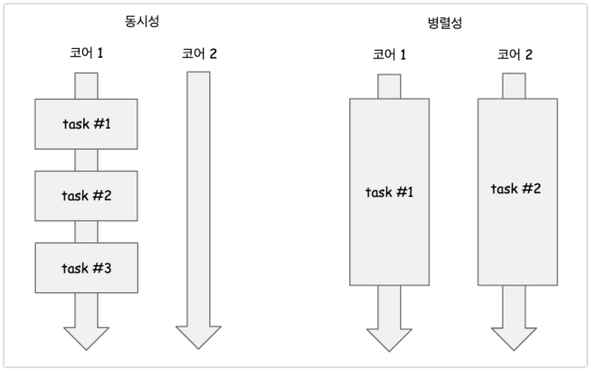

## 멀티스레딩 기본 용어들 및 개념들

**참고자료** : [모던 자바 인 액션](http://www.yes24.com/Product/Goods/77125987) 

 

## 목차

- [동시성과 병렬성](#동시성과-병렬성) 
- [동기 vs 비동기, 블로킹 vs 논블로킹](#동기-vs-비동기-블로킹-vs-논블로킹) 

 

## 동시성과 병렬성

동시실행 코드와 병렬실행 코드는 개념이 명확히 다르다ㅈ. 나 조차도 "동시에 실행되는 것이 나도 모르게 병렬로 수행되는거 아냐?" 이렇게 인식될 때가 굉장히 자주 있었다. 

동시와 병렬의 의미는 명확히 다르다. **동시**는 **하나의 코어에서 여러개의 작업을 동시에 실행되는 느낌이들도록 하는 것을 의미**한다. **병렬**은 **여러개의 코어에 세부 스레드들을 각각 실행되도록 분산시켜서 실행하는 것을 의미**한다.  

개인적인 의견이지만, **병렬**로 문제를 풀어낸 다는 것의 의미는 **"어느 정도는 하드웨어의 성능에 의존적이라는 의미"**이기도 하다. 애플리케이션이 동작하는 운영/개발환경에 CPU의 코어 수가 몇개가 있는지, 운영체제는 멀티코어를 지원하는지에 따라 수행시간이 달라지게 된다. 즉, 하드웨어의 성능에 의존적인 코드이다. 

 

**동시성** 

- 하나의 CPU 코어에서 여러 작업들을 동시에 실행하는 듯한 느낌을 주는 것 
- 이렇게 하기 위해서 메인 스레드의 흐름에서 오래걸릴 듯해 보이는 자식스레드를 풀어놓고 메인 스레드의 흐름과 자식 스레드를 번갈아 가면서 실행하는 것 
- 운영체제 내에서 실제로 사용자가 풀어놓은 스레드 들을 라운드 로빈 등의 스케쥴링 방식으로 스레드들을 스케쥴링하고, 사용자는 이에 대해 몰라도 동시에 실행되고 있는 듯한 느낌을 받는 것이다. 
- CompletableFuture 로 구현 가능하다. (모던 자바 인 액션 15,16장 참고) 

 

**병렬실행**  

- 여러개의 CPU에 여러 작업을 분산 시켜서 실행하는 것 
- 하나의 작업을 하나의 CPU에서 돌리고 그 동안 다른 작업도 다른 코어에서 돌리고 이런 방식을 병렬성이라고 부른다. 
- 동시성기반으로 작성된 코드를 여러 코어에 분산시켜서 병렬로 놓을 수도 있겠다는 생각도 든다. 
- 병렬 스트림, 포크/조인 프레임워크로 구현 가능하다. (모던자바인 액션 7장 참고) 

 

 

## 동기 vs 비동기, 블로킹 vs 논블로킹

> 참고자료 : [모던 자바 인 액션 - 16.1절 마지막 부분](http://www.yes24.com/Product/Goods/77125987) 

책의 16.1 장 맨 끝에서 동기, 비동기, 블록호출, 비블록 호출에 대해서 정리해주고 있다. 이런 글은 매너상 맨 앞에 두어야 하는데, 왜 맨 뒤에 두었는지 이해가 안되기도 했다.  

**동기 API** 

- 전통적인 동기 API는 메서드의 호출하고 동작이 완료되어 리턴하고 난 후 그 다음 동작을 수행한다. 
- 즉, 하나의 동작이 끝나는 시점까지 기다렸다가 그 다음 동작을 수행하는 것을 의미한다. 

 

**블록 호출(blocking call)** 

- 이렇게 동기 API를 사용하는 상황을 블록 호출(blocking call)이라고 한다. 

 

**비동기 API** 

- 비동기 메서드를 실행하면 리턴이 그 즉시 이루어진다. 
- 물론 해당 아직 작업을 수행중인데, 다른 스레드에서 실행되고 있는 중이다. 
- 다른 스레드에서 아직 수행중인 작업이 완료된 시점에 대한 처리는 보통 콜백 메서드를 전달하는 식으로 처리하는 경우가 많다. 
- 주로 I/O 시스템 프로그래밍에서 이와 같은 방식으로 동작을 수행한다.

 

**비블록 호출(non-blocking call)** 

- 이렇게 비동기 API를 사용하는 상황을 비블록 호출(non-blocking call)이라고 한다. 

 

