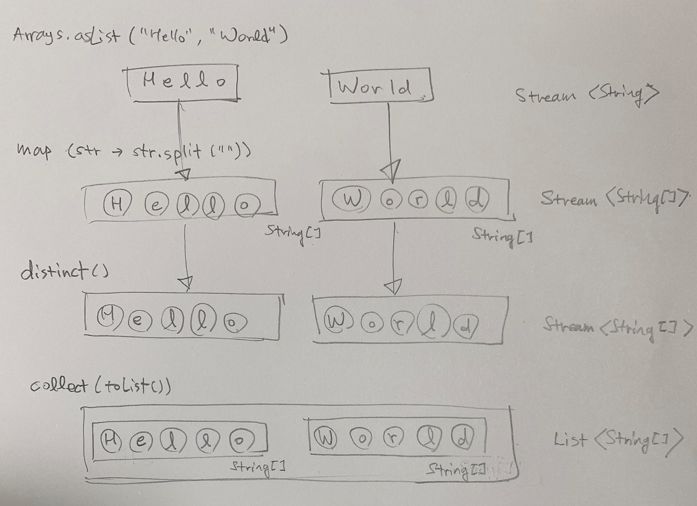
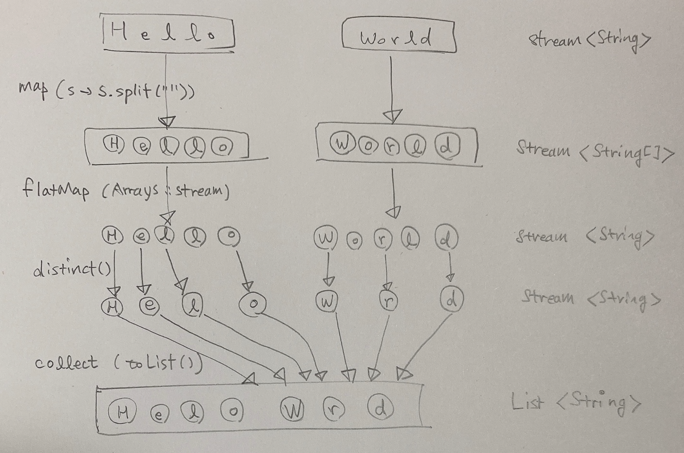

# 스트림 평면화하기 - map(), flatMap()

> List<String> words = Arrays.asList("Hello", "World");

위와 같이 선언된 문자열의 리스트를 `H, E, L, L, O, W, O, R, L, D` 로 변경하는 예제로 map(), flatMap() 함수의 동작을 정리할 예정이다.

<br>

## map() 함수로 문자열 조각내기

**테스트 코드**

```java
// String [] 으로 나뉜 각각의 스트림을 갖는다는 것은 조금 불편한 점이긴 하다.
@Test
@DisplayName("map함수로_문자열_조각내기")
void map함수로_문자열_조각내기(){
  List<String> words = Arrays.asList("Hello", "World");
  List<String[]> wordArrays = words.stream()
    .map(word -> word.split(""))
    .distinct()
    .collect(Collectors.toList());

  wordArrays
    .stream()
    .forEach(array->{
      String str = Arrays.toString(array);
      System.out.println(str);
    });
}
```

<br>

**출력결과**

```plain
[H, e, l, l, o]
[W, o, r, l, d]
```

<br>

위의 코드의 동작을 그림을 그려보면 아래와 같다.



<br>

## map() 함수에 트릭을 써서 flatMap() 흉내내보기

**테스트 코드**

```java
// [h, e, l, l, o] [w, o, r, l, d] 가 [ h, e, l, l, o], [ W,o,r,l,d] 처럼 변경된 것 같지만 실제로는 아래와 같은 모양이다.
// [ Stream h, Stream e, Stream l, Stream l, Stream o ], [ Stream w, Stream o, Stream r, Stream l, Stream d]
// Stream<String> 으로 각각 분할되었다. 데이터의 원본인 String 으로 처리하는게 더 깔끔한데, 이건 조금 아직도 불편한 감이 있다.
@Test
@DisplayName("map함수에_트릭을_써서_flatMap_흉내내보기")
void map함수에_트릭을_써서_flatMap_흉내내보기(){
  List<String> words = Arrays.asList("Hello", "World");
  List<Stream<String>> streamedArray = words.stream()
    .map(word -> word.split(""))
    .map(array -> Arrays.stream(array))
    .collect(Collectors.toList());

  streamedArray
    .stream()
    .forEach(stream -> {
      stream.forEach(str -> {
        System.out.print(str + ", ");
      });
    });
}
```

<br>

**출력결과**

```plain
H, e, l, l, o, W, o, r, l, d,
```

<br>

## flatMap() 함수로 스트림을 평면화하기 (1)

**테스트 코드**

```java
// 위에서 Stream<String> 으로 변환한 것에 착안해
//  String [] -> Stream<String> 으로 변환하고
//  flatMap 을 이용해 Stream<String> -> String 으로 변환해준다.
//  이렇게 String 으로 변환되었음을 확인하기 위해 아래 예제에서는 toUpperCase() 함수를 적용했다.
@Test
@DisplayName("flatMap함수로_스트림을_평면화해보자_1")
void flatMap함수로_스트림을_평면화해보자_1(){
  List<String> words = Arrays.asList("Hello", "World");
  List<String> flatResult = words.stream()
    .map(word -> word.split(""))
    .flatMap(array -> Arrays.stream(array))
    .map(s-> s.toUpperCase())
    .collect(Collectors.toList());

  System.out.println(flatResult);
}
```

<br>

**출력결과**

```plain
[H, E, L, L, O, W, O, R, L, D]
```

<br>

## flatMap() 함수로 스트림을 평면화하기 (2)

**테스트 코드**

```java
// 위의 flatMap 예제에서는 [Hello, World] 를 [H,E,L,L,O, W,O,R,L,D] 로 변환했었다.
// 이렇게 변환된 [H,E,L,L,O, W,O,R,L,D] 를 중복된 문자를 제거해서
// [H, E, L, O, W, R, D] 로 변환해보자.
@Test
@DisplayName("flatMap함수로_스트림을_평면화해보자_2")
void flatMap함수로_스트림을_평면화해보자_2(){
  List<String> words = Arrays.asList("Hello", "World");
  List<String> characters = words.stream()
    .map(word -> word.split(""))
    .flatMap(array -> Arrays.stream(array))
    .map(string -> string.toUpperCase())
    .distinct()
    .collect(Collectors.toList());

  System.out.println(characters);
}
```

<br>

**출력결과**

```plain
[H, E, L, O, W, R, D]
```

<br>

위의 스트림 함수를 사용할 때의 연산과정을 그림으로 표현해보면 아래와 같다.



<br>