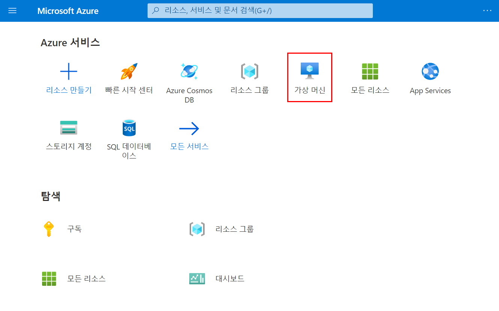
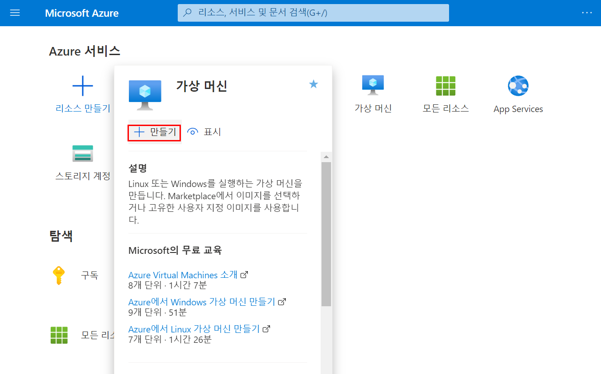
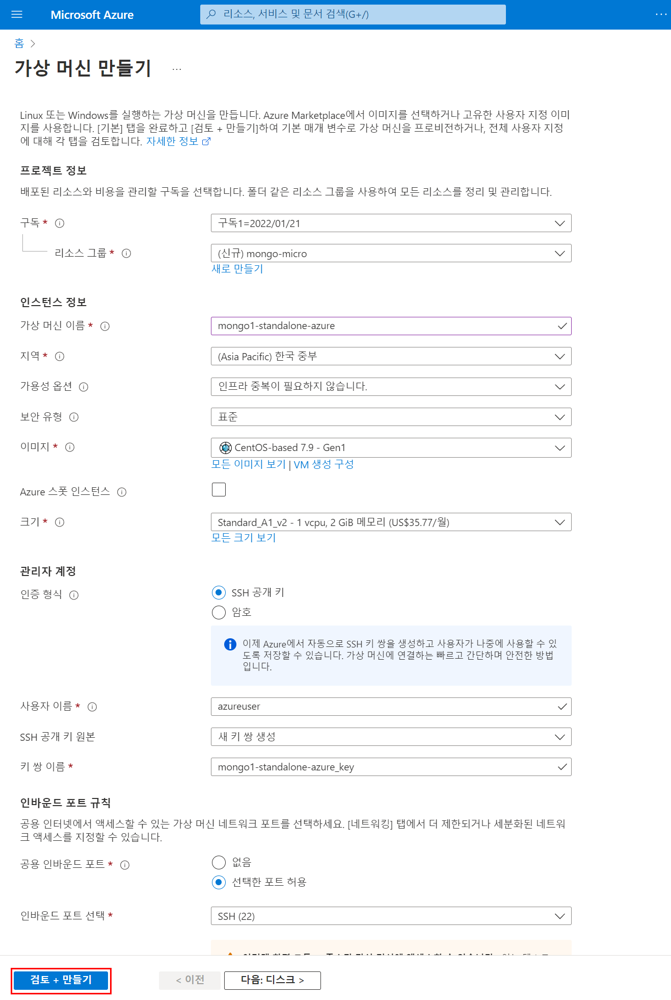
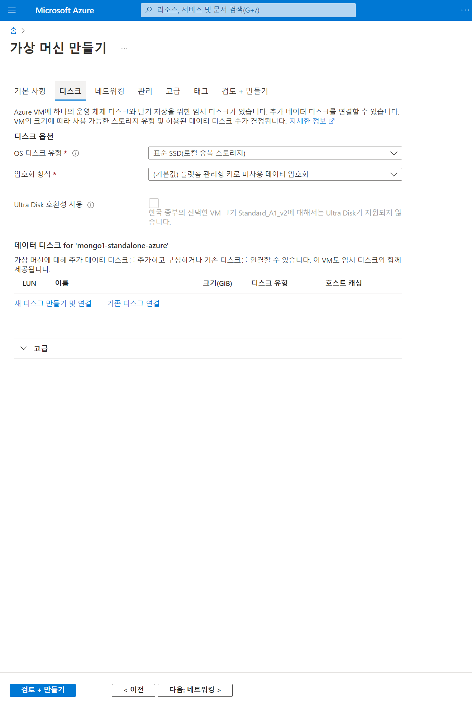
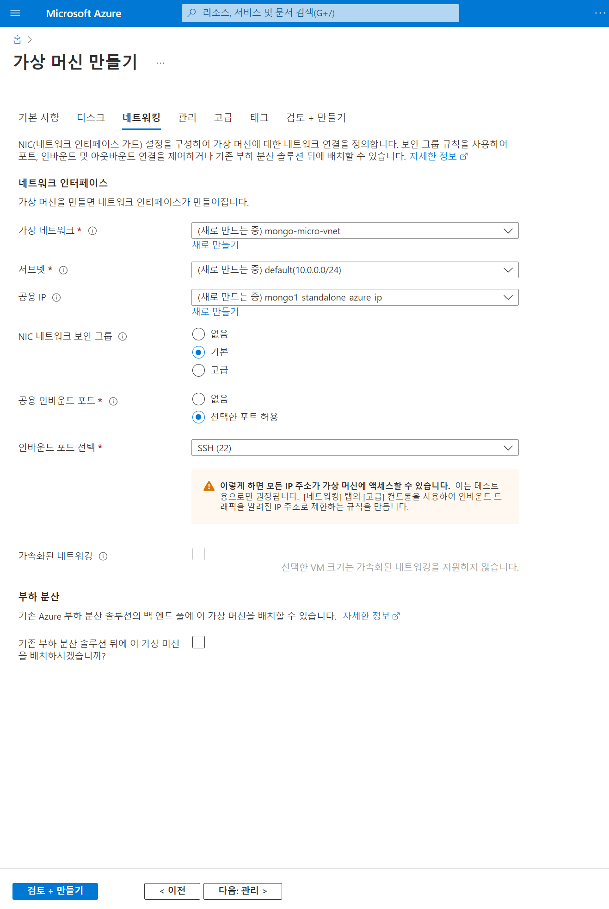
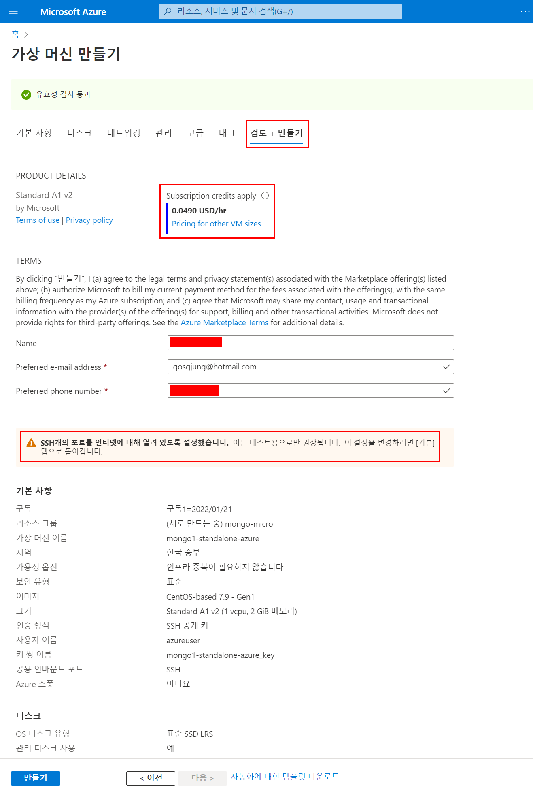
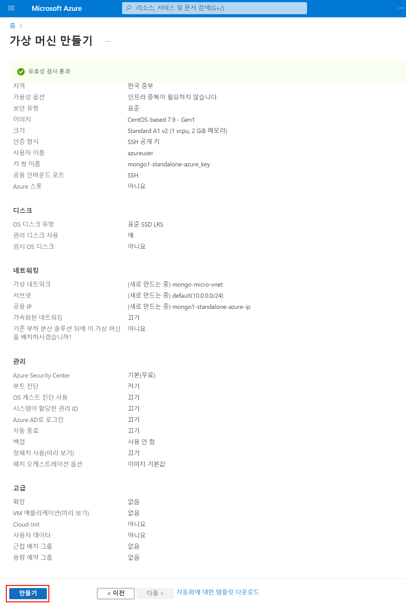
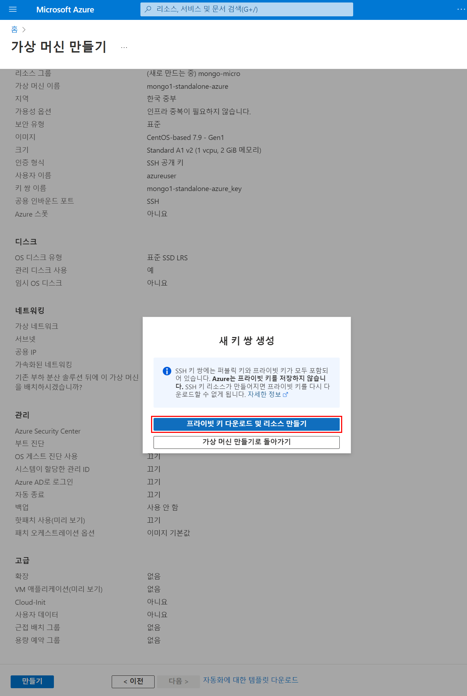

# Azure 무료 크레딧 이용하기 

검색해보니 vultur 등의 서비스가 많았다. 하지만 나는 귀찮다. Azure를 사용하기로 했다. 그 중에서도 Azure Cosmos 를 사용할까 하고 찾아보다가 그냥 일단은 가상 인스턴스에 설치해서 사용하는 방식을 선택했다. 

이번 글에 어떻게 구독을 했는지 남겨두는 이유는 세부 설정이나 리소스 명이 헷갈릴 때 다시 보면 될 것 같아서 일단 이렇게 남겨두었다. 

 

만들기 버튼을 눌러서 가상머신을 만든다.

가상머신 만들기

- azure 1 은 gosgjung 으로 시작하는 메일에 등록했다.
  - 그리고 가상머신 호스트 명은 mongo1-standalone-azure 다.
- azure2 는 soon.good 으로 시작하는 메일로 등록했다.
  - 그리고 가상머신 호스트 명은 mongo2-standalone-azure 다.

 

디스크 설정은 별 설정을 해주지 않았다.

 

 

그냥 싹다 무시하고 가상머신을 만들었다.

 

프라이빗 키를 다운로드 해서 가상머신 만들기 작업을 마무리 짓는다.

 

