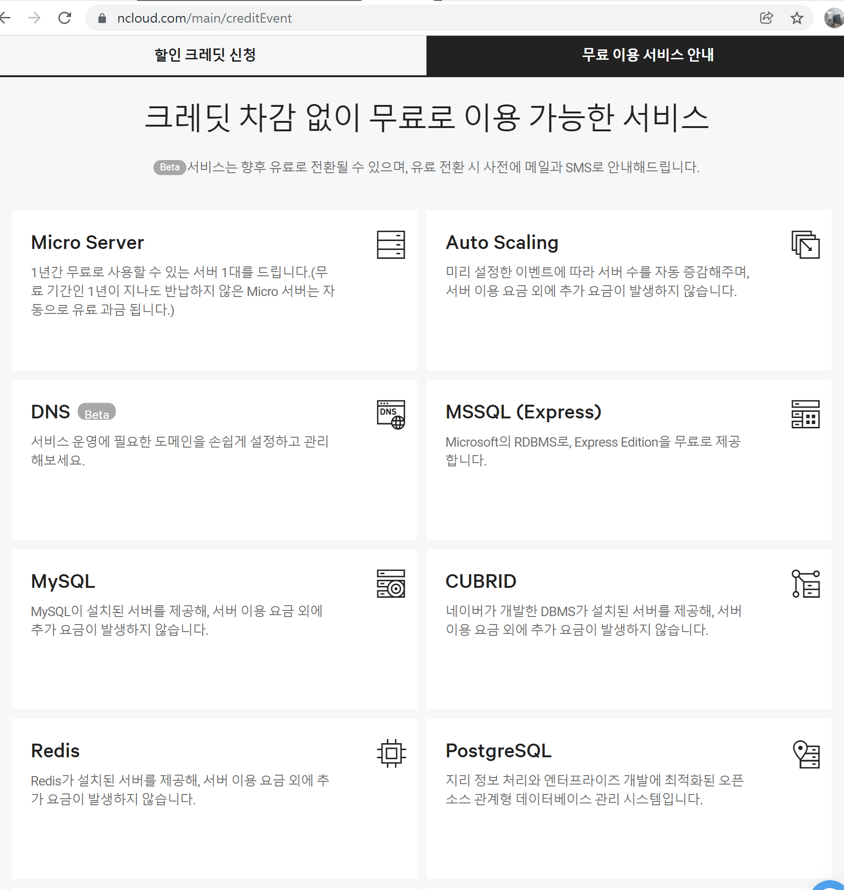
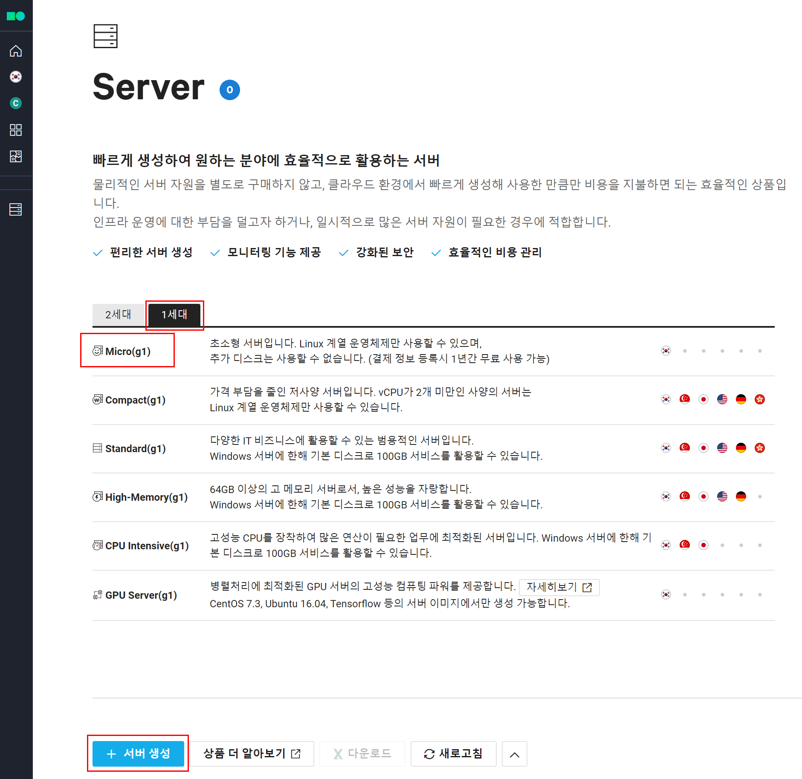
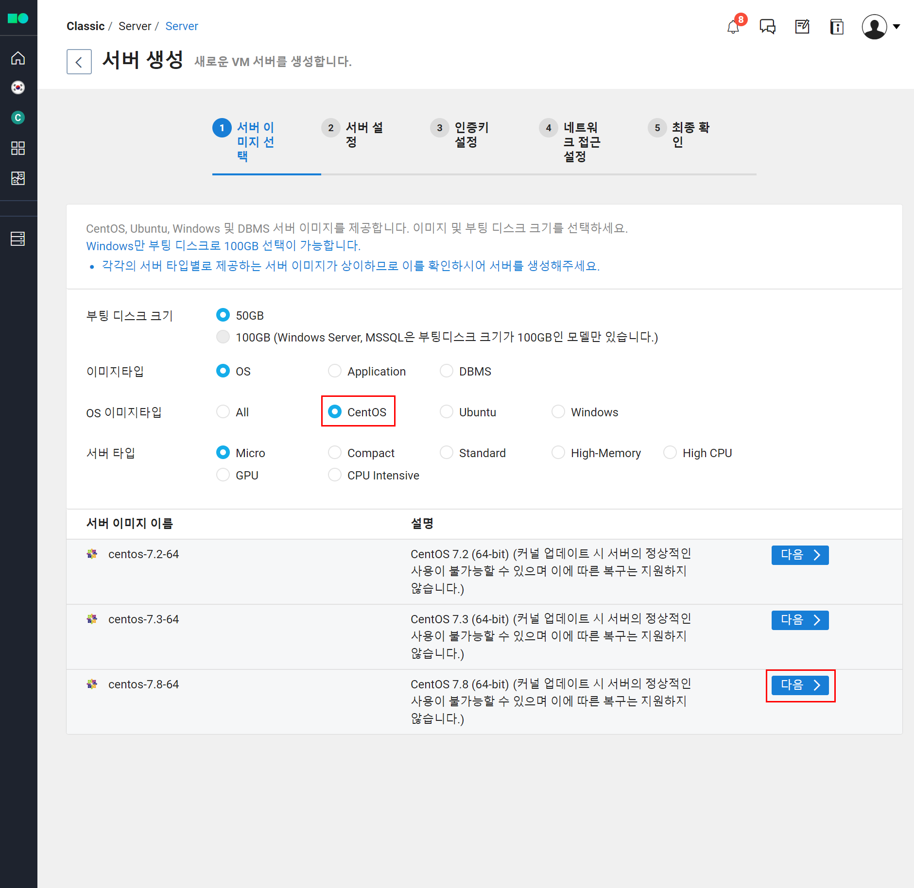
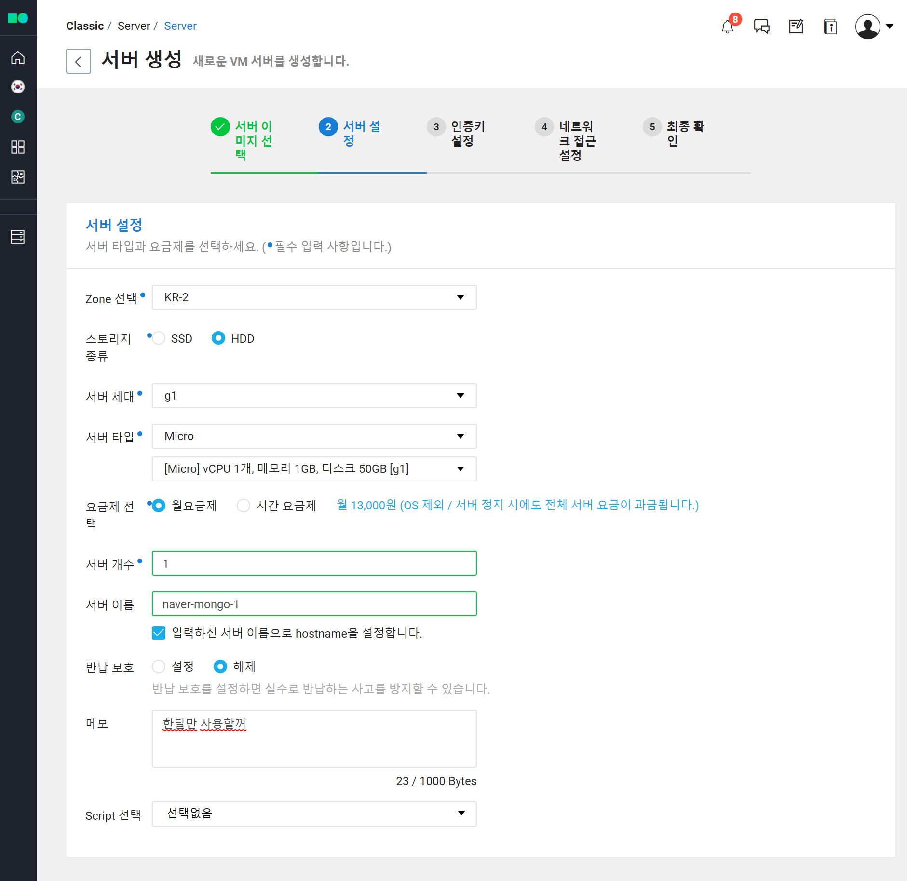
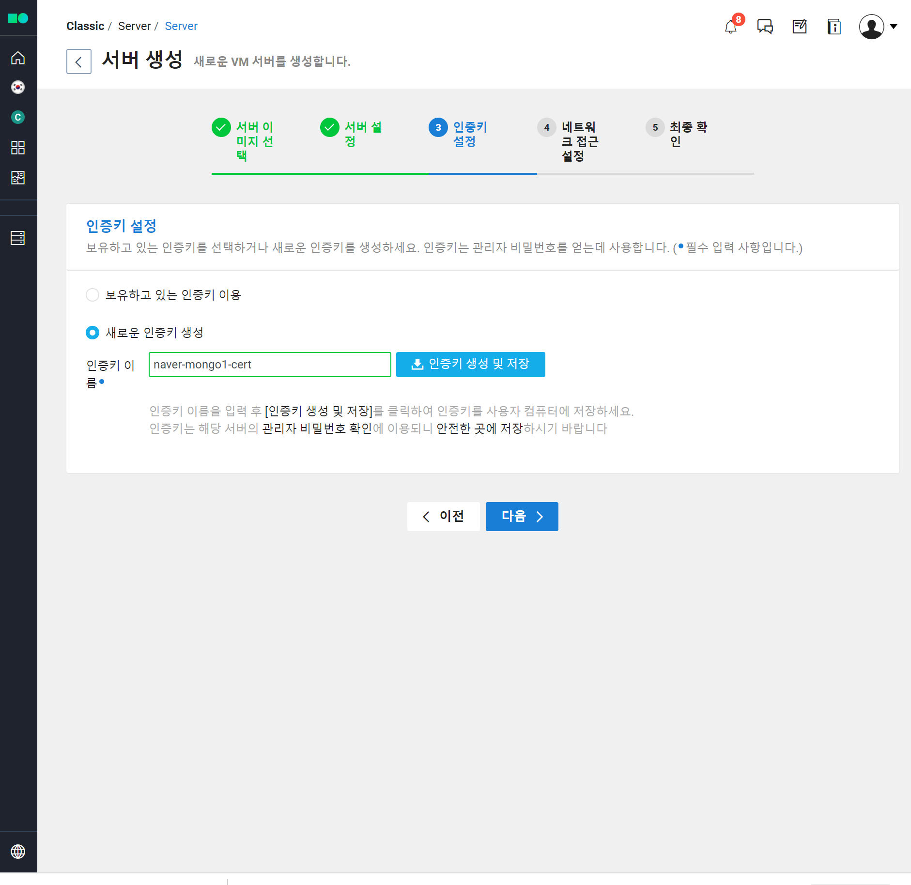
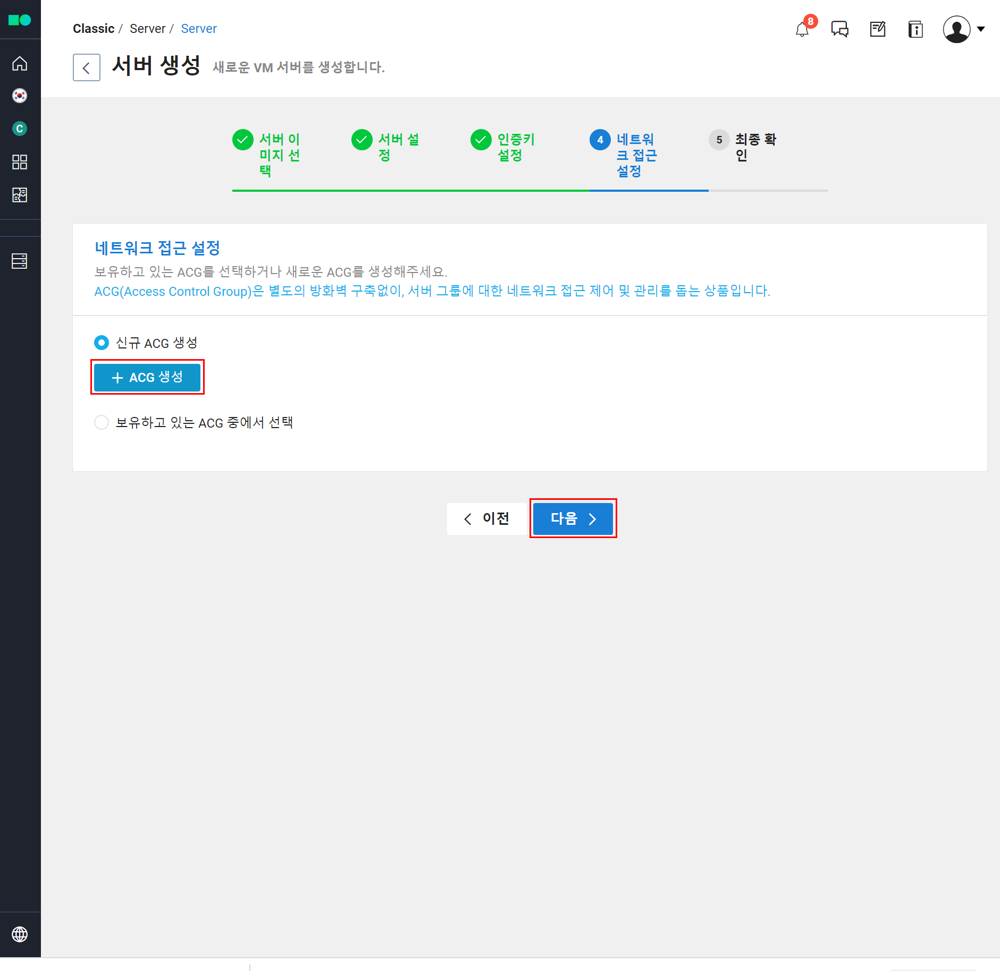
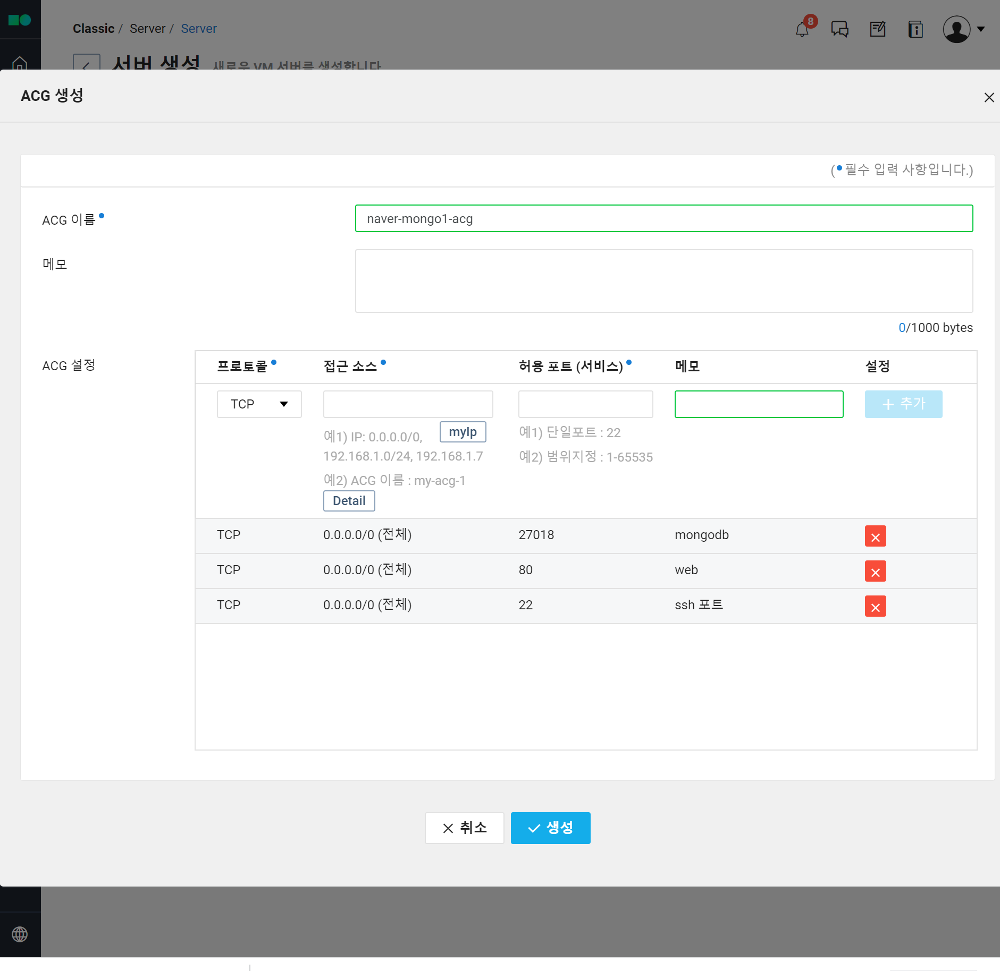
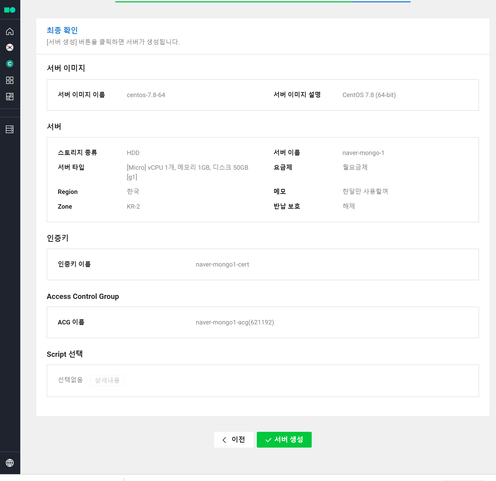
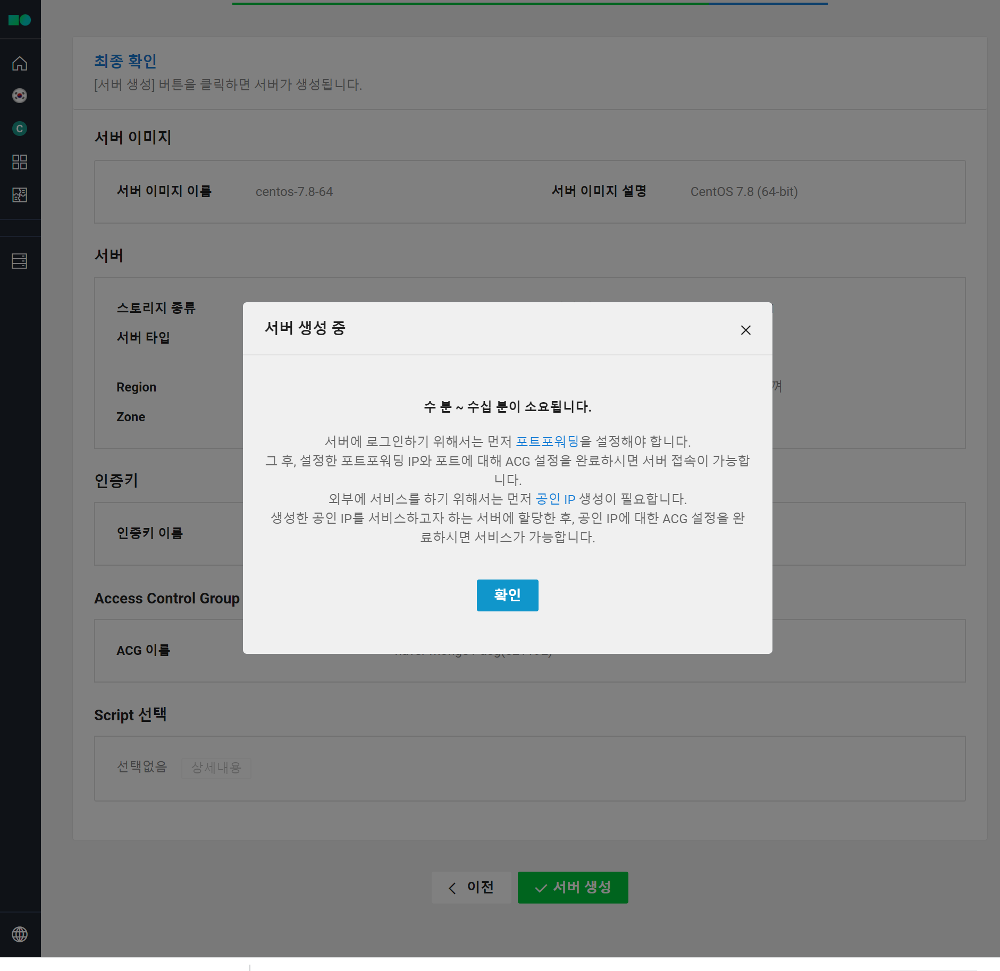

# 네이버 클라우드 무료 크레딧 이용하기

개인적인 사정으로 인해 아마존 AWS에 가입한 모든 개인계정들의 유료인스턴스들을 모두 종료&삭제했다. ㅠㅠ 

그런데 yfinance 데이터를 모아두는 용도로 MongoDB 클러스터를 구축해야 하는 일이 있어서 급하게 알아보다보니 요즘 네이버 클라우드를 사용할 때 Micro 서버를 사용하면 싸게 사용할 수 있는 것 같았다. 

크레딧 이벤트 페이지 

https://www.ncloud.com/main/creditEvent 

 

나는 이미 무료 구독정책에 해당하지 않아서 이걸 신청하면 12000원이 과금된다. 이정도면 그래도 나한테는 싸다는 생각이 든다. 

아래 화면에서 Micro Server 를 선택하자.

서버 생성시에는 1세대로 메뉴를 꼭 바꿔서 해야 한다. 그래야 Micro 서버를 선택하는 화면이 나온다. 엉뚱하게 다른 것을 선택하면 과금되니 주의하자.

OS 타입은 CentOS를 선택했고, 서버 이미지는 centos 7.8 을 선택했다. 흐흐흐... 잠깐 동안 우분투를 강제로 사용당해서 너무 우울했었다.

 

아래와 같이 입력해주고 다음 버튼 클릭 

아래와 같이 인증서 파일 명을 입력해주고 인증키 생성 및 저장 버튼을 누르면 pem 파일이 다운로드 된다.

 

신규 ACG 생성

 

ACG는 아래와 같이 구성했다. 생성버튼 클릭

 

서버 생성 버튼 클릭

 

알림창이 뜨는데 대충 읽지 말고 확인 버튼누르면 된다.

 

몽고DB 클러스터 셋을 하나 구성하려먼 나머지 두개의 인스턴스를 구해야 하는데 이렇게 계획중이다.

- MS Azure 내에 가상머신 무료인스턴스 개설 
- Linode 또는 AWS... 나는 AWS의 노예일세

 

