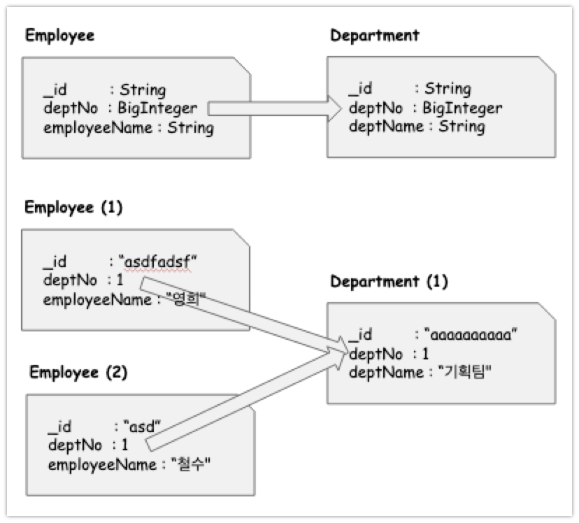
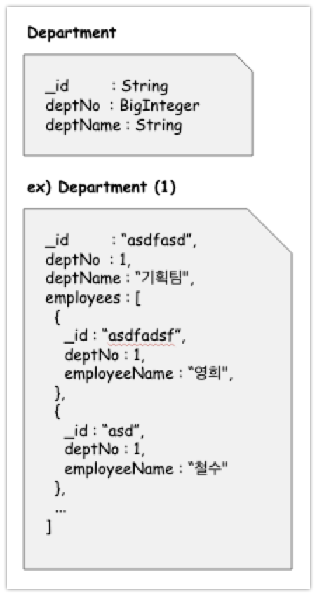
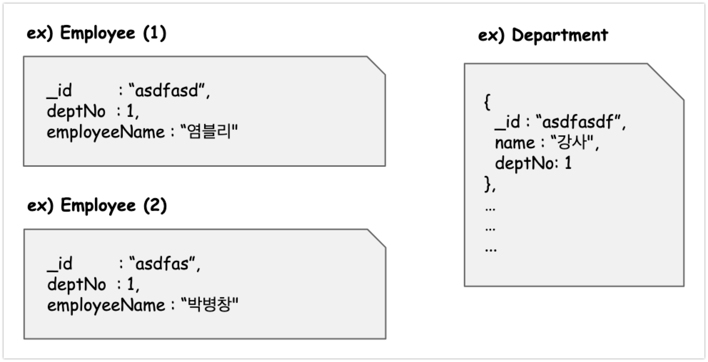
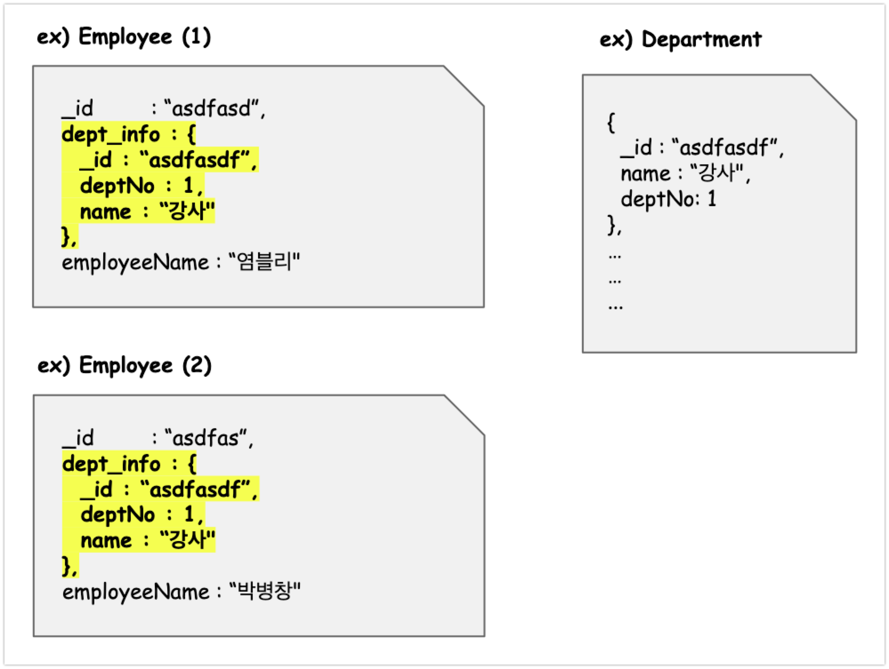
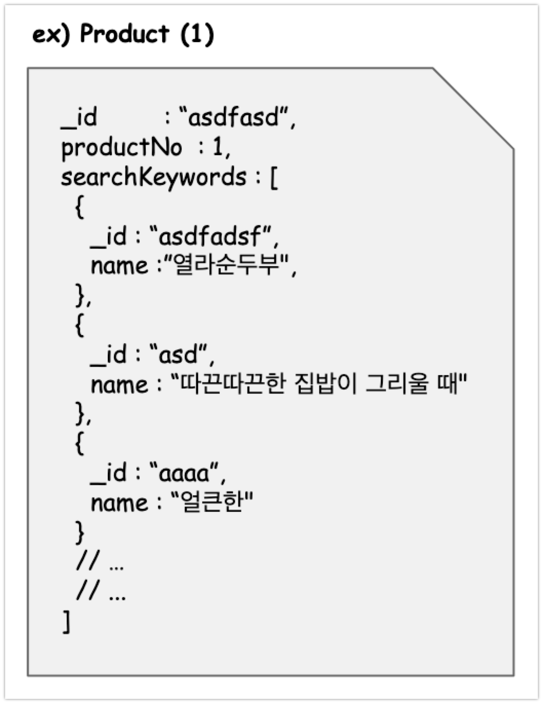
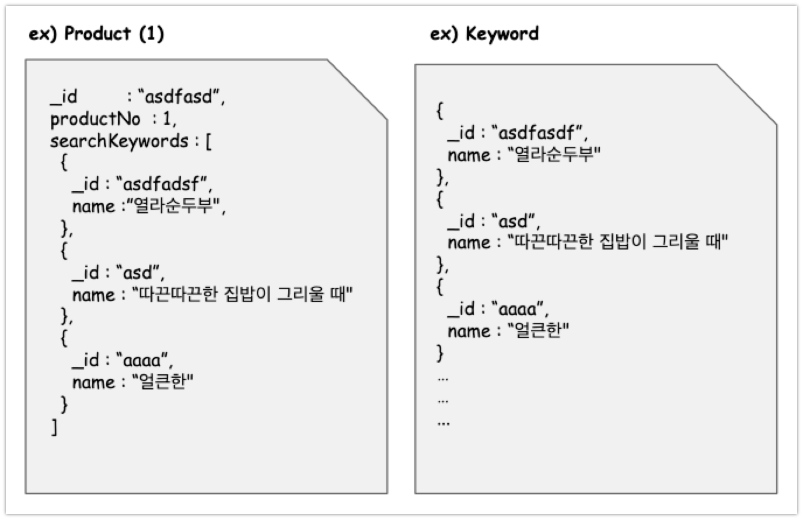

# MongoDB의 참조방식들

MongoDB에서는 컬렉션의 도큐먼트 간 서로 데이터를 참조하는 방식은 아래의 방식들이 있다. (RDB에서의 JOIN 과 유사한 개념이다.) <br>

- 레퍼런스 방식<br>
- 확장된 레퍼런스 방식(Extended Reference Pattern)<br>
- 임베디드 방식<br>
- subset 패턴<br>

- Attribute Pattern<br>
  - [www.mongodb.com/blog - Attribute Pattern](https://www.mongodb.com/blog/post/building-with-patterns-the-attribute-pattern)<br>
- Outlier Pattern<br>
  - [www.mongodb.com/blog - Outlier Pattern](https://www.mongodb.com/blog/post/building-with-patterns-the-outlier-pattern)<br>

<br>

## 목차

- [참고자료](#참고자료)<br>
- [레퍼런스 방식](#레퍼런스-방식)<br>
- [임베디드 방식](#임베디드-방식)<br>
- [레퍼런스 방식과 임베디드 방식의 차이점](#레퍼런스-방식과-임베디드-방식의-차이점)<br>
- [임베디드 방식의 장단점](#임베디드-방식의-장단점)<br>
  - [단점](#단점)<br>
  - [장점](#장점)<br>
- [Extended Reference 패턴 (확장된 레퍼런스 방식)](#extended-reference-패턴-확장된-레퍼런스-방식)<br>
- [subset 패턴](#subset-패턴)<br>
- [Attribute 패턴](#attribute-패턴)<br>
- [Outlier 패턴](#outlier-패턴)<br>

<br>

## 참고자료

- 주교재<br>
  - [맛있는 MongoDB](http://www.yes24.com/Product/Goods/85011885)<br>

- MongoDB 공식 매뉴얼<br>
  - [www.mongodb.com - subset pattern](https://www.mongodb.com/blog/post/building-with-patterns-the-subset-pattern)<br>
  - [www.mongodb.com/blog - Extended Reference Pattern](https://www.mongodb.com/blog/post/building-with-patterns-the-extended-reference-pattern)<br>
  - [www.mongodb.com/blog - Attribute Pattern](https://www.mongodb.com/blog/post/building-with-patterns-the-attribute-pattern)<br>
  - [www.mongodb.com/blog - Outlier Pattern](https://www.mongodb.com/blog/post/building-with-patterns-the-outlier-pattern)<br>

<br>

## 레퍼런스 방식

레퍼런스 방식은 아래와 같은 형식이다. 학교에서 처음 데이터베이스를 배울 때 Employee,Department 를 예제로 하는 경우가 많아서 아래의 예제를 만들어봤다.



레퍼런스 방식에서는 정보의 양이 늘어날수록 크기가 작은 도큐먼트의 갯수가 늘어난다. 그리고 도큐먼트 들 사이의 관계를 저장하기 위한 필드가 더 필요하게 된다. 레퍼런스 방식과, 임베디드 방식은 자주 비교되며 장단점을 비교하는 편인데 여기에 대해서는 뒤에서 레퍼런스 방식과 임베디드 방식의 차이점을 정리해볼 예정이다.<br>

<br>

## 임베디드 방식

> 참고) MongoDB 에서는 관계형 DB에서의 각 테이블의 row 와 같은 개념을 **'도큐먼트'** 라고 부른다.<br>

아래와 같이 참조관계에 있는 도큐먼트 들을 배열로 표현해 저장하는 방식을 임베디드 방식의 모델이라고 한다. 이 방식에는 한계점이 있다. MongoDB의 도큐먼트의 크기는 16MB까지가 제한되어 있다. 이 16MB 의 제한이 걸려있는 문제로 인해 배열 사이즈가 무한히 길어질 경우 데이터가 유실될 위험 역시 존재한다. 이런 경우 **subset** 패턴 등을 적용하기도 한다.<br>

subset pattern 에 대해서는 아래에서 자세히 다루겠지만, 참고할 만한 자료는 아래와 같다.<br>

- [www.mongodb.com - subset pattern](https://www.mongodb.com/blog/post/building-with-patterns-the-subset-pattern)<br>

<br>



<br>

## 레퍼런스 방식과 임베디드 방식의 차이점

**레퍼런스 방식**의 경우 정보의 양이 늘어날 수록 도큐먼트의 수가 늘어난다.<br>

**임베디드 방식**의 경우 정보의 양이 늘어날 수록 도큐먼트의 크기가 커진다.<br>

**레퍼런스 방식**의 경우 도큐먼트들 사이의 관계를 저장하기 위한 필드가 더 필요하다. <br>

**임베디드 방식**은 도큐먼트 내의 배열 필드를 수정하는 방식으로 정보를 추가한다.<br>

**레퍼런스 방식**의 경우 연결된 정보를 SELECT ALL 해올 경우는 부하가 있을 수 있다.<br>

**임베디드 방식**은 연결된 정보를 SELECT ALL 해올 경우 단순히 배열 형태의 필드를 반환하면 되므로 부하가 크지 않다. (하지만, 전체 내용을 불러오기보다는 페이지네이션을 적용하는 경우가 더 많기 때문에, 현실적으로 SELECT ALL을 해오는 경우는 많지 않다는 점도 생각해야 한다.)<br>

<br>

## 임베디드 방식의 장단점

### 단점

**배열 필드 내에서 필요한 정보를 추려낼때 조회 성능 저하**<br>

임베디드 방식을 사용할 경우 임베디드 된 데이터의 경우 배열과 같은 자료구조로 저장되어 있는데, 이 배열 내에서 필요한 정보만을 불러와야 할 경우 읽기 성능이 느려질 수 있다.<br>

<br>

**전체 데이터를 통으로 불러올 경우는 유리, 하지만 일부 페이지를 선택해 들고올 때는 불리**<br>

전체 데이터를 한꺼번에 들고오는 경우는 배열 방식의 경우 유리하다. 하지만 일부 페이지를 선택해 들고 올 때는 조금 불리한 편이다. 페이지네이션을 적용하거나 탑N 성 쿼리를 보낼때는 불리해지는 편이다.<br>

<br>

**subset 패턴, TopN 쿼리의 결과를 도큐먼트 내에 배열로 가지고 있기 위한 대안**<br>

TopN 쿼리가 제품의 특성으로 이미 결정지어져 있고, 자주 사용한다면 쿼리를 따로 작성하지 않고 subset 패턴을 통해 결합하는것도 좋은 방식이다. subset 패턴에 대해서는 글의 뒤에서 간결 명료하게 정리해볼 예정이다.<br>

<br>

**도큐먼트 크기제한 - 16MB** <br>

MongoDB에서 하나의 도큐먼트가 가질수 있는 최대 크기는 16MB이다. 정보의 양이 무한히 쌓이는 경우 도큐먼트의 특정 필드에 계속해서 배열에 데이터를 추가하게 되어 16MB를 넘어갈 수도 있다.<br>

<br>

**데이터 수정시의 단점**<br>

임베디드 방식은 배열 기반으로 저장되어 있는 필드를 수정해야 하는데, 배열기반의 필드에서 원하는 필드를 찾아서 수정하는 것은 성능상으로 불리하다.<br>

<br>

### 장점

**트랜잭션의 원자성**<br>

게시글 수정시 하나의 도큐먼트 내에서 수정하게 되므로 트랜잭션의 원자성이 지켜지게 된다.<br>

<br>

**SELECT ALL 시 조회 성능**<br>

SELECT ALL 시에 배열 기반으로 이루어져 있는 필드를 그대로 반환하면 되기 때문에 SELECT ALL 연산에 대한 성능이 보장된다. 하지만, SELECT ALL 보다는 특정 기간 검색에 특화되어 있는 제품이 많기 때문에 그리 유용한 선택은 아니다.<br>

<br>

**적용한다면 유리할 수 있는 경우들**<br>

배열로 저장할 필드가 적고 조건 조회에 성능이 소모되지 않는다면 임베디드 방식을 고려해보는 것도 좋은 방식이다.<br>

참조를 하지 않고도 필요한 정도의 데이터만을 추려서 배열로 가지고 있으면 유리한 경우가 있다. 예를 들면 Top N 쿼리가 적용된 필드를 미리 도큐먼트 내의 필드 하나에 배열로 가지고 있는 경우를 들 수 있다. 여기에 대해서는 아래에서 [subset 패턴](#subset-패턴) 에 정리해두었다.<br>

<br>

## Extended Reference 패턴 (확장된 레퍼런스 방식)

> **참고자료**<br>
>
> - [www.mongodb.com - The Extended Reference Pattern](https://www.mongodb.com/blog/post/building-with-patterns-the-extended-reference-pattern)<br>


<br>

[www.mongodb.com - The Extended Reference Pattern](https://www.mongodb.com/blog/post/building-with-patterns-the-extended-reference-pattern) 에서는 주문-고객 관계의 모델을 예로 들면서 Extended Reference 패턴을 위와 같이 표현하고 있다.<br>

N-1 관계의 모델에서 JOIN 작업을 줄이기 위해 주문마다 고객에 대한 모든 정보를 포함시키면 중복된 정보가 많이 발생한다. 그리고 주문에 일부 고객 정보가 필요하지 않는 경우 역시 있다.<br>

Extended Reference Model(확장 참조 패턴)은 이런 경우에 대해 적용할 수 있다. 고객에 대한 모든 정보를 복제하는 대신 자주 액세스 하는 필드만을 복사해준다. 모든 정보를 포함하거나 JOIN 정보에 대한 참조를 포함하지 않고 이름, 주소 같은 가장 자주 액세스되는 우선순위가 가장 높은 필드만 포함시킨다.<br>

위 그림을 보면 `Customer` 컬렉션내에서 자주 변하지 않으면서 `Order` 컬렉션 내의 `shipping_address` 필드에 두면 괜찮을 것 같은 항목들을 선정해서 따로 모아놓은 것을 확인할 수 있다.<br>

<br>

**Order 컬렉션 내에서 Customer 정보의 일부를 객체 형태로 담아놓은 부분**<br>

Customer 컬렉션 내의 name, street, city, country 를 shipping_address 항목 내에 추가해주었다.<br>

```json
{
  _id: ObjectId("asdfasdfasdfasdf"),
  // ...
  shipping_address: {
    name: "Katrina Pope",
    street: "123 Main St",
    city: "Somewhere",
    country: "Someplace"
  },
  order: [
    {
      // ...
    }
  ]
}
```

<br>

**단점, 유의할 점**<br>

**데이터가 중복된다는 점은 이 패턴의 단점이다.**<br>

- 이런 이유로 자주 변경되지 않는 필드들을 지정하는 것이 좋다.<br>
- 예를 들면 `user_id` 처럼 변경될 확율이 높지 않은 필드를 확장 객체 모델로 지정하는 것도 좋은 선택이다.<br>

<br>

**필요한 데이터만 가져와서 복제해야 한다.**<br>

- 주문 송장에 고객의 나이, 닉네임 이런 것들을 포함할 필요는 없다. 필요한 정보인 이름정보,주소정보 만을 추가하는 것이 더 낫다.<br>

<br>

**Extended Reference 모델 보다는 레디스 또는 멤캐시와 같은 인메모리 Database로 대체할 수 있다면 인메모리 Database를 활용하는 방식으로 대체하는 것이 좋다.**<br>

- [mongodb 블로그](https://www.mongodb.com/blog/post/building-with-patterns-the-extended-reference-pattern)에서는 언급하고 있지는 않지만, Extended Reference 모델은 주로 도큐먼트에 대한 메타 정보를 가져와야 할 때 사용하는 것 같다는 느낌을 받았다.<br>
- 주로 도큐먼트에 객체 형태로 가지고 있으면서 조인을 하지 않기 위해 사용하는 것으로 보인다. 이런 목적이라면, 메타정보 성격의 데이터들은 인메모리 DB에 저장해두는 것도 좋은 방법으로 보인다.<br>

<br>

**예제 #1**<br>

아래는 직접 작성해본 예제이다. Employee, Department 모델을 예제로 만들어봤다. Employee와 Department 각각은 deptNo 를 관계로 해서 서로를 참조할 수 있다.<br>

**적용 전**<br>



<br>

**적용 후**<br>

Department 에서 자주 변경되지 않을 것 같은 항목인 `deptNo`와 `_id` 를 Employee 컬렉션 내의 도큐먼트의 필드 dept_info 필드에 추가해주었다.



확실히 이런 메타정보 성격의 데이터는 아래와 같은 방식을 사용하기 보다는<br>

- N-1 모델로 JOIN<br>
- Extended Model로 설계를 보완<br>

인메모리 데이터베이스인 Redis, Memcached 를 사용하는 것이 더 좋은 선택인 것 같다는 생각이 든다.<br>

<br>

## subset 패턴

> **참고자료**<br>
>
> - [www.mongodb.com - subset pattern](https://www.mongodb.com/blog/post/building-with-patterns-the-subset-pattern)<br>

<br>

subset 패턴은 개념적으로 정리하는 것보다는 예를 들어서 정리하는 것이 낫겠다는 생각이 들었다. 위의 mongodb 블로그에서는 subset pattern 을 사용하면 좋은 여러가지 경우를 예를 들어주고 있다. `상품` 컬렉션과 `리뷰` 컬렉션의 관계를 통해 설명하고 있고, 내용이 어렵지 않아 금방 이해가 되었다.(영어를 읽는 것은 조금 힘들었다. 도입부에 디스켓 이야기로 길게 이야기한 것은 조금 이상하긴 했다.)<br>

아래 예제는 이해를 쉽게 하기 위해 [www.mongodb.com - subset pattern](https://www.mongodb.com/blog/post/building-with-patterns-the-subset-pattern) 을 바탕으로 예제를 하나 만들어본 예제이다.<br>

<br>

**쇼핑몰의 연관검색어 리스트 출력 예**<br>

쇼핑몰의 물건을 MongoDB에 저장하려 한다고 해보자. 이 Product (물건) 컬렉션의 경우 아래와 같이 연관검색어를 임베디드 패턴으로 저장하고 있다고 해보자. 이 Product 는 지금까지 무리 없이 잘 운영되고 있었다. <br>

하지만, 10년이 지는 어느 순간부터 "열라면"이라는 상품(Product)에 대한 연관검색어가 1700만건 이상 생겼다. 도큐먼트 하나의 데이터 크기는 최대 16MB 이하여야 한다. 1700 만건의 데이터가 하나의 도큐먼트에 배열로 쭉 생겼다는 것은 객체 하나당 1Byte라고 짧게 퉁쳐도 16MB를 넘어서게 된다. 물론, 예가 정말 터무니 없이 극단적인 예이긴 하다.<br>

하지만, document 내에 배열이 엄청 길어지면 필요한 것만을 찾아낼 때 로직을 따로 작성해야 하고, 데이터 정합성 관리도 안될것이다. 이런 단점을 보완할 수 있는 패턴 중 하나가 subset 패턴이다.<br>

<br>



<br>

쇼핑몰에서는 연관검색어가 100만개라고 해서 모두 보여줄 필요는 없다. 연관검색어 중에서 원하는 기준으로 추려서 5개 정도만 보여주어도 된다. 아래의 경우를 보자.<br>



Keyword 컬렉션에는 모든 사용자들의 keyword 를 저장하고 있는다. 그리고 Product 내의 `searchKeywords` 프로퍼티에는 가장 인기있는 검색어 3개만 저장하고 있는다. 이 `searchKeywords` 필드에는 저장하는 데이터의 성격은 TopN 쿼리 성격의 데이터이다. 이때 이렇게 저장되어있는 searchKeyword 필드같은 배열 필드인 임베디드 필드 역시 인덱싱 대상이 되는데, 이렇게 subset 패턴을 이용해서 가볍게 관리를 한다면, 재색인 연산을 할때 부하를 줄이기에도 유리할 것 같다.<br>

<br>

## Attribute 패턴

TODO 정리<br>

[Attribute Pattern](https://www.mongodb.com/blog/post/building-with-patterns-the-attribute-pattern)<br>

<br>

## Outlier 패턴

[Outlier Pattern](https://www.mongodb.com/blog/post/building-with-patterns-the-outlier-pattern)<br>

<br>

TODO 정리
