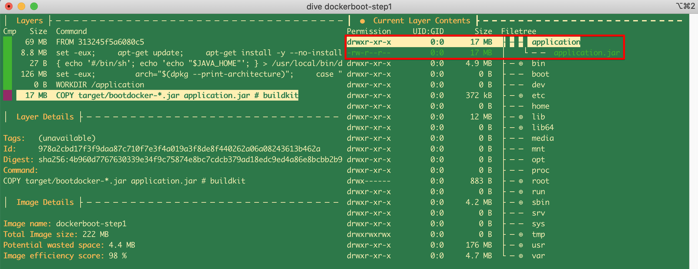
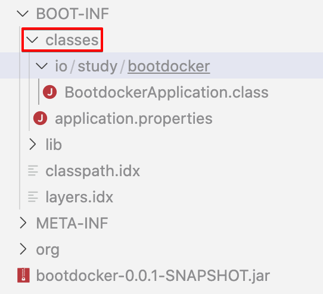

# 1.애플리케이션 도커이미지 만들기 기본빌드(통째로-빌드)

통째로 빌드하는 방식이다. 권장되지는 않는 방식이긴 하다. 빌드 속도가 오래걸리지 않거나, 프로젝트 사이즈가 크지 않을때 사용하면 좋은 방식일 것 같다. 그래도 애플리케이션의 이미지를 만드는 과정이라던가, jar 파일이 어떻게 생겼는지, 도커 내부 디렉터리 구조는 어떤 식으로 확인하는지 등을 이번 문서에서 정리했다.

<br>

## 참고

- https://docs.spring.io/spring-boot/docs/2.3.0.RELEASE/maven-plugin/reference/html/#introduction
- Dockerfile 명령어
  - https://www.daleseo.com/dockerfile/
- 도커 이미지 내부 디렉터리 탐색기 (dive)
  - https://github.com/wagoodman/dive

<br>

## SUMMARY

도커 이미지 내 디렉터리 탐색기<br>

https://github.com/wagoodman/dive<br>

<br>

**Dockerfile**

```dockerfile
FROM openjdk:11.0.8-jre-slim
WORKDIR application
ARG JAR_FILE=target/bootdocker-*.jar
COPY ${JAR_FILE} application.jar
ENTRYPOINT ["java","-jar","application.jar"]
```

<br>

**이미지빌드**

```bash
docker build -t dockerboot-step1
```

<br>

**도커 컨테이너 실행하기**

```bash
docker run --rm -p 8080:8080 dockerboot-step1
```

<br>

## 실습

**예제 프로젝트 생성**

간단한 예제를 도커 이미지로 만들 것이기 때문에 http://start.spring.io 에서 아무것도 안건들고 기본으로 설정된 그대로 스프링 프로젝트를 다운받았다.


**spring web mvc 의존성 추가**<br>

임베디드 톰캣이 계속 돌아가도록 지정하기 위해서는 **starter-web** 의존성을 추가해주어야 한다.

```xml
<dependency>
    <groupId>org.springframework.boot</groupId>
    <artifactId>spring-boot-starter-web</artifactId>
    <version>2.5.2</version>
</dependency>
```

<br>

**./mvnw clean package**<br>

./mvnw clean package 로 jar 파일의 패키지를 생성해두자.<br>

jar 파일이 생성된 모습은 아래와 같다.<br>


<br>

프로젝트 루트에 Dockerfile 을 만들어두자. 

```dockerfile
FROM openjdk:11.0.8-jre-slim
WORKDIR application
ARG JAR_FILE=target/bootdocker-*.jar
COPY ${JAR_FILE} application.jar
ENTRYPOINT ["java","-jar","application.jar"]
```

<br>

**도커 이미지 빌드**<br>

- `-t` 옵션 : 도커 이미지에 이름을 부여

만약 -t 옵션을 주지 않고 빌드할 경우 생성한 도커 이미지는 해시스트링과 함께 생성되는데, 나중에 찾기 쉬운이름이 아니기에, 가급적 -t 옵션으로 고유한 이름을 부여해 빌드하는 것이 권장됨

```bash
docker build -t dockerboot-step1 .
```

<br>

**참고) Dockerfile이 다른 디렉터리에 있거나, 다른 이름의 Dockerfile을 사용해야 하는 경우**<br>

만약 다른 디렉터리 위치에서 빌드해야 하는 경우(프로젝트 디렉터리 구조상 그래야 하는 경우)

아래와 같이 Dockerfile 파일이 있는 디렉터리 명을 직접 지정해주어서 빌드하는 것 역시 가능하다. 

또는 Dockerfile이름을 다른 방식으로 지정했을 경우 (Dockerfile_cbt 등) 해당 Dockerfile의 이름까지 지정해주어 빌드하는 것 역시 가능하다. (위의 명령어는 . 을 마지막 인자로 주어 현재 디렉터리에서 빌드하도록 옵션을 준것임)

```bash
$ docker build -t dockerboot-step1 ./bootdocker
```

<br>

**생성된 도커 이미지 확인하기**<br>

```bash
$ docker images

REPOSITORY         TAG              IMAGE ID       CREATED              SIZE
dockerboot-step1   latest           2a6b82e0ed4d   About a minute ago   213MB
...
```

<br>

**생성된 도커 실행하기 (포트 : 9991, 백그라운드로 실행)**<br>

```bash
# 명령어 형식
$ docker container run --rm -d -p 9991:8080 --name [생성될 컨테이너 명 입력 : 여기서는 dockerboot-step1] [도커이미지 이름 입력 : 여기서는 dockerboot-step1]

# 출력결과를 확인하고자 할 경우는 -d 옵션을 빼고 실행하자.

# 전체 명령어
$ docker container run --rm -d -p 9991:8080 --name dockerboot-step1 dockerboot-step1
```

<br>

**도커 이미지 파일 내부 확인**<br>

https://github.com/wagoodman/dive 에서 dive 라는 이름의 도커 디렉터리 탐색기를 다운로드 받고, 운영체제 맞도록 설치.<br>

맥OS에서는 아래의 명령어로 설치 가능하다.

```bash
$ brew install dive
```

<br>

도커 이미지 내의 내용을 확인하기 위해서는 아래의 명령을 입력한다.

```bash
$ dive [도커이미지이름(dockerboot-step1)] 
```

<br>

확인해보면 jar 파일 하나만 17MB 나 된다. (클래스 두개만 있는데 17MB)


만약 코드를 바꿔서 다시 빌드하면 또 17MB를 다시 만들어야 한다.<br>

우리가 만든 애플리케이션에 관련된 컨텐츠를 확인해보기위해 [Tab] 버튼을 눌러 오른쪽 창으로 이동해보면 아래와 같이 application 이라는 이름의 디렉터리가 따로 생생된 것을 확인할 수 있다. 그리고 이 디렉터리 내에는 application.jar 라는 이름의 파일이 위치하고 있다. 이 파일이 실제 docker 내부에서 동작하는 jar 파일이다. <br>

방금전 작성한 Dockerfile 내에서는 jar 파일을 통째로 `COPY` 명령어로 아래와 같은 구문으로 옮겨주었었다.<br>

> WORKDIR application<br>
>
> ARG JAR_FILE=target/bootdocker-*.jar<br>
>
> COPY ${JAR_FILE} application.jar<br>

<br>



<br>

## shell script 로 만들어두기

```bash
./mvnw clean package
docker build -t dockerboot-step1 .
docker container run --rm -d -p 9991:8080 --name dockerboot-step1 dockerboot-step1
```

<br>

## jar 파일 내부 디렉터리 구조 파악하기

밖으로 나와서 jar 파일을 적당한 위치에 복사하고, 그 위치로 이동해 jar 파일의 압축을 풀어보자

jar 파일의 압축을 푸는 명령어의 옵션은 -x 이고, 파일명 지정은 f 옵션이다.

```bash
cd target
mkdir sample
cd sample
cp -a ../bootdocker-0.0.1-SNAPSHOT.jar .
jar -xf bootdocker-0.0.1-SNAPSHOT.jar

# vscode 로 열어보기
code . 
```

생성된 디렉터리들은 아래와 같다.


<br>

알아보기 쉽게 텍스트로 정리해봤다.

```plain
BOOT-INF
|-classes
|-lib
|-classpath.idx
|-layers.idx

META-INF
|- maven         # pom.xml, 등의 파일들이 위치하고 있다.
|-MANIFEST.MF
org                    # spring 관련된 내용들이 주로 위치하고 있는 디렉터리 
		        # 부트 로더인데, MANIFEST.MF 를 보고 JarLauncher가 main 클래스 인것을 확인하고,  Spring boot classpath index 가 classpath.idx 파일에 있음 등등을 MANIFEST.MF에서 파악하게 된다.
```

위의 디렉터리 중에서 도커 이미지를 가볍게 만들고자 할 때 사용하게 되는 디렉터리는 classes, lib 이다. (다음 문서에서 정리할 예정이다. 예를 들면 애플리케이션 코드만을 수정했을 경우 classes 내의 파일만 COPY 명령을 수행하게 된다.)

<br>

### jar 파일 내의 디렉터리들 

#### BOOT-INF/classes

우리가 작성한 파일들이 들어가는 곳



<br>

#### BOOT-INF/lib

참조하는 라이브러리들 (메이븐 pom.xml 에 선언한 의존성 라이브러리들)


<br>

jar 파일 패키징 할 때 jar 파일 안에 들어가는 META 정보들이 들어있다.<br>

#### MANIFEST.MF

MANIFEST.MF 파일을 열어보자.


<br>

META-INF > MANIFEST.MF


