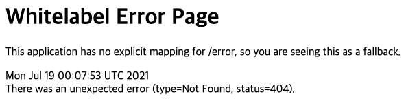

# 2.애플리케이션-도커이미지-만들기-디렉터리-커스터마이징

## 참고자료

- [Inflearn 강의 - 백기선님, 스프링 부트 업데이트](https://www.inflearn.com/course/%EC%8A%A4%ED%94%84%EB%A7%81%EB%B6%80%ED%8A%B8-%EC%97%85%EB%8D%B0%EC%9D%B4%ED%8A%B8) 
  - 이글을 보시는 분들 중 스프링 부트를 현업에서 사용하고 계신 개발자분이라면 [백기선님 강의](https://www.inflearn.com/course/%EC%8A%A4%ED%94%84%EB%A7%81%EB%B6%80%ED%8A%B8-%EC%97%85%EB%8D%B0%EC%9D%B4%ED%8A%B8) 를 꼭 들어보셨으면 합니다. 항상 강의 내용이 깔끔하고 주제전달이 명확하셔서 자주 듣게됩니다~!!
- https://docs.spring.io/spring-boot/docs/2.3.0.RELEASE/maven-plugin/reference/html/#introduction

<br>

## 저번문서에서 만든 도커 이미지

```dockerfile
FROM openjdk:11.0.8-jre-slim
WORKDIR application
ARG JAR_FILE=target/bootdocker-*.jar
COPY ${JAR_FILE} application.jar
ENTRYPOINT ["java","-jar","application.jar"]
```

man clean package 로 만든 .jar 파일을 도커 컨테이너 안에 `COPY` 명령어로 전달해주는 단순한 예제였다. 이때 jar 파일이 17MB 정도로 매우 무거운 편이었다.


<br>

## shell script로 만들어두기

만약 모든 과정이 검증이 되서 배포용도의 스크립트로 사용할 것이라면 shell script로 만들어두는 것도 좋은 방법일 수 있겠다.

```bash
# 메이븐 클린 + jar 패키징
./mvnw clean package

# dockerboot-step1 라는 이름으로 이미지 빌드
docker build -t dockerboot-step1 .

# docker container 구동
docker container run --rm -d -p 9991:8080 --name dockerboot-step1 dockerboot-step1
```

<br>

## 참고) 도커 명령어

dockerboot-step1 이미지를 dockerboot 이라는 이름의 컨테이너로 구동시키기

```bash
docker container run --rm -d -p 9991:8080 --name dockerboot-step1 dockerboot-step1
```

`--name`옵션을 주게 되면, `--name`옵션에 지정한 dockerboot-step1 이라는 이름으로 container 를 삭제할 수 있어서 추후 관리시에 편리해진다.<br>

<br>

- `-p` 포트포워딩 지정
- `-d` 백그라운드에서 실행되도록 지정

<br>

## jar 파일 내부 구조

jar 파일을 통으로 패키징했을 때 만들어진 jar 파일의 실제 내부 구조는 아래와 같았었다.


위에 나타난 디렉터리 들 중에서 사용자 레벨에서 jar 파일을 더 가볍게 커스터마이징 할 수 있는 계층의 디렉터리는 `BOOT-INF/lib` , `BOOT-INF/classes` 이다.

- BOOT-INF/lib
  - 직접 디렉터리를 열어보면 메이븐 의존성 파일에 선언된 의존성 클래스 파일들이 위치한 것을 확인할 수 있다.
- BOOT-INF/classes
  - 우리가 만든 애플리케이션의 코드들이 위치하고 있음을 확인 가능하다.


## JAR 파일 압축을 풀어서 용도별로 디렉터리를 구성해 복사하기

도커파일 이미지를 만들때 가급적 한 파일을 통째로 복사하기 보다는 용도별로 디렉터리를 구분해 복사한다면, 자주 사용되면서, 변경되지 않는 경우는 캐싱이 적용되기에 빌드 속도가 더 빨라지게 된다.


이렇게 하기 위해 jar 파일 내의 디렉터리 중  /BOOT-INF/lib, /BOOT-INF/classes 디렉터리 만을 복사할 할 것인데, 각 디렉터리 복사를 따로 하게끔 했다. JDK의 경우는 도커컨테이너에 가장 처음으로 source 에 복사해 둔다. <br>

이렇게 하는 dockerfile 의 내용은 아래와 같다.

```dockerfile
FROM openjdk:11.0.8-jdk-slim AS jdk-image
WORKDIR source
ARG JAR_FILE=target/bootdocker-*.jar
COPY ${JAR_FILE} application.jar
RUN jar -xf ./application.jar

FROM openjdk:11.0.8-jre-slim
WORKDIR application
COPY --from=jdk-image source/BOOT-INF/lib lib
COPY --from=jdk-image source/BOOT-INF/classes app/META-INF
ENTRYPOINT ["java","-cp","app:lib/*", "io.study.bootdocker.BootdockerApplication"]
```

위의 Dockerfile 에서는 `FROM ~ AS jdk-image` 라는 명령어로 빌드하고 있다. 이렇게 AS 키워드를 통해 빌드 스테이지에 별칭을 줄 수 있다. 자세한 내용은 https://docs.docker.com/develop/develop-images/multistage-build/#name-your-build-stages 을 참고하자.

<br>

첫번째 빌드 스테이지

- 빌드 스테이지의 이름은 jdk-image 이다.
- jdk 가 동작하는 디렉터리는 도커컨테이너 내의 /source 디렉터리 이다.
- appliciation.jar 파일, 즉 JAR파일의 압축을 푸는 역할을 담당한다.
- 이렇게 하면 application 이라는 디렉터리가 생성된다.

```dockerfile
FROM openjdk:11.0.8-jdk-slim AS jdk-image
WORKDIR source
ARG JAR_FILE=target/bootdocker-*.jar
COPY ${JAR_FILE} application.jar
RUN jar -xf ./application.jar
```

<br>

두번째 빌드 스테이지

- 이번엔 구동시킬 것이기에 jre 도커 이미지를 사용한다.

- 도커 컨테이너 내의 /application 디렉 터리로 이동한다.

- 방금 전 jdk-image 스테이지에서 application.jar 파일의 압축을 푼 /source 디렉터리 내에서 BOOT-INF/lib 디렉터리를 복사해 /application/lib 디렉터리에 위치시킨다.

- 방금 전 jdk-image 스테이지에서 application.jar 파일의 압축을 푼 /source 디렉터리 내에서 BOOT-INF/classes 디렉터리를 복사해서 /application/app/META-INF 디렉터리에 위치시킨다.  

- 그리고 ENTRYPOINT 로 구동시키는데, 클래스 패스를 명시해서 구동시킨다.

- - java -cp 명령어로 클래스 패스를 명시했다.
  - 클래스 패스는 app, lib 디렉터리 내의 모든 파일("app:lib/*)을 대상을 ㅗ한다.
  - 구동시킬 클래스 명은 BootdockerApplication 파일이다.


```dockerfile
FROM openjdk:11.0.8-jre-slim
WORKDIR application
COPY --from=jdk-image source/BOOT-INF/lib lib
COPY --from=jdk-image source/BOOT-INF/classes app/META-INF
ENTRYPOINT ["java","-cp","app:lib/*", "io.study.bootdocker.BootdockerApplication"]
```

<br>

## 첫번째 구동

첫번째 구동시에는 모든 파일들을 압축을 풀거나 dockerhub에서 필요한 내용을 pull 받아온다.<br>

두번째 구동시에는 몇몇 과정들은 캐시를 사용하게 되는데, 두번째 구동시와 빌드시 달라지는 점이 어떤것인지 확인하기 위해 첫번째 구동시의 화면을 캡쳐해두었다.<br>

```bash
./mvnw clean package
docker build -t dockerboot-step2 . 
```

<br>

첫번째 빌드시에는 시간이 꽤 걸린다.


<br>

dive 로 도커 이미지 내부 확인 

```bash
dive dockerboot-step2
```

<br>

dive 로 이미지를 확인해보면 아래와 같다.<br>

그림을 보면 source/BOOT-INF/lib 에 해당하는 application/lib 디렉터리는 약 40MB 정도인데, 이 디렉터리는 재사용하는 것이 가능하다.<br>


**이미지 실행시켜보기**

9992 포트를 도커의 8080 포트에 연결해주었고 컨테이너의 이름은 dockerboot-step2 로 지정해주었다. 그리고 container 구동시에 사용한 도커 이미지 이름은 dockerboot-step2 이다.

```dockerfile
docker container run --rm -d -p 9992:8080 --name dockerboot-step2 dockerboot-step2
```

<br>

**브라우저 접속**

localhost:9992 에 접속해보자. Whitelabel Error Page가 나타난다면 정상적으로 구동된 것 이다.

<br>

## 소스 수정후 재 빌드

이번에는 간단한 소스를 추가해보고, 빌드할 때 어떤 부분들만을 추가하고 어떤 부분들이 캐시되어 그대로 있는지 빌드 과정을 확인해보자.<br>

추가할 소스는 아래와 같다.<br>

**HelloController.java**

```java
package io.study.bootdocker;

import org.springframework.web.bind.annotation.GetMapping;
import org.springframework.web.bind.annotation.PathVariable;
import org.springframework.web.bind.annotation.RestController;

@RestController
public class HelloController {

	@GetMapping("/hello/{name}")
	public String getHello(@PathVariable("name") String name){
		return "Hello, " + name + ". ";
	}
}
```

<br>

**메이븐 빌드 + 도커 이미지 재빌드** 

```bash
$ ./mvnw clean package
$ docker build -t dockerboot-step2
```

<br>

이미지가 빌드된 과정을 캡쳐한 그림은 아래와 같다.


<br>

(1) : lib 부분은 달라진 부분이 없기에 CACHED 되었다.<br>

(2) : app 부분은 .class 파일들이 변경되었기에 COPY --from=openjdk-image source/BOOT-INF/classes app 을 수행한다.<br>

즉, 달라진 부분인 (2)의 부분만 Dockerfile 내의 명령을 수행하게 된다.<br>

**컨테이너 구동시켜보기**<br>

```bash
$ docker stop dockerboot-step2
$ docker container run --rm -d -p 9992:8080 --name dockerboot-step2 dockerboot-step2
```

브라우저에 접속해보면 아래 그림처럼 정상적으로 접속되는 것을 확인할 수 있다.



<br>

예제를 모두 실행해봤으니 더 사용하지 않는다면 컨테이너를 중지시키는 것이 낫다.

```bash
$ docker container stop dockerboot-step2
```

<br>

## 참고

**도커 캐시 지우기 (1)**<br>

> https://blog.khtinsoft.xyz/posts/system/docker-ps-command

도커 캐시를 타는지 안타는지 개발PC에서 Docker 이미지의 동작을 확인해야 하는 경우가 있다. 이 경우 아래와 같은 명령어를 통해 캐시이미지를 지워주면 된다.

```bash
docker rmi $(docker images -aq)
```

<br>

**도커 캐시 지우기 (2) - 시스템 전역 캐시 데이터 삭제**<br>

> https://forums.docker.com/t/how-to-delete-cache/5753/2

또는 이렇게 해도 CACHED 가 뜬다면 아래의 명령어를 내리면 된다.

```bash
docker system prune -a
```

<br>