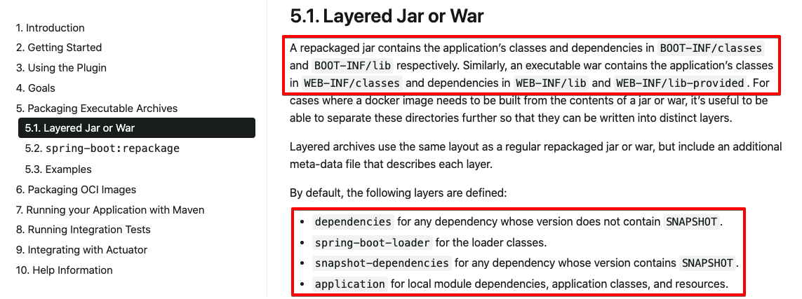
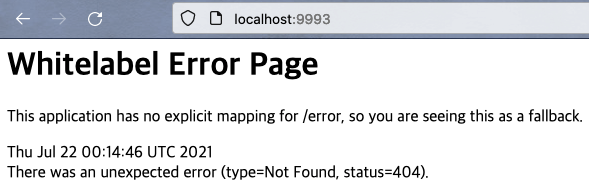

# 3. 애플리케이션 도커 이미지 만들기 - layertools 로 용도별 디렉터리를 따로 두어 빌드하기

저번문서인 [2.애플리케이션 도커 이미지 만들기 - 디렉터리 커스터마이징](https://github.com/gosgjung/must-learn/blob/develop/%EC%8A%A4%ED%94%84%EB%A7%81%EB%B6%80%ED%8A%B8/%EB%8F%84%EC%BB%A4-%EC%BF%A0%EB%B2%84%EB%84%A4%ED%8B%B0%EC%8A%A4-%EC%97%B0%EB%8F%99/2.%EC%95%A0%ED%94%8C%EB%A6%AC%EC%BC%80%EC%9D%B4%EC%85%98-%EB%8F%84%EC%BB%A4%EC%9D%B4%EB%AF%B8%EC%A7%80-%EB%A7%8C%EB%93%A4%EA%B8%B0-%EB%94%94%EB%A0%89%ED%84%B0%EB%A6%AC-%EC%BB%A4%EC%8A%A4%ED%84%B0%EB%A7%88%EC%9D%B4%EC%A7%95.md) 에서는 디렉터리를 두개로 분리해서 도커 이미지 내에서 클래스패스를 지정해 스프링부트 애플리케이션이 실행될 수 있도록 지정했었다. 이번에는 스프링부트에서 지원하는 빌드 플러그인인 `spring-boot-maven-plugin` 을 이용해서 4개의 디렉터리로 분리되어 실행되도록 할 것이다. <br>

이렇게 하는 것의 장점은 나눠지는 디렉터리가 2개에서 4개로 늘어났기 때문에, 캐싱이 될 수 있는 디렉터리가 4개로 늘어났다는 점이다. <br>

## 실습 github

- 실습으로 실행한 예제의 디렉터리
  - [github.com/gosgjung/study-boot-docker-k8s](https://github.com/gosgjung/study-boot-docker-k8s/tree/develop/boot-docker-step3/bootdocker3)

<br>

## 참고자료

- Creating Efficient Docker Images with Spring Boot 2.3
  - [https://spring.io/blog/2020/08/14/creating-efficient-docker-images-with-spring-boot-2-3](https://spring.io/blog/2020/08/14/creating-efficient-docker-images-with-spring-boot-2-3)
  - 읽어보니, 요약이 잘 되어 있는 자료였다. 댓글도 보니 실제로 실무에서 사용해보는 사람들의 의견도 볼수 있어서 좋았다.
- docs.spring.io/current - spring boot maven plugin
  - [https://docs.spring.io/spring-boot/docs/current/maven-plugin/reference/htmlsingle/](https://docs.spring.io/spring-boot/docs/current/maven-plugin/reference/htmlsingle/)
- Layerd Jar or War
  - [https://docs.spring.io/spring-boot/docs/current/maven-plugin/reference/htmlsingle/#packaging.layers](https://docs.spring.io/spring-boot/docs/current/maven-plugin/reference/htmlsingle/#packaging.layers)

<br>

https://docs.spring.io/spring-boot/docs/current/maven-plugin/reference/htmlsingle/#packaging.layers 에서는 Layered Jar, War 에 대해 정리하고 있다. <br>

현재시점의 최신버전 문서는 스프링부트 2.5.2 버전 기준으로 작성되어 있다. 2.5.2 버전의 공식문서에서는 아래 그림 처럼  Jar, War 의 계층에 대해 조금 더 자세히 설명하고 있다. Dockerfile로 이미지를 만들어서 쿠버네티스 등에 다중화하는 케이스가 많아지면서 layertools 를 사용하는 경우가 많아서 이것을 의식해서 문서를 정리한게 아닐까하는 생각이...든다.<br>



layertools 를 이용해 jar 를 패키징한 후에 jar 패키지의 압축을 jar -xf 명령으로 풀어보면 아래의 4가지의 디렉터리가 생성되어 있음을 확인할 수 있다.

- `dependencies` : maven 의존성 파일들이 모여있다. 자주 변경되지 않는 의존성 파일들이 위치한다.
- `spring-boot-loader` : spring boot 를 로딩하는 클래스이다. jar 파일의 압축을 풀어서 해당 디렉터리를 확인해보면 layer.idx 파일도 보이고, MANIFEST.MF 파일들을 보면 JarLauncher 등이 어디에 있는지 등을 확인할 수 있다.
- `snapshot-dependencies` : maven 의존성 들 중에서 안정화된 버전인 GA같은 버전이 아닌 SNAPSHOT 같은 자주 변경되는 버전들을 모아두는 곳이다.
- `application` : 가장 자주 변경되는 영역. 사용자가 변경한 애플리케이션 코드들이다.

조금 자세히 보다보면 용도에 따라 디렉터리들을 분류해둔 것임을 알 수 있다. 변경된 부분만 다시 빌드를 하고, 변경되지 않은 부분들은 캐싱하여 불필요한 리소스 낭비를 하지 않도록 디렉터리의 성격 및 빈도별로 분류한 것 같다. [Creating Efficient Docker Images with Spring Boot 2.3](https://spring.io/blog/2020/08/14/creating-efficient-docker-images-with-spring-boot-2-3) 을 보면 기본 설정이 꼭 좋은 것은 아니라는 댓글들도 있다. layertools 로 생성되는 디렉터리들 역시 제품에 맞도록 커스터마이징하는 경우 역시도 많다는 것을 알 수 있다. 항상 그렇듯이 기본 설정이 만능은 아니다. 상황에 맞게 현명하게 판단해야 하는 것 같다.<br>

## 참고

`spring-boot-maven-plugin not found` 라는 에러가 발생할 수 있다. 이 에러는 `spring-boot-maven-plugin` 의 version 을 명시해두지 않아 발생하는 에러이다.<br>

아래와 같이 version 을 설정해주자.<br>

```xml
<build>
  <plugins>
    <plugin>
      <groupId>org.springframework.boot</groupId>
      <artifactId>spring-boot-maven-plugin</artifactId>
      <version>2.5.2</version>
    </plugin>
  </plugins>
</build>
```

<br>

## layertools 를 사용한 jar 패키징

layertools 를 사용해 jar 파일을 패키징해보자.

```xml
<build>
  <plugins>
    <plugin>
      <groupId>org.springframework.boot</groupId>
      <artifactId>spring-boot-maven-plugin</artifactId>
      <version>2.5.2</version>
      <configuration>
        <layers>
          <enabled>true</enabled>
        </layers>
      </configuration>
    </plugin>
  </plugins>
</build>
```

<br>

이제 위의 설정을 적용해서 패키징을 해보자. 

```bash
$ ./mvnw clean package
$ cd target
$ mkdir sample
$ cp -a bootdocker2-0.0.1-SNAPSHOT.jar sample
$ jar -xf bootdocker2-0.0.1-SNAPSHOT.jar
$ code .  # code 로 현재 디렉터리(.)을 열어보기
```

<br>

이전과는 다르게 layers.idx 라는 이름의 파일이 생성되었다. 그리고 아직은 `dependencies` , `spring-boot-loader` , `snapshot-dependencies` , `application` 이렇게 4가지의 디렉터리로 나눠지지도 않은 상태이다. 즉, layertools 로 jar 패키징을 한 패키지는 계층화가 적용된 패키지는 아니다. 하지만 layers.idx 파일을 조금 자세히 살펴보면, **layer를 어떻게 분리할 지에 대해 layers.idx 파일에 리스트업을 해놓았다는 것**을 알 수 있게 된다.


<br>

이제 `dependencies` , `spring-boot-loader` , `snapshot-dependencies` , `application` 디렉터리로 나눠지게 하려면, jar 파일을 layertools 모드로 실행시키면 된다. 아래에서 사용하고 있는 명령인 `java -jar -Djarmode=layertools bootdocker3-0.0.1-SNAPSHOT.jar extract` 같은 명령을 사용하면 디렉터리가 4개로 분리되게 된다. <br>

> `-Djarmode=layertools` 옵션과 함께 `extract` 옵션을 주어서 layertools 로 스프링부트 jar 패키지를 extract 하겠다는 명령이라고 기억하면 기억에 오래남을 것 같다.<br>

```bash
$ cd target
$ mkdir jarmode-sample
$ cd jarmode-sample
$ cp -a ../bootdocker3-0.0.1-SNAPSHOT.jar .
$ java -jar -Djarmode=layertools bootdocker3-0.0.1-SNAPSHOT.jar extract
# ...
$ ll
total 33840
drwxr-xr-x  4 soongujung  staff   128B Jul 21 23:59 application
-rw-r--r--  1 soongujung  staff    17M Jul 21 23:51 bootdocker3-0.0.1-SNAPSHOT.jar
drwxr-xr-x  3 soongujung  staff    96B Jul 21 23:59 dependencies
drwxr-xr-x  2 soongujung  staff    64B Jul 21 23:59 snapshot-dependencies
drwxr-xr-x  3 soongujung  staff    96B Jul 21 23:59 spring-boot-loader
```

`java -jar -Djarmode=layertools bootdocker3-0.0.1-SNAPSHOT.jar extract` 명령을 내리고 나서 결과를 확인해보니 `dependencies` , `spring-boot-loader` , `snapshot-dependencies` , `application`  라 압축이 풀려있는 것을 확인할 수 있다.

<br>

## 그렇다면 layertools 란?

spring-boot-maven-plugin 에서 제공해주는 layertools 는 위에서 실험해 본 결과를 통해 유추해볼 수 있는 사실은 아래와 같다. 

- 원래는 jar 파일 내에 BOOT-INF, META-INF 디렉터리로만 구성되어 있는 것을  
- jar 패키징 시에 layertools = enabled 로 설정되어 있는 것을 `spring-boot-maven-plugin`이 읽어들여서 layers.idx 라는 파일과 함께 jar파일을 패키징한다.
- 이후 jarmode 를 layertools 로 지정하고, extract 명령을 주면 `dependencies` , `spring-boot-loader` , `snapshot-dependencies` , `application`  디렉터리로 용도별로 압축이 풀린다.

<br>

## 그렇다면 Dockerfile 은?

Dockerfile에는 `java -jar -Djarmode=layertools [jar파일명] extract` 를 통해 압축을 풀어서 생긴 디렉터리 4개를 COPY 명령으로 각각 복사해준다. 이중 변경되지 않은 것은 캐싱된다. 

<br>

## 실습 ) Dockerfile

먼저, 프로젝트를 clean 후, package를 해주자.

```bash
$ ./mvnw clean package
```

<br>

**Dockerfile**<br>

위에서 정리한 4개의 디렉터리를 생성하는 구문과 함께 도커 이미지를 빌드하는 구문은 아래와 같다.

```dockerfile
FROM openjdk:11.0.8-jdk-slim AS openjdk-image
WORKDIR original
ARG JAR_FILE=target/bootdocker*.jar
COPY ${JAR_FILE} target.jar
RUN java -jar -Djarmode=layertools target.jar extract

FROM openjdk:11.0.8-jre-slim
WORKDIR application
COPY --from=openjdk-image original/application ./
COPY --from=openjdk-image original/dependencies ./
COPY --from=openjdk-image original/snapshot-dependencies ./
COPY --from=openjdk-image original/spring-boot-loader ./
ENTRYPOINT ["java", "org.springframework.boot.loader.JarLauncher"]
```

언뜻 보기에 어려운 내용같아 보이지만, dockerfile을 잠시 자세히 보면, 아래의 세가지 동작을 수행하고 있음을 간파할 수 있다.

- java -jar -Djarmode=layertools 옵션으로 jar 파일의 압축을 푼다.(=extract)
  - `spring-boot-maven-plugin`으로 jar패키지의 압축을 푸는 과정이다.
- application, dependencies, snapshot-dependencies, spring-boot-loader 디렉터리들을 각각 개별 디렉터리로 복사해둔다.
- 마지막으로 ENTRYPOINT 명령을 통해 JarLauncher를 실행시킨다.
  - 실행은 스프링부트의 JarLauncher 를 이용해 실행한다는 점을 기억하자.

<br>

**이미지 빌드**<br>

```bash
$ docker build -t dockerboot-step3 .
```

<br>

**도커 컨테이너 구동시키기**<br>

- 로컬 PC의 9993 포트가 도커 컨테이너 내의 8080 포트로 바인딩되도록 하여 스프링부트 애플리케이션을 구동시켰다.

```bash
$ docker container run --rm -d -p 9993:8080 --name dockerboot-step3-app dockerboot-step3 

0a33c52a09536038011f1443ac9ea1bfe8f531fa46292c09ee985c085660861a
```

<br>

**접속확인**<br>

- 정상적으로 잘 접속되는 것을 확인할 수 있다.



<br>

**도커 컨테이너 삭제**<br>

- 실습이 끝났으므로, 구동중인 도커 컨테이너를 정지시킴과 동시에 삭제되도록 아래의 명령어를 입력하자.

```bash
$ docker container stop dockerboot-step3-app
```


