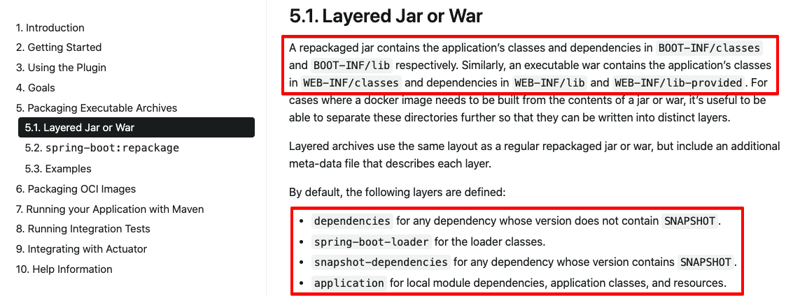
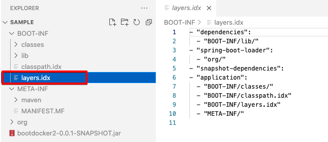

# 3. 애플리케이션 도커 이미지 만들기 - layertools 를 이용해 디렉터리 계층화

사실, 개인적으로는 계층화라는 용어를 쓰는 것보다는 자주 사용되는 빈도순으로 폴더 4개를 만들어서 도커 이미지 빌드시에 이미지 내에 파일에 복사하는 것이라고 설명하는 게 맞지 않을까? 하는 생각을 했다. 사실 layer 라는 단어가 한국어로 표기하기에는 계층이라는 말로밖에 번역이 안되니 어쩔수 없기는 하다. 샤기컷이나, 시크릿 투톤, 포토샵 이런 것들을 해봤다면 layer라는 단어가 조금은 잘 연상되지 않을까 싶다.<br>

## 참고자료

- Creating Efficient Docker Images with Spring Boot 2.3
  - [https://spring.io/blog/2020/08/14/creating-efficient-docker-images-with-spring-boot-2-3](https://spring.io/blog/2020/08/14/creating-efficient-docker-images-with-spring-boot-2-3)
  - 읽어보니, 요약이 잘 되어 있는 자료였다. 댓글도 보니 실제로 실무에서 사용해보는 사람들의 의견도 볼수 있어서 좋았다.
- docs.spring.io/current - spring boot maven plugin
  - [https://docs.spring.io/spring-boot/docs/current/maven-plugin/reference/htmlsingle/](https://docs.spring.io/spring-boot/docs/current/maven-plugin/reference/htmlsingle/)
- Layerd Jar or War
  - [https://docs.spring.io/spring-boot/docs/current/maven-plugin/reference/htmlsingle/#packaging.layers](https://docs.spring.io/spring-boot/docs/current/maven-plugin/reference/htmlsingle/#packaging.layers)

<br>

https://docs.spring.io/spring-boot/docs/current/maven-plugin/reference/htmlsingle/#packaging.layers 에서는 Layered Jar, War 에 대해 정리하고 있다. <br>

현재시점의 최신버전 문서는 스프링부트 2.5.2 버전 기준으로 작성되어 있다. 2.5.2 버전에서는 아래 그림 처럼  Jar, War 의 계층에 대해 조금 더 자세히 설명하고 있다. Dockerfile로 이미지를 만들어서 쿠버네티스 등에 다중화하는 케이스가 많아지면서 layertools 를 사용하는 경우가 많아서 이것을 의식해서 문서를 정리한게 아닐까하는 생각이...든다.<br>

dependencies, spring-boot-loader, snapshot-dependencies, application 으로 디렉터리를 분류하는 것은 처음 공부할 때 왜 이렇게 하는지 확신이 잘 안들었는데, 거의 스프링 공식 문서에서는 권장사항으로 자리잡게 되었나보다.<br>



layertools 를 이용해 jar 를 패키징한 후에 jar 패키지의 압축을 jar -xf 명령으로 풀어보면 아래의 4가지의 디렉터리가 생성되어 있음을 확인할 수 있다.

- `dependencies` : maven 의존성 파일들이 모여있다. 자주 변경되지 않는 의존성 파일들이 위치한다.
- `spring-boot-loader` : spring boot 를 로딩하는 클래스이다. 압축이 풀려있는 디렉터리를 확인해보면 layer.idx 파일이나, MANIFEST.MF 파일들을 보면 JarLauncher 등이 어디에 있는지 적혀있다.
- `snapshot-dependencies` : maven 의존성 들 중에서 안정화된 버전인 GA같은 버전이 아닌 SNAPSHOT 같은 자주 변경되는 버전들을 모아두는 곳이다.
- `application` : 가장 자주 변경되는 영역. 사용자가 변경한 애플리케이션 코드들이다. 

자세히 보면 자주 변경되는 순이라고 딱 짚어서 결론 내리기는 애매하다. 하지만, 용도에 따라 디렉터리들을 분류해둔 것임을 알 수 있다. 필요한 경우에만 다시 빌드를 하고 나머지 영역들은 캐싱을 하기 위해 분류해둔 것 같다. 많은 사용자들의 의견이 반영된 것이 아닐까 싶다. [Creating Efficient Docker Images with Spring Boot 2.3](https://spring.io/blog/2020/08/14/creating-efficient-docker-images-with-spring-boot-2-3) 을 보면 기본 설정이 꼭 좋은 것은 아니라는 댓글들도 있다. layertools 로 생성되는 디렉터리들 역시 제품에 맞도록 커스터마이징하는 경우 역시도 많다는 것을 알 수 있다. 항상 그렇듯이 기본 설정이 만능은 아니다. 상황에 맞게 현명하게 판단해야 하는 것 같다.<br>

## 참고

spring-boot-maven-plugin not found 라는 에러가 발생할 수 있다. 이 에러는 spring-boot-maven-plugin 의 version 을 명시해두지 않아 발생하는 에러이다.<br>

아래와 같이 version 을 설정해주자.<br>

```xml
<build>
  <plugins>
    <plugin>
      <groupId>org.springframework.boot</groupId>
      <artifactId>spring-boot-maven-plugin</artifactId>
      <version>2.5.2</version>
    </plugin>
  </plugins>
</build>
```

<br>

## layertools 를 사용한 jar 패키징

layertools 를 사용해 jar 파일을 패키징해보자.

```xml
<build>
  <plugins>
    <plugin>
      <groupId>org.springframework.boot</groupId>
      <artifactId>spring-boot-maven-plugin</artifactId>
      <version>2.5.2</version>
      <configuration>
        <layers>
          <enabled>true</enabled>
        </layers>
      </configuration>
    </plugin>
  </plugins>
</build>
```

<br>

이제 위의 설정을 적용해서 패키징을 해보자. 

```bash
$ ./mvnw clean package
$ cd target
$ mkdir sample
$ cp -a bootdocker2-0.0.1-SNAPSHOT.jar sample
$ jar -xf bootdocker2-0.0.1-SNAPSHOT.jar
$ code .  # code 로 현재 디렉터리(.)을 열어보기
```

<br>

이전과는 다르게 layers.idx 라는 이름의 파일이 생성되었다. 그리고 아직은 `dependencies` , `spring-boot-loader` , `snapshot-dependencies` , `application` 이렇게 4가지의 디렉터리로 나눠지지도 않은 상태이다.   



<br>

이제 `dependencies` , `spring-boot-loader` , `snapshot-dependencies` , `application` 디렉터리로 나눠지게끔 하는 명령은 아래와 같다.<br>

```bash
$ cd target
$ mkdir jarmode-sample
$ cd jarmode-sample
$ cp -a ../bootdocker3-0.0.1-SNAPSHOT.jar .
$ java -jar -Djarmode=layertools bootdocker3-0.0.1-SNAPSHOT.jar extract
# ...
$ ll
total 33840
drwxr-xr-x  4 soongujung  staff   128B Jul 21 23:59 application
-rw-r--r--  1 soongujung  staff    17M Jul 21 23:51 bootdocker3-0.0.1-SNAPSHOT.jar
drwxr-xr-x  3 soongujung  staff    96B Jul 21 23:59 dependencies
drwxr-xr-x  2 soongujung  staff    64B Jul 21 23:59 snapshot-dependencies
drwxr-xr-x  3 soongujung  staff    96B Jul 21 23:59 spring-boot-loader
```

<br>

위의 결과처럼 결국은 `java -jar -Djarmode=layertools bootdocker3-0.0.1-SNAPSHOT.jar extract` 명령을 내리고 나서 결과를 확인해보니 `dependencies` , `spring-boot-loader` , `snapshot-dependencies` , `application`  라 압축이 풀려있는 것을 확인할 수 있다.

<br>

## 그렇다면 layertools 란?

spring-boot-maven-plugin 에서 제공해주는 layertools 는 위에서 실험해 본 결과를 통해 유추해볼 수 있는 사실은 아래와 같다. 

- 원래는 jar 파일 내에 BOOT-INF, META-INF 디렉터리로만 구성되어 있는 것을  
- `dependencies` , `spring-boot-loader` , `snapshot-dependencies` , `application`  디렉터리로 용도별로 jar 파일들을 위치시켜서 압축을 풀어주는 것임을 알 수 있다.

<br>

## 그렇다면 Dockerfile 은?

Dockerfile에는 `java -jar -Djarmode=layertools [jar파일명] extract` 를 통해 압축을 풀어서 생긴 디렉터리 4개를 COPY 명령으로 각각 복사해준다. 이중 변경되지 않은 것은 캐싱된다. 

<br>

## 실습 ) Dockerfile