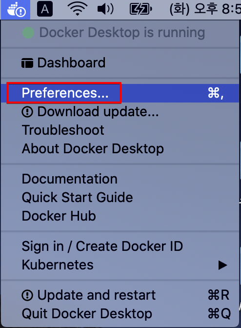
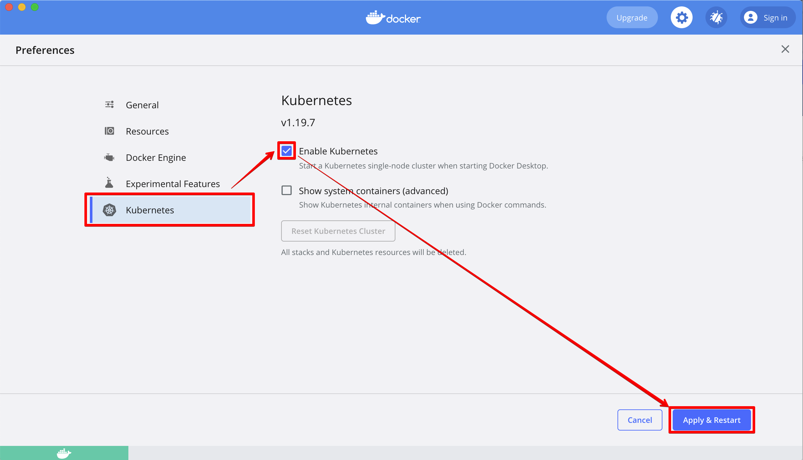
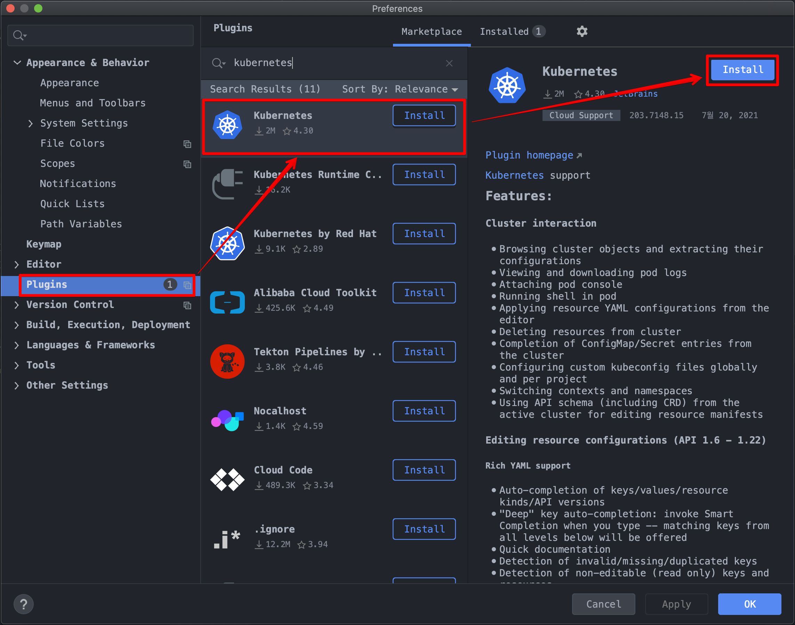
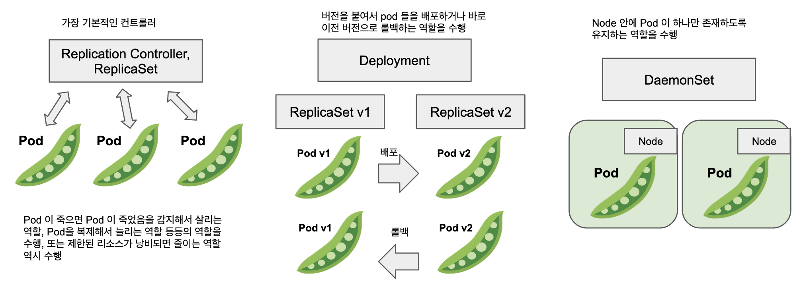
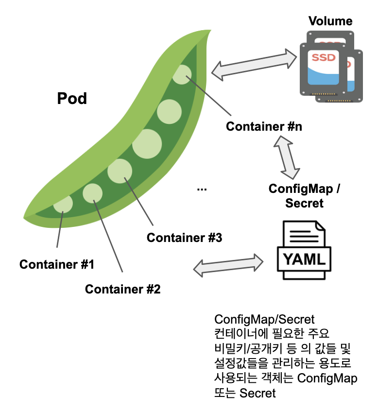
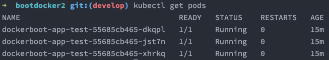
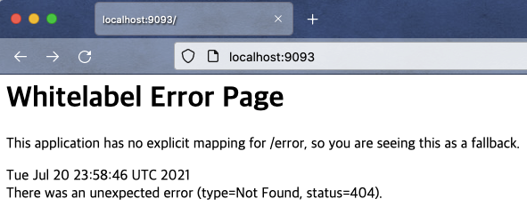

# 쿠버네티스에-스프링-부트-애플리케이션-배포하기-1.단순배포

사실 전 회사에서 쿠버네티스를 이용해서 애플리케이션을 배포하는 것들을 스터디해서 사내 위키에 정리해본 경험이 있었고, 실제로 개발팀 내에서도 실무에서 적용하신 분들이 있었다. 하지만, 나의 경우는 실무에서는 완전히 처음부터 쌩으로 처음부터 써본적이 없기에 이력서에 사용할줄 안다고 쓰지는 못하겠다는 생각이 자주 들었었다. 사실, 단순 애플리케이션 배포하는 것 외에, 실무에서는 더 다양한 문제들에 맞닥뜨린다. (다 만들어진 쿠버네티스 오브젝트들의 명세서인 yaml 파일을 기반으로 차트라는 것을 만드는 것을 해본적은 있었다.)<br>

프록시 서버를 경유할 수 있도록 해주는 것과, 지금은 기억이 가물가물하지만, `no_proxy` 에 입력하는 호스트들을 나열하는 것도 문자열이 조금만 틀려도 에러가 난다는 점이 조금 테스트가 빡시다는 단점이 있다. 이 외에도 pod 안에서 외부서버(예를 들면  cdn 등등)에 접속할 수 있는지 없는지 이런 것들도 다 테스트해봐야 한다. 또 이것이 확정되면 차트라는 것을 이용해서 주요 서버주소 등을 변수로 바꾸어서 배포할수 있는 차트라는 것을 사용한다. <br>

사실 차트를 만드는 작업은 쿠버네티스 yml 파일을 모두 작성하고 나서 시작하는 작업이다. 전 직장에서 어떤 고참은 kubernetes 배포 명세서인 yaml 파일이 다 만들어지지도 않았는데, 어디서 단순히 책을 대충 보고와서 차트 기반으로 만들어달라고 한 경험도 있었다. 이게 또 업무로 강압적으로 잡혀서 명백히 운영/개발업무가 이슈로 할당되어 있는데도 강압적으로 업무 성과로 내지도 못하는 이상한 일을 해야만 하는 굉장히 불합리하고 곤란한 경험을 했던 경험이 있었다.<br>

> 차트는 쿠버네티스로 배포하는 명세서인 yml 파일을 모두 만들었고, 디버깅도 모두 완료되었다면, 그리고 배포시 변경될 사항이 없다면, 그때 사용하는 쿠버네티스가 인식하는 go 언어기반으로 파싱하는 템플릿 파일이다.<br>

<br>

오늘은 단순히 쿠버네티스에 단순 스프링 부트 앱이 돌아가는 인스턴스 3개를 띄우고, 이것의 네트워크 포트를 관리하는 게이트웨이 역할의 Service 오브젝트를 띄우는 과정을 문서로 정리했다.<br>

**참고**<br>

- 예제 github : [github.com/gosgjung/study-boot-docker-k8s](https://github.com/gosgjung/study-boot-docker-k8s/tree/develop/boot-docker-step2/bootdocker2)

<br>

## 개발 도구 설정

> kubernetes 설정에 필요한 개발환경 설정 + 개발툴 설정을 정리함.

도커 > Perferences ...  클릭 > 



<br>

이어서 나타난 메뉴에서 kubernetes 메뉴 클릭 > Enable Kubernetes 체크 > Apply & Restart 클릭



<br>

조금 오래걸린다.<br>다 설치하고 나서 Intellij 에도 kubernetes 관련 플러그인을 설치해주자. <br>



<br>

## 필수 개념 요약

> 참고자료
>
> - apiVersion 종류 : https://honggg0801.tistory.com/45

<br>

### apiVersion

`apiVersion` <br>

apiVersion 에는 아래의 3가지중 하나를 사용할 수 있다. 사실 종류는 더 많다. 자세한 내용은 [여기](https://honggg0801.tistory.com/45)를 참고하자.

- `v1`
  - 쿠버네티스에서 발행한 첫 stable release API 
- `apps/v1`
  - Deployment, RollingUpdate, ReplicaSet을 사용하고자 할 때 사용

- `autoscaling/v1`
  - pod 의 autoscale 기능을 포함하는 API 이다.

<br>

### 컨트롤러

컨트롤러에는 Replication Controller, Deployment, DaemonSet 이 있다. 이 중에서 이번 문서에서 사용할 것은 Deployment 이다. 아래는 예전에 공부하면서 그려봤던 그림이다.



Pod 이라는 것은 도커 컨테이너를 여러개를 묶음으로 가지고 있는 객체이다. (아래 그림 역시 직접 그려봤었던 그림)<br>

### pod



조금 억지스러운 예이긴 하지만 예를 들면 Pod 안에 rabbitmq 컨테이너, springboot컨테이너를 하나의 Pod 에서 돌리고 이 Pod 들을 ReplicaSet으로 여러개의 Pod으로 복제하여 동시에 돌리는 경우도 예를 들수 있을 것 같다.

<br>

## 쿠버네티스에 배포하기

위에서 정리한 주요 개념들인  pod, 컨트롤러 등을 yaml 파일 내에 각각 key/value 형식으로 저장해두면, PC 또는 서버에 설치된 쿠버네티스 에이전트 프로그램은 이 key/value 타입의 파일을 읽어들여서 개발 PC 또는 서버 내의 메모리에 kubernetes 오브젝트들을 만들어준다. 아래에서 우리가 작성하게 되는 yaml 파일은 예를 들면, 인터넷 쇼핑을 할때 뭘 살지 저장해놓는 장바구니 같은 개념이다. <br>

이렇게 작성한 yaml 파일은 쿠버네티스에서 만들어둔  CLI 툴인 kubectl 을 이용해서 읽어들여서 오브젝트를 생성하고 삭제하고 하는 것이 모두 가능하다. kubectl 은 예를 들면 인터넷 쇼핑몰의 결제 버튼과 같은 개념이다.<br>

<br>

### 도커이미지 빌드

테스트 용도로 사용할 도커 이미지를 빌드하자.

**참고**<br>

> 도커 이미지 명의 맨 뒤에 숫자가 붙으면 kubernetes 매니페스트 파일을 이용한 빌드시  `ErrImagePull` , `ImagePullBackOff` 가 발생한다. kubernetes를 구동시킬 목적으로 사용할 이미지의 경우에는 가급적 버전명, 이미지명의 맨 뒤에는 숫자를 배제해야 하는 것 같다. 중간에 숫자를 붙여야 한다면 이미지 명의 맨 뒤에 `-GA`, `-SNAPSHOT` 과 같은 문자를 붙여서 이미지를 빌드하는 것도 가능한 우회방법 중 하나이지 않을까 싶다.

```bash
$ docker build -t dockerboot-app:test .
```

**주의**

> 혹시라도 이 글을 읽는 사람들 중에 이미지 빌드를 Dockerfile이 없는 디렉터리에서 `$ docker build -t dockerboot-app:test .` 명령어를 내리지 않을까 싶기도 하다.<br>
>
> Dockerfile이 있는 곳에서 `$ docker build -t dockerboot-app:test .` 명령을 수행해야 한다. <br>
>
> 참고) [참고 예제 : study-boot-docker-k8s](https://github.com/gosgjung/study-boot-docker-k8s)

<br>

### k8s-dist.yaml

아래의 내용을 작성하고 프로젝트 루트에  k8s-dist.yaml 이라는 이름으로 저장하자.

```yaml
apiVersion: apps/v1
kind: Deployment
metadata:
  name: dockerboot-app-test
spec:
  selector:
    matchLabels:
      app: dockerboot-app-test
  replicas: 3
  template:
    metadata:
      labels:
        app: dockerboot-app-test
    spec:
      containers:
        - name: dockerboot-app-test
          image: dockerboot-app:test
          ports:
            - containerPort: 8080
---
apiVersion: v1
kind: Service
metadata:
  name: dockerboot-app-test
spec:
  selector:
    app: dockerboot-app-test
  type: LoadBalancer
  ports:
    - port: 9093
      targetPort: 8080
```

위에 정리한 설명에서 빠진것이 하나 있는데 Service 라는 개념의 쿠버네티스 오브젝트는 주로 Deployment 들이 외부와 접속할 수 있도록 해주어야 하는데 이때 Service 라는 종류의 쿠버네티스 오브젝트를 사용한다.<br>

타입은 Ingress, LoadBalancer 등의 여러가지가 있는데 이번 예제에서는 이 중에서 LoadBalancer 를 사용했다.<br>

<br>

**참고**<br>

> 도커 이미지 명의 맨 뒤에 숫자가 붙으면 kubernetes 매니페스트 파일을 이용한 빌드시  `ErrImagePull` , `ImagePullBackOff` 가 발생한다. kubernetes를 구동시킬 목적으로 사용할 이미지의 경우에는 가급적 버전명, 이미지명의 맨 뒤에는 숫자를 배제해야 하는 것 같다. 중간에 숫자를 붙여야 한다면 이미지 명의 맨 뒤에 `-GA`, `-SNAPSHOT` 과 같은 문자를 붙여서 이미지를 빌드하는 것도 가능한 우회방법 중 하나이지 않을까 싶다.<br>

<br>

### 쿠버네티스 내에서 구동시키기

쿠버네티스 내에 인스턴스 생성

```bash
$ kubectl apply -f k8s-dist.yaml 
deployment.apps/dockerboot-app-test created
service/dockerboot-app-test created
```

<br>

**출력결과**<br>

Kubernetes 오브젝트가 잘 동작하는지 확인해보면 아래와 같다.



<br>

위의 `k8s-dist.yaml` 파일에서는 Service 의 Port 를 9093 으로 지정했기 때문에 로컬 PC의 브라우저에서 9093 포트로 접속해보면 아래와 같이 정상적으로 동작되는 것을 확인가능하다.



<br>

쿠버네티스 내에 deployment 조회

```bash
$ kubectl get deployments
NAME                  READY   UP-TO-DATE   AVAILABLE   AGE
dockerboot-app-test   3/3     3            3           14m
```

<br>

쿠버네티스 내에 service 조회

```bash
$ kubectl get service
NAME                  TYPE           CLUSTER-IP      EXTERNAL-IP   PORT(S)          AGE
dockerboot-app-test   LoadBalancer   10.96.218.141   localhost     9093:30111/TCP   14m
kubernetes            ClusterIP      10.96.0.1       <none>        443/TCP          12h
```

<br>

쿠버네티스 내에 pods 조회

```bash
$ kubectl get pods   
NAME                                   READY   STATUS    RESTARTS   AGE
dockerboot-app-test-55685cb465-dkqpl   1/1     Running   0          15m
dockerboot-app-test-55685cb465-jst7n   1/1     Running   0          15m
dockerboot-app-test-55685cb465-xhrkq   1/1     Running   0          15m
```

> 실습하다보면 `ErrImagePull` , `ImagePullBackOff` 가 나타나면서 pod이 죽는 경우가 있다. 내 경우는 docker login 이 풀려있어서 나타나는 문제였다. (이유를 알게된 계기는 우연찮게 docker build 명령어로 이미지 만들때 docker scan 햅라는 문구가 떠서 scan을 하면서 알게되었다.) 

<br>

실습이 종료된 kubernetes 인스턴스 지우기

```bash
$ kubectl delete -f k8s-dist.yaml
```

<br>

## 참고) kubectl cheet sheet

> 아래 내용들은 2년 전  [study_archives/kubernetes/kubectl_명령어_치트시트](https://github.com/gosgjung/study_archives/blob/master/docker/kubernetes/kubectl_%EB%AA%85%EB%A0%B9%EC%96%B4_%EC%B9%98%ED%8A%B8%EC%8B%9C%ED%8A%B8.md) 에서 정리했던 내용이다.<br>

<br>

### bash 접속

```bash
$ kubectl -it exec dktmsvcjenkins-5754c88b-lx5mn bash
```

<br>

### kubernetes 로그 확인

```bash
# kubernetes 로그 확인
$ kubectl get log

# kubernetes 실시간 로그 확인
$ kubectl get log -f 
```

<br>

### 리소스 조회
#### namespace 조회
```
$ kubectl get namespace
...
```
<br>
#### pod, deployment, service 조회
```
$ kubectl get pod,deployment,service
```
<br>
#### 명령 실행
컨테이너 내부를 셸로 접근해보자.<br>
컨테이너가 여러개인 경우 -c옵션으로 컨테이너 명을 지정한다.<br>
```
$ kubectl exec -it pod-helloworld-sgjung sh -c nginx
```

표준출력을 보자(실행했을 때 stdout으로 나오는 메시지 확인)

```
$ kubectl logs -f pod-helloworld-sgjung -c echo
```
<br>
### 리소스 생성
ex) pod-helloworld.yaml
```
apiVersion: v1
kind: Pod
metadata:
    name: pod-helloworld-sgjung
spec:
    containers:
    - name: nginx
      image: gihyodocker/nginx:latest
      env:
      - name: BACKEND_HOST
        value: localhost:8080
      ports:
      - containerPort: 80
    - name: echo
      image: gihyodocker/echo:latest
      ports:
      - containerPort: 8080
```
<br>
####  매니페스트 파일로 리소스 생성
```
$ kubectl apply -f pod-helloworld.yaml
pod/pod-helloworld-sgjung created
```
<br>
### 리소스 삭제 
#### 매니페스트 파일로 리소스 삭제
```
$ kubectl delete -f pod-helloworld.yaml
pod "pod-helloworld-sgjung" deleted
```
<br>
#### 단순 파드명 지정하여 삭제
```
$ kubectl delete pod pod-helloworld-sgjung
pod "pod-helloworld-sgjung" deleted
```
<br>
### context 조작하기
GCP 와 같은 클라우드를 지원하는 원격의 cluster에 접속할 때 context를 switch 해가면서 접속할 수있다. (또는 오픈스택 기반의 프라이빗 클라우드도 포함)

#### 컨텍스트 조회

```
$ kubectl config get-contexts
```
<br>
### 컨텍스트 변경
```
$ kubectl config use-context [컨텍스트명]
Switched to context "kyle-bot-context".
```
<br>
### 컨텍스트 삭제
```
$ kubectl config delete-context [컨텍스트명]
deleted context kyle-bot-context from /Users/kyle.sgjung/.kube/config
```
<br>