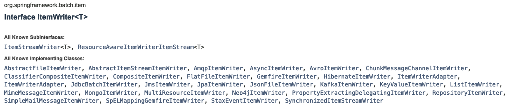

# 1. 스프링배치 Overview

그냥 뭐가 있는지만 보는 게 목표. 클래스들은 뭐가 있는지 설정은 어떻게 하는지 확인하는게 목표.<br>

<br>

## 예제

[github 예제 리포지터리](https://github.com/gosgjung/hellobatch)

예제 환경

- 

<br>

## 참고자료

스프링 공식문서

- [https://docs.spring.io/spring-batch/docs/current/reference/html/](https://docs.spring.io/spring-batch/docs/current/reference/html/)
- [Configuring and Running a Job](https://docs.spring.io/spring-batch/docs/current/reference/html/job.html#configureJob)

<br>

[처음 배우는 스프링 부트 2](http://www.yes24.com/Product/Goods/64584833)

- 이 책을 보고 Spring Batch 와 관련된 개념을 파악했다.
- 원래는 어떤 유명한 블로거 분이 정리해두신 페이지를 보고 1회독을 했는데, 참고자료에 이 [처음 배우는 스프링 부트 2](http://www.yes24.com/Product/Goods/64584833) 가 있었다. 
- 그래서 책을 한번 또 정독하게 되었다.
- 설정 코드를 직접 작성해보는 것과 단순히 책을 읽는 것과는 차이가 많이 난다는 것을 깨달았다.
- 개념 파악에 굉장히 도움이 많이 된 책이었다. 스프링 배치에 데해 아무것도 모르는 상태에서 친절하게 설명된 책을 보고 도움을 많이 얻은것 같다.
- [예제깃헙](https://github.com/young891221/Spring-Boot-Community-Batch)

<br>

이동욱님 깃헙/블로그

- https://github.com/jojoldu/spring-batch-in-action/blob/master/src/test/java/com/jojoldu/batch/example/exam10/BatchIntegrationTestJobConfigurationLegacyTest.java
  - 이 코드에서 [TestBatchConfig.java](https://github.com/jojoldu/spring-batch-in-action/blob/master/src/test/java/com/jojoldu/batch/TestBatchConfig.java)의 내용 역시 참고했다.

- [Spring Batch 가이드 - Spring Batch 테스트 코드](https://jojoldu.tistory.com/455)<br>

<br>

Stackoverflow

- https://stackoverflow.com/questions/44892974/exception-in-junit-cases-implementation-for-spring-batch

<br>

Baeldung

- [https://www.baeldung.com/spring-batch-testing-job](https://www.baeldung.com/spring-batch-testing-job)
- [https://github.com/eugenp/tutorials/tree/master/spring-batch](https://github.com/eugenp/tutorials/tree/master/spring-batch)

<br>

## Spring Batch의 Batch 처리 시의 장점들

- 대용량 데이터 처리에 최적화되어 있다.
- 효과적인 로깅, 통계처리, 트랜잭션 관리, 재사용 가능한 필수 기능 제공
- 예외, 비정상 동작에 대한 방어기능 제공

<br>

## Spring Boot Batch?

Spring Boot Batch 는 Spring Batch 를 간편하게 사용할 수 있도록 래핑된 프로젝트.

<br>

## Spring Boot Batch 개발시 주의사항

- 단순화하여 복잡한 구조, 복잡한 로직을 피해야 한다.
- 데이터에 자주 접근하기 때문에 데이터 무결성이 어긋나 발생하게 되는 예외상황들에 대한 방어책들을 마련해두어야 한다.
- 배치 처리시 잦은 시스템 I/0 사용은 피해야 한다. 잦은 I/O 로 데이터베이스 커넥션과 네트워크 비용이 커지면, 성능에 영향을 주게 된다.
- 스프링 배치는 스케쥴러 기능을 제공하지 않는다. 배치 처리 기능만 제공한다. 스프링에서 제공하는 쿼츠 프레임워크 등을 이용해야 한다. 쿼츠는 스케쥴링 기능 외에도 실행 이력관리도 가능하고, 클러스터링 까지 적용가능하다. 

<br>

## Spring Batch 의 주요 클래스들

스프링 부트 배치 공식 문서에서는 아래와 같이 객체들과의 관계를 친절하게 설명해주고 있다.


이미지 출처 : [https://docs.spring.io/spring-batch/docs/current/reference/html/job.html#configureJob](https://docs.spring.io/spring-batch/docs/current/reference/html/job.html#configureJob)<br>

위에 있는 클래스 들 외에도 JobInstance, JobExecution, StepExecution 이라는 클래스가 존재한다.<br>

<br>

주요 객체들을 요약해보면 아래와 같다.<br>

### JobRepository, JobLauncher

**JobRepository**<br>

JobRepository는 배치 처리 정보를 담고 있는 객체들을 조회하거나, 업데이트, 수정, 삭제 등의 역할을 수행하는 메서드 들을 제공한다.<br>

주로 JobExecution, ExecutionContext 등의 객체를 조회/수정/업데이트/삭제 등을 수행하도록 편의성 메서드들이 JobRepository 인터페이스 내에 정의되어 있다.<br>

JobExecution 객체에는 Job 이 실행되었고 몇번 실행되었고, 언제 끝났는지 등 배치 처리에 대한 메타데이터들을 가지고 있는다.<br>

어떤 Job이 실행되면, JobRepository 에서는 배치 실행에 관련된 정보를 가진 JobExecution 을 생성한다.<br>

참고) [JobRepository.java](https://github.com/spring-projects/spring-batch/blob/main/spring-batch-core/src/main/java/org/springframework/batch/core/repository/JobRepository.java)<br>

<br>

**JobLauncher**<br>

Job, JobParameters 를 활용해 배치를 실행하는 인터페이스<br>

인터페이스에는 run() 메서드 하나만 존재한다.<br>

참고) [JobLauncher.java](https://github.com/spring-projects/spring-batch/blob/main/spring-batch-core/src/main/java/org/springframework/batch/core/launch/JobLauncher.java)<br>

<br>

### Job, JobBuilder, JobBuilderFactory

작업의 단위 이다. 이 작업(Job)이라는 것은 단계를 가지고 실행할 수 있다.<br>

**"작업(Job)은 여러 단계(Step)으로 나누어 실행한다."** <br>

이렇게 생각하면 기억에 오래도록 남을 것 같다.<br>

Job 객체는 주로 설정(Config)파일에 빈(Bean)으로 등록해두는 편인데, 지연로딩(lazy-loading)되도록 Scope 를 지정하는 편이다.<br>

**JobBuilder, JobBuilderFactory**<br>

Job 객체는  JopBuilder 로 생성하고, JobBuilder 인스턴스를 생성하는 것은 JobBuilderFactory 로 생성한다.<br>

<br>

**참고) JobBuilderFactory 의 구현내용 (Spring Framework 내부 구현)**<br>

아래 소스의 JobBuilderFactory 클래스를 자세히 보면, get(String) 메서드로 JobBuilder 객체를 생성하는 것을 확인가능하다.

```java
public class JobBuilderFactory{
  private JobRepository jobRepository;
  
  public JobBuilderFactory(JopRepository jobRepository){
    this.jobRepository = jobRepository;
  }
  
  public JobBuilder get(String name){
    JobBuilder builder = new JobBuilder(name).repository(jobRepository);
    return builder;
  }
}
```

<br>

**참고) JobBuilder 의 구현내용 (Spring Framework 내부 구현)**<br>

- 출처 : [Spring Framework Git 저장소](https://github.com/spring-projects/spring-batch/blob/main/spring-batch-core/src/main/java/org/springframework/batch/core/job/builder/JobBuilder.java)<br>

JobBuilder 의 경우 JobBuilder 인스턴스가 아닌 SimpleJobBuilder, JobFlowBuilder 를 반환하는 것을 확인가능하다.<br>

이렇게 하는 이유는 Flow 를 생성할때와 Step을 생성할 때의 동작이 미세하게 다르기에 Flow를 사용하고자 할대와 Job을 사용하고자 할 경우를 나누어 메서드 오버로딩을 해놓은게 아닐까 하는 생각이 든다. <br>

```java
package org.springframework.batch.core.job.builder;

import org.springframework.batch.core.Step;
import org.springframework.batch.core.job.flow.Flow;

public class JobBuilder extends JobBuilderHelper<JobBuilder> {

	public JobBuilder(String name) {
		super(name);
	}

	public SimpleJobBuilder start(Step step) {
		return new SimpleJobBuilder(this).start(step);
	}

	public JobFlowBuilder start(Flow flow) {
		return new FlowJobBuilder(this).start(flow);
	}

	public JobFlowBuilder flow(Step step) {
		return new FlowJobBuilder(this).start(step);
	}
}
```

<br>

### Step, ItemWriter, ItemReader, ItemProcessor

작업(Job)은 여러 단계(Step)으로 나누어 실행한다. 는 것을 위에서 살펴봤다.<br>

모든 작업(Job)은 1개 이상의 Step 으로 구성된다.<br>

단계(Step)은 읽기(Reader), 처리(Processer), 쓰기(Writer)로 구성할 수 있다.<br>

Spring Batch 는 Writer, Processor, Reader 역할을 수행하는 인터페이스로 [ItemWriter](https://docs.spring.io/spring-batch/docs/current/api/org/springframework/batch/item/ItemWriter.html) , [ItemProcessor](https://docs.spring.io/spring-batch/docs/current/api/org/springframework/batch/item/ItemProcessor.html) , [ItemReader](https://docs.spring.io/spring-batch/docs/current/api/org/springframework/batch/item/ItemReader.html) 를 제공하고 있다. <br>

[ItemWriter](https://docs.spring.io/spring-batch/docs/current/api/org/springframework/batch/item/ItemWriter.html) , [ItemProcessor](https://docs.spring.io/spring-batch/docs/current/api/org/springframework/batch/item/ItemProcessor.html) , [ItemReader](https://docs.spring.io/spring-batch/docs/current/api/org/springframework/batch/item/ItemReader.html) 는 JmsWiter/Reader, AmqpItemWriter/Reader, JpaItemWriter/Reader 등의 여러가지 구현체 클래스들을 제공한다.<br>

> 참고 : ItemWriter 를 구현(implements)하고 있는 클래스들<br>
>
> 

<br>

### StepExecution

Job 에는 JobExecution 이라는 단위가 있다면, Step 에는 StepExecution 이라는 단위가 있다.<br>

StepExecution 은 Step의 실행정보를 담고 있는다.<br>

참고) [StepExecution.java](https://github.com/spring-projects/spring-batch/blob/main/spring-batch-core/src/main/java/org/springframework/batch/core/StepExecution.java)

```java
package org.springframework.batch.core;
// ...
@SuppressWarnings("serial")
public class StepExecution extends Entity {

	private final JobExecution jobExecution;

	private final String stepName;

	private volatile BatchStatus status = BatchStatus.STARTING;

	private volatile int readCount = 0;

	private volatile int writeCount = 0;

	private volatile int commitCount = 0;

	private volatile int rollbackCount = 0;

	private volatile int readSkipCount = 0;

	private volatile int processSkipCount = 0;

	private volatile int writeSkipCount = 0;

	private volatile Date startTime = new Date(System.currentTimeMillis());

	private volatile Date endTime = null;

	private volatile Date lastUpdated = null;

	private volatile ExecutionContext executionContext = new ExecutionContext();

	private volatile ExitStatus exitStatus = ExitStatus.EXECUTING;

	private volatile boolean terminateOnly;

	private volatile int filterCount;

	private transient volatile List<Throwable> failureExceptions = new CopyOnWriteArrayList<>();

  // ...
}
```


<br>

###  JobInstance, JobExecution

정해진 날짜 또는 실행되어야 하는 작업(Job)에 대한 하나의 실행단위는 JobInstance 이다. 그리고 Job이 실행되었음을 나타내는 정보는 JobExecution 이다.<br>

JobInstance는 JobExecution 을 여러 개 가질 수 있다.<br>

예를 들면, 메일 발송 작업 하는 Job 이 하나 있다고 해보자. 이때 메일 발송을 하는 작업이 실패해서 20분 뒤에 다시 발송을 한다고 해보자. 여기서 메일 발송을 하는 작업에 대한 하나의 실행단위는 JobInstance 이다.20분 뒤에 실행되는 JobInstance와 현재 작업의 JobInstance는 같은 JobInstance 이다.<br>

현재 실행되는 JobInstance의 실행 정보인 JobExecution과 20분 뒤에 실행된 JobExecuton 은 서로 다른 인스턴스이다.<br>

JobExecution 에는 JobInstance, 배치 실행상태, 시작시간, 끝난시간, 실패했을 때의 메시지 등 필드들이 있다.

참고 : [JobExecution.java](https://github.com/spring-projects/spring-batch/blob/main/spring-batch-core/src/main/java/org/springframework/batch/core/JobExecution.java)<br>

소스를 자세히 보면  jobInstance, jobParameters 등이 있는 것을 확인할 수 있다.<br>

```java
package org.springframework.batch.core;

@SuppressWarnings("serial")
public class JobExecution extends Entity {

	private final JobParameters jobParameters;

	private JobInstance jobInstance;

	private volatile Collection<StepExecution> stepExecutions = Collections.synchronizedSet(new LinkedHashSet<>());

	private volatile BatchStatus status = BatchStatus.STARTING;

	private volatile Date startTime = null;

	private volatile Date createTime = new Date(System.currentTimeMillis());

	private volatile Date endTime = null;

	private volatile Date lastUpdated = null;

	private volatile ExitStatus exitStatus = ExitStatus.UNKNOWN;

	private volatile ExecutionContext executionContext = new ExecutionContext();

	private transient volatile List<Throwable> failureExceptions = new CopyOnWriteArrayList<>();

	private final String jobConfigurationName;

	public JobExecution(JobExecution original) {
		this.jobParameters = original.getJobParameters();
		this.jobInstance = original.getJobInstance();
		this.stepExecutions = original.getStepExecutions();
		this.status = original.getStatus();
		this.startTime = original.getStartTime();
		this.createTime = original.getCreateTime();
		this.endTime = original.getEndTime();
		this.lastUpdated = original.getLastUpdated();
		this.exitStatus = original.getExitStatus();
		this.executionContext = original.getExecutionContext();
		this.failureExceptions = original.getFailureExceptions();
		this.jobConfigurationName = original.getJobConfigurationName();
		this.setId(original.getId());
		this.setVersion(original.getVersion());
	}

  // ...
  
}

```

<br>

### JobParameters

- [JobParameters](https://github.com/spring-projects/spring-batch/blob/main/spring-batch-core/src/main/java/org/springframework/batch/core/JobParameters.java) 클래스 내부에는 `Map<String,Parameter>`타입의 멤버필드 `parametrs` 가 있다. 이 `parameters` 는 Job 실행시 필요한 파라미터들을 키/밸류 형식으로 가지고 있는다.
- JobInstance 와 JobParameters 는 1:1 관계이다.
- String, Date, Long, Double 을 파라미터의 타입으로 사용할 수 잇다.
- 참고 : [JobParameters](https://github.com/spring-projects/spring-batch/blob/main/spring-batch-core/src/main/java/org/springframework/batch/core/JobParameters.java) , [JobParameter](https://github.com/spring-projects/spring-batch/blob/main/spring-batch-core/src/main/java/org/springframework/batch/core/JobParameter.java)

<br>

## Spring Boot 에서 사용하기

Spring Boot 는 Spring 에 비해 설정이 간편하다는 장점은 정말 많이 알려져 있는 것 같다. 하지만, 직접 Spring Batch 설정을 해보다 보니, 다른 라이브러리에 비해 Spring Batch 를 설정이 쉽지많은 않았다. 에러로그를 찾아가면서 설정을 수정했고, DB연동 없이 일단 Batch가 동작하는지 확인하는 것 만을 목표로 설정을 완료했다.<br>

<br>

### 의존성 추가

굳이 라이브러리 연동 예제를 복잡하게 만들고 싶지는 않아서 jpa 연동부분을 뺐다. 이번 예제에서는 단순히 List 객체를 생성하는 예제로, Batch 설정이 잘 동작하는지 만을 테스트하는 것이 목적이다.<br>

```groovy
dependencies {
	implementation 'org.springframework.boot:spring-boot-starter-batch'
// implementation 'org.springframework.boot:spring-boot-starter-data-jpa'
	testImplementation 'org.springframework.boot:spring-boot-starter-test'
	testImplementation 'org.springframework.batch:spring-batch-test'
	runtimeOnly 'com.h2database:h2'
	compileOnly('org.projectlombok:lombok')
}
```

<br>

### @EnableBatchProcessing

EnableBatchProcessing 을 SpringBootApplication 또는 테스트하려는 클래스 내에 추가해주어야 잘 동작한다.<br>

> 참고 :  `@EnableBatchProcessing` 이란? <br>
>
> - 스프링 부트 스타터 배치에 미리 설정된 배치 관련 설정들을 실행시키는 어노테이션
> - 배치 처리에 필요한  JobBuilder, StepBuilder, JobRepository, JobLauncher 등의 다양한 설정이 자동으로 주입된다.

<br>

아래와 같이 스프링 메인 클래스로 지정된 클래스 위에 `@EnableBatchProcessing` 애노테이션을 적용해주었다.

```java
package io.study.batch.hellobatch;

import org.springframework.batch.core.configuration.annotation.EnableBatchProcessing;
import org.springframework.boot.SpringApplication;
import org.springframework.boot.autoconfigure.SpringBootApplication;

@EnableBatchProcessing
@SpringBootApplication
public class HellobatchApplication {

	public static void main(String[] args) {
		SpringApplication.run(HellobatchApplication.class, args);
	}

}
```


### Configuration

설정 코드다. 별 내용은 없다. 일단은 spring-boot-starter-batch 라이브러리가 동작하는지만을 검증하기 위한 껍데기 테스트를 위한 설정코드이다.<br>

주의할 내용이 몇가지 있다.

- > stepBuilderFactory.get("잡이름")
  >
  > ​	.<I, O>chunk(청크사이즈)
  >
  > ​    .processor(...)
  >
  > ​    ....

  위의 구문에서 chunk 앞에 I(입력, Input), O(출력, Output) 을 꼭 지정해주어야 processor 내에 ItemProcessor 객체 지정시 에러를 내지 않는다.

- processor 지정

  - ItemProcessor 인터페이스를 implements 한 커스텀  Processor 를 객체로 생성하여 넘겨주어야 한다.
  - 아래 코드에서 new BookItemProcessor() 의 구문에서 BookItemProcessor 는 내가 직접 구현한 클래스이다.(아래에서 정리함)

<br>

```java
package io.study.batch.hellobatch.config;

import io.study.batch.hellobatch.config.processor.BookItemProcessor;
import io.study.batch.hellobatch.vo.Book;
import org.springframework.batch.core.Job;
import org.springframework.batch.core.Step;
import org.springframework.batch.core.configuration.annotation.JobBuilderFactory;
import org.springframework.batch.core.configuration.annotation.StepBuilderFactory;
import org.springframework.batch.item.support.ListItemReader;
import org.springframework.batch.item.support.ListItemWriter;
import org.springframework.beans.factory.annotation.Qualifier;
import org.springframework.context.annotation.Bean;
import org.springframework.context.annotation.Configuration;

import java.util.Arrays;
import java.util.List;

@Configuration
public class SampleJob1Config {

    @Bean
    public Job sampleJob1(JobBuilderFactory jobBuilderFactory,
                          @Qualifier("sampleStep1") Step sampleStep1){
        return jobBuilderFactory.get("sampleJob1")
                .preventRestart()
                .start(sampleStep1)
                .build();
    }

    @Bean
    public Step sampleStep1(StepBuilderFactory stepBuilderFactory,
                            @Qualifier("sampleBookReader") ListItemReader<Book> sampleBookReader,
                            @Qualifier("sampleBookWriter") ListItemWriter<Book> sampleBookWriter){
        return stepBuilderFactory.get("sampleStep1")
                .<Book, Book>chunk(10)
                .reader(sampleBookReader)
                .processor(new BookItemProcessor())
                .writer(sampleBookWriter)
                .build();
    }

    @Bean
    public ListItemReader<Book> sampleBookReader(){
        List<Book> books = Arrays.asList(
                new Book("A Book on C", 1000),
                new Book("League of Legend", 2000)
        );
        return new ListItemReader<>(books);
    }

    @Bean
    public ListItemWriter<Book> sampleBookWriter(){
        return new ListItemWriter<>();
    }
}
```


### Processor 구현

```java
package io.study.batch.hellobatch.config.processor;

import io.study.batch.hellobatch.vo.Book;
import org.springframework.batch.item.ItemProcessor;

public class BookItemProcessor implements ItemProcessor<Book, Book> {
    @Override
    public Book process(Book item) throws Exception {
        return item;
    }
}
```


## 테스트 코드

### Test 설정 

@EnableBatchProcessing 을 적용하여 Batch 설정을 적용했다.<br>

```java
package io.study.batch.hellobatch.config;

import org.springframework.batch.core.configuration.annotation.EnableBatchProcessing;
import org.springframework.batch.test.JobLauncherTestUtils;
import org.springframework.boot.autoconfigure.EnableAutoConfiguration;
import org.springframework.context.annotation.Bean;
import org.springframework.context.annotation.Configuration;

@Configuration
@EnableAutoConfiguration
@EnableBatchProcessing
public class TestJobConfig {
    @Bean
    public JobLauncherTestUtils jobLauncherTestUtils(){
        return new JobLauncherTestUtils();
    }
}
```

<br>

> 참고) 만약 @EnableAutoConfiguration 애노테이션을 제거하면 아래와 같은 에러 문구를 확인할 수 있다.<br>
>
> @EnableAutoConfiguration 애노테이션을 해제했을 때 아래와 같은 에러가 날 경우 data.sql(스프링 JDBC), import.sql(하이버네이트) 등을 ` src/main/resources`  또는 `src/test/resources` 디렉터리 아래에 두어서 테이블을 스프링 부트가 생성하도록 두면 되는 듯 해보인다.<br>
>
> ```plain
> Caused by: org.h2.jdbc.JdbcSQLSyntaxErrorException: Table "BATCH_JOB_INSTANCE" not found; SQL statement:
> SELECT JOB_INSTANCE_ID, JOB_NAME from BATCH_JOB_INSTANCE where JOB_NAME = ? and JOB_KEY = ? [42102-200]
> ```

<br>

### Test 실행시켜보기

SpringBatch 테스트가 바로 동작하지 않아서 조금 당황했다. 이유는 실제 작성한 JobConfig도 직접 불러와야 하는 것으로 보인다. 김영재님 책을 보고 배치환경설정을 따라하다가 에러를 냈는데, 해당 책이 출간된 시점이 2018년도니 지금은 많은 내용이 변한것이 아닐까 하는 생각이 들었다. 어찌하다보니 결국은 또 [여기](https://github.com/jojoldu/spring-batch-in-action/blob/master/src/test/java/com/jojoldu/batch/example/exam10/BatchIntegrationTestJobConfigurationLegacyTest.java) 의 자료를 참고해서 어떻게 설정했는지 파악후 비슷하게 적용해보니 잘 되었다.<br>

```java
package io.study.batch.hellobatch;

import io.study.batch.hellobatch.config.SampleJob1Config;
import io.study.batch.hellobatch.config.TestJobConfig;
import org.assertj.core.api.Assertions;
import org.junit.jupiter.api.DisplayName;
import org.junit.jupiter.api.Test;
import org.springframework.batch.core.BatchStatus;
import org.springframework.batch.core.JobExecution;
import org.springframework.batch.core.JobParameters;
import org.springframework.batch.core.JobParametersBuilder;
import org.springframework.batch.test.JobLauncherTestUtils;
import org.springframework.beans.factory.annotation.Autowired;
import org.springframework.boot.jdbc.EmbeddedDatabaseConnection;
import org.springframework.boot.test.autoconfigure.jdbc.AutoConfigureTestDatabase;
import org.springframework.boot.test.context.SpringBootTest;

@SpringBootTest(classes = {TestJobConfig.class, SampleJob1Config.class})
@AutoConfigureTestDatabase(connection = EmbeddedDatabaseConnection.H2)
public class SampleJob1Test {

    @Autowired
    private JobLauncherTestUtils jobLauncherTestUtils;

    @DisplayName("배치_단순동작_테스트")
    @Test
    public void 배치_단순동작_테스트(){
        try {
            JobExecution jobExecution = jobLauncherTestUtils.launchJob();
            Assertions.assertThat(jobExecution.getStatus()).isEqualTo(BatchStatus.COMPLETED);
        } catch (Exception e) {
            e.printStackTrace();
        }
    }

    private JobParameters defaultJobParameters(){
        JobParametersBuilder paramBuilder = new JobParametersBuilder();
        paramBuilder.addString("jobID", String.valueOf(System.currentTimeMillis()));
        return paramBuilder.toJobParameters();
    }
}
```

- SpringBootTest
  - TestJobConfig 클래스를 SpringBootTest 로 로딩하도록 설정해두었다.
  - 애플리케이션의 설정코드인  SampleJob1Config.class 를 로딩해서 테스트하도록 설정했다.


