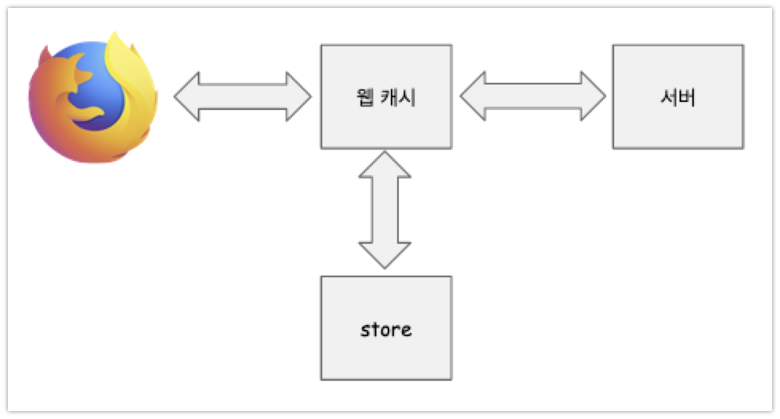

# 웹 캐시 동작 원리 (6.1 ~ 6.2)

**캐시**에는 여러가지 종류가 있는데, 오늘 정리할 내용은 **웹 캐시**라 불리는 **리버스 프록시 캐시**가 HTTP 프로토콜에서 어떤 방식으로 정해진 응답을 내어주는지 정리할 예정이다. 캐시 서버는 HTTP/1.1 규격(RFC2616)을 기반으로 동작한다. 조금 더 자세히 정리해보면, HTTP 헤더에 어떤 값을 지정하는 가에 따라서 캐싱 처리를 어떻게 하는지 어떻게 응답하는지를 정리해볼 것 같다.  

헤더에 대한 내용을 조금 자세히 다루지만, 캐시 유효성과 캐시 컨텐츠 갱신에 대해서도 나중에 보기 쉽게 정리해보려 노력해본 것 같다.  
  

**캐시 유효성**에서는 캐시를 조건부 요청으로 어떻게 요청하는지 등에 다루는데, 실제 상용 서비스의 개편업무/프로모션 페이지 작업을 하면서 접한 내용들을 이곳에서 접하니 반갑기도 하고 이해하는데에 구체적인 예를 떠올릴 있었던 것 같다.   

**캐시 컨텐츠 갱신**에서는 캐시 퍼지, 캐시 무효화에 대한 내용이 나오는데, 캐시 컨텐츠 갱신에 대해서는 캐시서버를 활용해 원본 서버에 부하를 덜어내는 방법, 새로운 페이지 오픈시에 발생할 수 있는 새로운 리소스 요청 폭증에 대비하는 예, 그리고 조건부 요청에 대해 정리했다.   

**캐시유효성 체크**, **캐시 컨텐츠 갱신**을 정리하면서는 정말 **조건부 요청** 이라는 개념이 정말 중요하다는 것을 느꼈다.  

## 목차

- [참고자료](#참고자료)
- [캐시](#캐시)
- [캐시 서버의 종류](#캐시-서버의-종류)
- [HTTP 특징](#HTTP-특징)
- [HTTP의 캐시 제어 방식](#HTTP의-캐시-제어-방식)
  - Cache-Control : --- 와 Expires 헤더에 값을 지정할 때 캐시서버와 응답서버, 클라이언트 사이에서 어떤 동작을 하는지 정리
  - [Expire](#expire)
  - [Cache-Control: max-age](cache-control-max-age)
  - [Date, Age 헤더](#date-age-헤더)
  - [Cache-Control: s-maxage](#cache-control-s-maxage)
  - [ETag](#etag)
  - [Cache-Control: public](#cache-control-public)
  - [Cache-Control: private](#cache-control-private)
  - [Cache-Control: no-cache](#cache-control-no-cache)
  - [Cache-Control: no-store](#cache-control-no-store)
- [캐시 유효성 체크](#캐시-유효성-체크)
  - [시간 기반의 조건부 요청](#시간-기반의-조건부-요청)
  - [컨텐츠 기반의 조건부 요청](#컨텐츠-기반의-조건부-요청)
- [캐시 컨텐츠 갱신](#캐시-컨텐츠-갱신)
  - [퍼지](#퍼지)
  - [무효화](#무효화)
  - [비동기 캐시 갱신](#비동기-캐시-갱신)

## 참고자료

[웹 성능 최적화기법](http://www.yes24.com/Product/Goods/96262886)

## 캐시

요청한 데이터의 크기가 크거나 요청수가 많을 경우 항상 같은 결과를 응답하게 되는 결과에 대해서는 캐시에 key, value 형태로 저장해두면, 서버의 부담도 줄어든다는 장점이 있다. 이렇게 서버와 클라이언트 간의 응답 컨텐츠의 사본을 저장하는 공간을 보통 캐시라고 부른다.  

그리고 이러한 캐시를 유지하고 관리해주는 별도의 서버 역시 사용하는 경우가 있다. 이렇게 별도로 캐시를 유지하고 관리해주는 서버를 캐시 서버라고 부른다.  

  

**기본적인 동작 방식**  

- 최초 1회 요청
  - 컨텐츠 요청에 대해서는 캐시 서버에는 내용이 없기 때문에 캐시 서버에 응답의 복사본을 저장해둔다.
- 이후 같은 요청
  - 이때는 응답결과의 복사본을 캐시서버에 저장해두었기 때문에 이 결과를 캐시 서버가 응답해준다.

**최초 1회 요청**  

  

**최초 2회 요청**  

## 캐시 서버의 종류

웹 아키텍처에서 주로 사용되는 캐시 또는 캐시 서버들의 종류는 아래와 같은 것들이 있다.

- 브라우저
  - 브라우저 캐시, 로컬 캐시
- 캐시 서버
  - 서버에서 성능향상을 위해 별도로 사용
  - 리버스 프록시 서버에 캐시 기능을 추가해 리버스 캐시 프록시 서버로 사용하기도 하는데 이것을 웹 캐시라고 부른다. (참고 : 우리가 잘 아는 웹 서버가 리버시 프록시 서버에 속함)

ex)

- Apache Traffic Server 
  - 아파치 소프트 웨어 제단에서 제공하는 오픈소스 웹 캐시 서버
- Nginx
  - 이제는 많이 유명해진 Nginx. 로고가 멋있다아...
- Varnish Cache
  - 캐시를 통한 HTTP 가속을 목적으로 개발된 오픈소스 소프트웨어
  - 캐시 및 가속 기능을 제공

## HTTP 특징

HTTP/1.1 부터 명시적으로 캐시를 제어할 수 있는 헤더를 추가했는데 이것이 Cache-Control 헤더이다. HTTP/1.1 이전인 HTTP/1.0 까지는 명시적으로 캐시를 제어하는 기술은 없었고, 언제까지 유효한지(Expire), 만료일 이후 해당 자원의 변경여부를 확인하는 요청/응답 헤더를 정의/기록하는 것에 대한 정의만 있었다.

**HTTP/1.1 이후**   

- Cache-Control 헤더의 도입
- Cache-Control 은 명시적으로 캐시를 제어할 수 있는 헤더
- HTTP/1.1 에서 캐시를 제어하는 목적은 아래의 두가지로 정의된다.
  - 원본 서버로의 요청 수를 최소화
    - 네트워크 왕복 수를 줄여 결과적으로 사용자에 대한 응답 속도를 단축할 수 있다.
  - 완전한 컨텐츠를 응답하지 않아도 된다.
    - 네트워크 대역폭과 리소스 낭비를 줄이고 비용을 효율화

  

**HTTP/1.0 이후**  

- Cache-Control 처럼 명시적으로 캐시를 제어하는 기술은 없었다.
- **Expire** : 언제까지 유효한지 정의 하는 헤더
- 해당 자원의 변경여부를 확인하는 요청/응답 헤더

## HTTP의 캐시 제어 방식

> `Cache-Control : ---` 와 `Expires` 헤더에 값을 지정할 때 캐시서버와 응답서버, 클라이언트 사이에서 어떤 동작을 하는지 정리

브라우저는 프로토콜과 통신규약에 정의된 행동을 헤더에 맞게끔 행동한다. 리버스 프록시 캐시 서버는 웹서버에서 응답헤더에 보내준 헤더를 보고 규약에 맞게끔 행동한다.  

HTTP 라는 프로토콜을 사용할 때 캐시 제어 방식을 클라이언트와 서버에서 적절한 동작을 하도록 약속하려면, **HTTP/1.0, HTTP/1.1 에서 지원하는 헤더 값이 의미하는 바를 잘 알아야 한다.** 이것을 잘 알고 적용해서 브라우저에서의 동작과 리버스 프록시 캐시 서버의 동작을 결정할 수 있다.  

  

### Expire

HTTP/1.0 은 원본 서버에서 Expire, Date 헤더를 함께 응답으로 전달한다. 그리고 이 Expire 와 Date 값을 이용해 응답 컨텐츠가 캐시 서버 내에서 유지될 시간을 지정할 수 있다. 이렇게 캐시 서버 내에서 유지될 기간을 Time To Live(TTL) 이라고 부른다. 이 TTL 은 아래와 같이 **Expire - Date** 으로 구해진다.

- Time To Live (TTL) = Expire_value - Date_value

**참고) Network Time Protocol (NTP) 를 이용한 시계 동기화**  

Network Time Protocol(NTP)는 글로벌 표준 시간 동기화를 위한 매케너즘을 제공하고 있다. 대부분의 서버에서 이것을 구현하고 있다. 서버 - 클라이언트 간 시간 동기화를 위해 꼭 시계 동기화 여부를 확인해야 한다.

  

### Cache-Control: max-age

HTTP/1.1 에서는 Cache-Control: max-age 헤더로 캐시 유지 시간을 정의할 수 있다. Expire 는 만료 날짜를 지정한 반면, max-age 는 얼마나 오래 캐시 내에 유지할 지(유효기간)를 명시적으로 지정하는 헤더이다.   

max-age 만큼의 시간이 경과된 후에 오는 요청에 대해서는 캐시 서버는 원본서버에서 응답 컨텐츠를 가져와 캐시를 갱신하거나, 컨텐츠 변경여부를 원본서버에서 조회해온다.  

  

**HTTP/1.0 버전의 브라우저에서 Cache-Control: max-age 미인식 문제**  

캐시 서버가 HTTP/1.1 을 지원해서 Cache-Control 의 max-age를 사용한다고 하더라도, 브라우저가 HTTP/1.0 버전인 오래된 브라우저일 경우 **Cache-Control: max-age** 는 인식되지 않는다. 이런 이유로 응답이 HTTP/1.0 과 HTTP/1.1 에서 모두 호환 되도록 Expire, Cache-Control: max-age 를 모두 함께 응답으로 내려주는 것이 좋다.  

Expire, Cache-Control: max-age 가 모두 명시된 경우 HTTP/1.1 기반의 캐시 서버는 Cache-Control을 우선적으로 인식하여 응답을 생성해낸다.  

  

### Date, Age 헤더

max-age 헤더값을 기반으로 얼마나 오래 캐시에 머물렀는지 파악하기 위해 전달하는 헤더가 있는데 이것이 Date, Age 헤더이다. HTTP/1.0 에서 Date 헤더를 사용하는 것을 위에서 확인했으니, Date 헤더는 원래 사용하는 것임을 확인했다. 참고로 **Date 헤더**는 **원본 서버 -> 캐시서버**로 전달해주는 응답생성 시각이다.  

캐시 서버 -> 브라우저 로는 Age 헤더에 Date - 응답시간을 담아서 클라이언트에게 전달해준다. 이 age 값을 max-age 값과 비교해 캐시처리된 응답의 만료여부를 판단하는 것 역시 가능하다. 정확한 age를 계산하는 것은 컴퓨팅 시간 등을 고려해야 하는데, 이것이 복밥하여 많은 CDN 업체는 age를 사용하기보다는 자체적인 알고리즘으래 캐시 만료여부를 판단한다.  

### Cache-Control: s-maxage

s-maxage를 이용하면 사용중인 모든 CDN의 캐시 주기를 일괄적으로 설정하거나 변경할 수 있다. 하지만 s-maxage는 표준으로 도입된 지 얼마 되지 않았기 때문에 CDN업체가 이 헤더를 지원하는지를 확인해봐야 한다.

### ETag

ETag(Entity Tag) 헤더는 원본 서버가 리소스를 식별하기 위해 부여하는 고유 번호이다. 캐시 서버는 ETag로 원본서서의 리소스가 만료된것인지 여부를 확인할 수 있다. ETag는 문자들을 조합해 고유의 문자열을 만드러서 생성하는 문자들의 조합이다. 

보통 우리가 자주 볼수 있는 것은 캐시가 변경되었음을 확인할 수 있도록 이미지/css 파일 등의 정적 파일들에 **시간**이나 **Timestamp** 를 조합한 킷값을 사용하는 경우이다. 반면 ETag의 경우 고유 문자열을 만들어서 캐시의 킷값으로 사용한다.  

### Cache-Control: public

모든 캐시에 캐시될 수 있고 사용자 제한 없이 모든 사용자에게 응답이 전달될 수 있다는 의미의 헤더이다.  

### Cache-Control: private

Cache-Control: private 를 설정한다고 해서 응답에 담긴 개인 정보까지 보호되지는 않는다. public, private 는 응답 메시지를 어디에 캐시할 것인지 지정하기 위해 사용될 뿐 그 자체로 개인정보를 보호하는 장치가 되지는 않는다.  

TODO : 더 자세한 의미 찾아보기 (MDN 등등)  

### Cache-Control: no-cache

Cache-Control: no-cache 는 아래의 두가지 경우에 따라 다르게 정리하게 될 수 밖에 없다.

- 요청헤더에 Cache-Control: no-cache 를 담아 요청하는 경우
- 응답 헤더에 Cache-Control: no-cache 를 담아 응답하는 경우

**요청헤더에 Cache-Control: no-cache 를 담아 요청하는 경우**  

Cache-Control: no-cache 를 헤더에 담아 요청하는 경우 캐시된 응답을 받는 것이 아니라 매번 새로운 컨텐츠를 응답으로 전달받는다. 즉, Cache-Control: no-cache 를 요청 헤더로 해서 클라이언트가 캐시 서버에 요청을 하면 캐시 서버는 항상 웹 서버에서 원본 컨텐츠를 가져온다.  

  

> **참고)**
>
> max-age=0 을 요청 헤더에 사용하는 것과 비슷한 동작을 하는 것으로 착각하기 쉽다. max-age=0 는 유효기간인 0 이 지났다고 해서 단순히 응답서버로부터 컨텐츠를 새로 받아오지는 않는다.  
>
> 캐시서버가 max-age=0을 요청 헤더로 하는 요청을 받았을 때 캐시 서버에 조건부 요청을 보내 응답 메시지가 변경되었는지 확인한다. (예를 들면, css 등에 타임스탬프 등을 지정해서 버저닝을 해놓은 경우를 생각해보자. 이런 값이 변경되었는지를 확인해봤는데, 해당 컨텐츠의 킷값으로 지정한 문자열을 킷값으로 하는 리소스가 지금 캐시 서버에 존재한다면, 새로운 컨텐츠를 받아오지 않고 캐시된 결과값을 리턴한다.)  

  

**응답헤더에 Cache-Control: no-cache 를 담아 응답하는 경우**

응답헤더에 Cache-Control: no-cache를 담아 응답하는 경우는 요청헤더에 담을 때와는 다르게 max-age=0 과 유사한 동작을 한다. **응답캐시 사본을 클라이언트에게 전달하기 전에 먼저 응답서버를 조회해서 변경되었는지를 먼저 조회한다.** 이렇게 조회한 결괏값으로 **변경되었음을 감지하면 새로 받아오고**, **변경되지 않았다면 캐시 사본을 클라이언트에게 전달**한다.  

  

조금 더 자세히 설명해보면 ... 캐시 서버에는 두 번째 이후의 응답 사본이 캐시로 저장되어 있는데, 이 응답 사본의 헤더에 max-age=0 이 있다면, 캐시 응답 사본을 클라이언트에게 전달하기 전에 먼저 응답 서버의 해당 컨텐츠가 변경되었는지를 먼저 조회한다. 그리고 변경되지 않았다면 캐시 응답 사본을 그대로 클라이언트에게 전달한다. 만약 변경되었다면 캐시 응답 사본을 새로고침하고 새로고침한 컨텐츠를 전달한다.  

동작 절차를 예를 들어서 정리해보면 아래와 같다.  

- 첫번째 요청
  - 클라이언트(브라우저, 웹뷰 등)가 응답서버로 요청을 한다.
  - 응답 서버로 한 요청에 들르기 전에 캐시서버를 들른다.
  - 캐시 서버에서는 해당 컨텐츠가 저장되어있지 않음을 확인하고 원본 서버로부터 컨텐츠를 가져와 저장소에 저장해둔다.
  - 캐시 서버는 이 컨텐츠를 클라이언트에게 응답으로 전달해준다.
- 두번째 요청
  - 클라이언트(브라우저, 웹뷰 등)가 응답서버로 또 요청을 한다.
  - 응답 서버로 한 요청에 들르기 전에 캐시서버를 들른다. 
  - 캐시 서버에 해당 컨텐츠가 저장되어 있음을 확인했다.
  - 캐시 서버는 해당 컨텐츠가 응답 서버에서 변경되었는지 조회해본다.
  - 응답 서버에서 해당 컨텐츠가 변경되었다면, 캐시된 응답 사본을 새로고침한다.

  

만약 원본서버의 응답에서 특정항목은 캐시하고 싶지 않을 때는 지시자 옆에 캐시하지 않을 헤더들을 나열해주면 된다. 예를 들면 no-cache="Accept-Range"라고 응답에 기술하면 된다. 이렇게 하면 서버는 응답을 캐시하되 Accept-Range 헤더를 캐시하지 않는다.  

  

### Cache-Control: no-store

no-store 는 응답메시지가 캐시 저장소에 저장되는 것을 금지한다. no-store의 목적은 캐시 데이터의  예기치 않은 유출을 방지하는 것이 목적이다.  

  

**no-cache 와의 비교**  

no-cache 는 응답을 항상 최신 상태로 유지하도록 지시한다. 하지만 no-store처럼 저장소에 저장되는 것을 막지는 않는다. no-store와 no-cache가 비슷하게 생겨서 혼동하기 쉬우니 유의해야 할 것 같다.

## 캐시 유효성 체크

HTTP 표준은 조건부 요청(conditional request)라는 메커니즘을 정의하고 있다. 이 조건부 요청이라는 것은 캐시 서버 내의 리소스가 TTL(Time To Live)이 만료되었을 때 원본서버의 해당 리소스의 변경 여부 결괏값에 따라 다른 응답을 받도록 요청하는 것을 의미한다. 

경우의 수로 나누어 어떤 동작을 하는지 정리해보면 아래와 같다.  

- TTL이 만료된 리소스가 원본 서버 내에서 변경되지 않았을 경우
  - 304 Not Modified 코드를 헤더에 설정하여 보낸다. 
  - 이때 응답에 본문이 없기 때문에 서버와 네트워크 자원 낭비를 방지할 수 있다.
- TTL이 만료된 리소스가 원본 서버 내에서 변경되어 있을 경우
  - 200 응답 코드를 헤더에 설정하고, 변경된 컨텐츠를 응답 본문에 실어서 내보낸다.

  

조건부 요청은 시간기반으로 보내는 방법과 컨텐츠 기반으로 요청을 보낸는 방법 두가지가 있다.  

  

### 시간 기반의 조건부 요청

시간 기반의 조건부 요청은 원본서버의 컨텐츠 변경 여부를 컨텐츠의 최종 변경시간 중심으로 파악하는 요청이다. 이 때 사용하는 헤더의 종류는 두가지 이다.

- **Last-Modified**
  - **원본 서버가 컨텐츠를 캐시서버에 응답으로 실어 보낼때** 캐시 서버에 전달헤주는 **응답헤더**
  - **원본 서버가 컨텐츠를 캐시서버에 응답으로 실어 보낼 때** 원본서버의 해당 컨텐츠의 메타정보중 Last Modified (최근 변경된 시간)을 함께 응답으로 보낸다.
    - 이때의 Last Modified 의 시간을 Fri, 16, Apr 2021 09:00:00 GMT 라고 하자. (뒤에서 변경시각을 확인하기 위해 예를 들었다.)
  - 캐시 서버는 이 응답을 잘 받아두고 있는다. 
  - 그리고 TTL이 지난 후에 같은 컨텐츠에 대한 요청이 있을 때는 아래의 동작을 수행한다.
- **If-Modified-Since**
  - **캐시서버가 원본서버에 원본서버의 데이터가 변경되었는지 조회할 때** 사용하는 **요청 헤더**
  - TTL 시간이 지난 이후 캐시서버에 같은 요청이 올 경우 캐시서버는 원본서버의 해당 리소스가 변경되었는지 확인한다.
  - 이때 If-Modified-Since 라는 헤더에 이전 요청에서 받았던 Last Modified 의 값을 그대로 담아서 보낸다.
  - 즉, **최종 변경되었던 시각(Last Modifed) 이후로 변경되었나요?**(If Modified Since?) 하고 원본 서버에 질의하는 과정이다.
  - 만약 변경된 사항이 있다면 200 코드와 함께 응답본문에 변경된 새로운 컨텐츠를 실어보낸다.
  - 만약 변경된 사항이 없다면 본문 없이 304 코드를 응답헤더로 되돌려준다.

  

### 컨텐츠 기반의 조건부 요청

위에서 정리한 시간 기반의 조건부 요청에서는 Last-Modified, If-Modified-Since 라는 헤더를 이용해 최종 변경시각이라는 정보를 통해 조건부 요청을 수행했었다. 컨텐츠 기반의 조건부 요청은 컨텐츠에 고유 식별자같은 ID 같은것을 부여해서 이것이 변경되었는지를 판단한다. 대표적인 방식으로 ETag 헤더를 사용하는 방식이다.  

시간 기반의 조건부 요청처럼 두번의 요청/응답 절차가 있는데, 책을 보고 이해한 한도 내에서 아주 간단하게만 정리해보면 아래와 같다.  
  

**ETag 생성**  

- Cache-Control: public, 블라블라.  
  ETag: "...."
  - 최초 요청에 대해서는 원본 서버에서 해당 리소스에 대해 식별할 수 있는 식별자로 ETag기반의 문자열을 만들어 ETag 값을 전달해준다.
- If-None-Match : "ETag 식별자 문자열"
  - TTL 시간이 경과한 후에 캐시 서버로 컨텐츠에 대한 요청이 왔을 때 캐시 서버는 원본 서버로 If-None-Match : "..." 헤더를 함께 전달해준다.
  - 원본서버로 보내는 이 요청의 의미는, ETage 식별자 문자열이 있는지(Match) 조회 하는 것을 의미한다.
  - 만약 이 식별자 문자열이 원본 서버에 없다면, 200 응답과 함께 새로운 컨텐츠를 캐시서버에 전달해준다.
  - 만약 이 식별자 문자열이 원본 서버에 존재한다면 원본서버는 캐시서버에 304 Not Modified 응답을 보내준다.

## 캐시 컨텐츠 갱신

캐시를 갱신하는 방법은 퍼지, 무효화 이렇게 두가지 방법이 있다. 예를 들면 보통 서비스를 새로운 버전으로 리뉴얼 할 경우 기존의 캐시된 이미지, CSS 들이 쓸모없게 되는 경우가 많다. 이 경우 퍼지 또는 무효화를 수행하는 것 역시 가능하다.  
  
  

### 퍼지

저장소를 완전히 지우는 방식이다. CDN을 사용할 경우 업체가 제공하는 관리 콘솔 또는 API를 이용해 전체 캐시할 수 있다. 또한 대부분의 캐시 서버들은 캐시를 지우는 명령/API를 제공해주고 있다.  

하지만, 퍼지 시에 주의해야 할 점들이 있다.

**퍼지 시 주의해야 할 요소들**  

- 퍼지할 리소스의 양이 많을 경우, 원본 서버가 그만한 양의 리소스를 처리해 낼 만한 성능을 낼 수 있는지 고려해야 한다.
  - 캐시되지 않은 새로운 요청들이 한번에 원본서버로 몰리게 되기 때문에 서버의 리소스에 부담을 줄 수 있기 때문이다.
- 새로고침할 리소스가 많을 때는 갑작스러운 퍼지는 피해야 한다.
  - 이런 경우에 대비해서 새로운 페이지 오픈, 프로모션 작업이 있을때 미리 캐시 서버에 리소스를 적재해두어야 한다.
- 예) 프로모션, 새로운 페이지 오픈 등의 작업이 있을 때
  - 캐시되지 않은 요청이 한꺼번에 원본 서버로 몰려서 서버 리소스에 부담을 주게 된다. 이 경우 퍼지를 하는 것보다는 아래와 같은 방법 들을 활용해 캐시서버에 미리 리소스를 저장해두는 방법이 권장될 수 있다.
    - 따라서 테스트 툴 등을 활용해서 미리 캐시 서버에 해당 리소스를 적재해두는 방법
    - API 를 미리 만들어 두어 해당 API로 미리 해당 리소스를 적재하게끔 하는 방법 

### 무효화

**퍼지**는 캐시 저장소를 완전히 비워서 새로운 컨텐츠들을 원본서버로부터 채워내는 개념이었다.  

**캐시 무효화(invalidate)**는 조건부 요청을 통해 갱신이 필요한 리소스들만을 추려낸 후 필요한 리소스들만 갱신하는 개념이다. 아래와 같은 형태의 헤더를 이용해 캐시 서버의 내용을 무효화 한다.  

> Cache-control: max-age=0, **must-revalidate**

  

원본 서버나 웹 캐시 서버에서 이렇게 무효화 정책을 사용할 경우 퍼지를 할때와 동일하게 트래픽의 수는 같을 수 있다. 하지만, **퍼지**의 경우는 무거운 리소스들(gif, 동영상, 고화질 사진, js 라이브러리 등)도 모두 새로 받아온다. **무효화**의 경우는 if-modified-since, if-none-match 요청이 대부분이 되기 때문에, 실제 변경된 리소스만 골라서 컨텐츠를 반환하게 되어, 퍼지를 할 때 보다 트래픽(대역폭)의 부하를 줄일 수 있다.  

  

여기에 더해서 미리 트래픽에 부하가 생길 수 있는 리소스들을 미리 캐시 서버에 적재해 둔다면 부하가 커지는 일은 없을 것 같다.

### 비동기 캐시 갱신

캐시주기가 만료되었는데, 원본 서버에 저장된 내용 역시 새롭게 갱신된 경우이고, 동영상과 같은 큰 사이즈의 파일이라면, 새로 접속하는 사용자는 컨텐츠가 적용된 페이지에 접속했을 때 접속이 느리다는 느낌을 받을 수 있다.  

이렇게 리소스가 큰 요청이 새로 고침되는 경우에 대비해서, 비동기적으로 캐시를 갱신하는 방법 또한 존재한다. 이 방식을 비동기 캐시 갱신이라고 한다. 비동기 캐시 갱신은 요청 헤더에 아래와 같이 지정해준다.

> Cache-Control: max-age=600, stale-while-revalidate=30

위의 요청헤더의 의미는 이렇다. 600초의 캐시 유효기간으로 캐시 서버의 리소스를 사용하되, 원본서버의 내용이 변경되었을 때에도, 30초 동안은 캐시 서버의 리소스를 그대로 서비스 받는다. 그리고 그 30초 동안 캐시 서버는 원본서버에서 제공해주는 변경된 컨텐츠로 갱신하여 다음 요청부터 클라이언트가 갱신된 요청을 받을 수 있도록 한다.

(참고: ['stale'의 사전적 의미](https://en.dict.naver.com/#/search?query=stale) : 신선하지 않은, (만든지) 오래된, 퀴퀴한)

  

