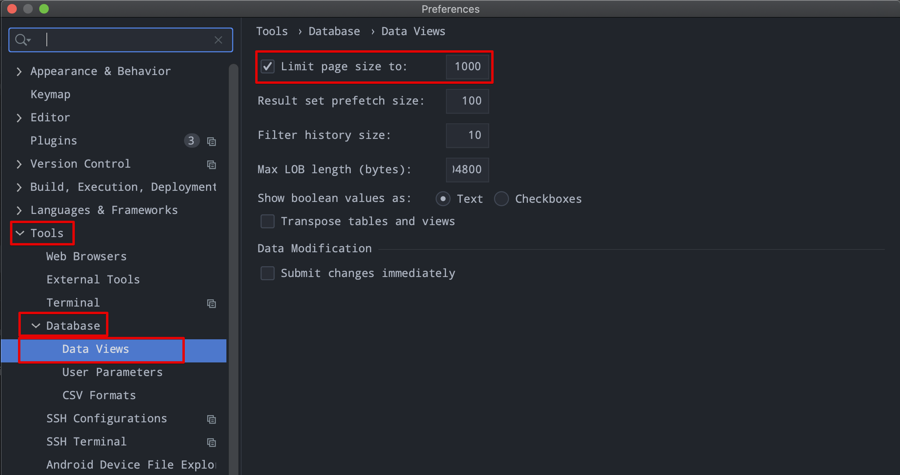

# Intellij SQL 출력결과의 limit row 사이즈 변경

가끔 Intellij 내의 SQL View 기능이 500 건을 limit 를 걸어서 귀찮을때가 있다. 이때 limit 을 1000~ 2000 등의 사이즈로 변경하고 싶을 때가 있는데 해당 내요을 찾아본 자료는 아래와 같다. 

 

## 참고자료

- 검색어 : `intellij sql limit row change`
- [https://www.jetbrains.com/help/idea/rows.html](https://www.jetbrains.com/help/idea/rows.html)
- [https://www.jetbrains.com/help/idea/rows.html#set-the-number-of-rows-in-the-data-editor](https://www.jetbrains.com/help/idea/rows.html#set-the-number-of-rows-in-the-data-editor)

 

## HOW TO

- Tools | Database | Data Views.
- Limit page size 필드를 수정

