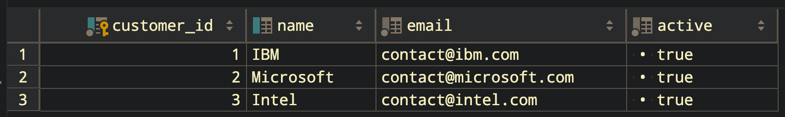
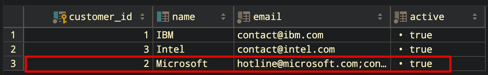

## Postgresql Upsert (Insert + Update)

Postgresql 을 다루게 되면서 upsert 구문을 접했는데, insert 와 update 를 짬뽕해놓은 SQL이다. JPA만 사용할 수 있다면 좋겠지만, 가끔은 JDBCTemplate 기반으로 DBMS 벤더에 특화된 SQL을 써야만 하는 순간이 오는 순간이 많다. <br>

지금까지는 기존 소스를 그대로 가져다 쓰면서 이해했는데, 쓰다보니 이제는 한번 정도는 직접 정리해둬야 빨리 보고 적용하게 될 것 같기도 하고 개념을 좀더 이해해야 겠다는 생각이 들어 정리 시작!!<br>

> 참고) ON CONFLICT 는 Postgresql 9.5 에서부터 사용가능하다.

<br>

## 참고자료

- [https://sungtae-kim.tistory.com/36](https://sungtae-kim.tistory.com/36)
- [https://www.postgresqltutorial.com/postgresql-upsert/](https://www.postgresqltutorial.com/postgresql-upsert/)

쉽게 참고할만한 한국자료 없을까? 하다가 [sungtae-kim.tistory.com](https://sungtae-kim.tistory.com/36) 의 내용을 접했다. 내용을 보고나서, 해외자료 링크를 타고 들어가 본문을 읽으면서 내용을 잘 이해하게 되었다.<br>

<br>

## PostgreSQL의 UPSERT 구문

postgresql 의 upsert 구문은 아래와 같은 모양이다. ( [공식 페이지](https://www.postgresqltutorial.com/postgresql-upsert/) 의 내용을 조금 쉽게 나열했다.)

```sql
INSERT INTO table_name(column1, column2, ...) 
VALUES (value1, value2, ...)
ON CONFLICT target action;
```

<br>

위의 구문에서 ON CONFLICT target action 이 눈에 띈다.

이 중 target 의 의미는 아래의 세가지 중 하나가 된다.

- column1, column2, ...

- - insert + update 할 컬럼들의 리스트들을 하나씩 나열한다.

- ON CONSTRAINT constraint_name

- - constraint_name 은 유니크 제약조건의 이름이다.

- WHERE predicate

- - Predicate 가 적용되는 Where 절이다.

<br>

ON CONFLICT target action 에서의 action 은 아래의 두가지 중 하나가 된다.

- DO NOTHING 

- - 컨플릭트 날때 아무것도 안하겠다 의 의미이다.

- DO UPDATE SET colum_1 = value_1, ... WHERE condition

- - 컨플릭트 날때 새로운 값으로 세팅하겠다는 의미다.

<br>

## 예제 테이블 : customers

예제 테이블을 자세히 보면, Customers 테이블의 기본키는 customer_id 이다. 그리고 UNIQUE 키는 name 이다.<br>

위에서 정리했듯이 insert ~ on conflict 에서 검사하는 constraint 는 유니크 제약조건이다. <br>

(Primary Key가 아니다. 어떤 경우는 Primary Key 도 Unique 제약조건이 부여된다는 이야기를 듣기는 한것 같기는 하다. 단, Primary Key 에만 Conflict 를 걸 수 있는 것은 아니다.)

```sql
DROP TABLE IF EXISTS customers;

CREATE TABLE customers (
  customer_id serial PRIMARY KEY,
  name VARCHAR UNIQUE,
  email VARCHAR NOT NULL,
	active bool NOT NULL DEFAULT TRUE
);
```

<br>

Customers 테이블에 데이터 INSERT

```sql
INSERT INTO 
	customers (name, email)

VALUES 
	('IBM', 'contact@ibm.com'),
	('Microsoft', 'contact@microsoft.com'),
	('Intel', 'contact@intel.com');
```

저장된 데이터는 아래와 같다.



위의 데이터에서 name 이 Microsoft 인 로우(=데이터)의 email 을 [contact@microsoft.com](mailto:contact@microsoft.com) 으로 지정했다. 그런데 email 을 [hotline@microsoft.com](mailto:hotline@microsoft.com) 으로 추가하려는 경우 아래와 같이 INSERT/UPDATE 를 작성할 수 있다. <br>

(그냥 단순히 UPDATE 문을 사용할 수도 있다. 하지만, UPSERT의 경우는 행이 있으면 업데이트 하고, 행이 없으면 INSERT 하기에, UPSERT 구문을 사용해야 하는 경우가 분명히 있기는 하다.)<br>

```sql
INSERT INTO customers (NAME, email)
VALUES('Microsoft','hotline@microsoft.com') 
ON CONFLICT ON CONSTRAINT customers_name_key 
DO NOTHING;
```

그리고 이때 이미 존재하는 데이터가 있다면, 아무 액션도 안취하게끔 하는 구문이다.<br>

위의 경우는 유니크 제약조건 명을 사용했는데, 아래와 같이 유니크 제약조건이 걸린 컬럼 명을 명시하는 것으로도 가능하다.<br>

```sql
INSERT INTO customers (name, email)
VALUES('Microsoft','hotline@microsoft.com') 
ON CONFLICT (name) 
DO NOTHING;
```

이번에는 이미 email이 [contact@microsoft.com](mailto:contact@microsoft.com) 인 데이터가 있더라도, 이것이 존재한다면 새로운 데이터인  [hotline@microsoft.com](hotline@microsoft.com) 뒤에 문자열 `;` 을 붙이고 기존 데이터인 contact@microsoft.com 을 덧붙여서 저장하려는 경우 아래와 같이 SQL 을 작성가능하다.<br>

```sql
INSERT INTO customers (name, email)
VALUES('Microsoft','hotline@microsoft.com') 
ON CONFLICT (name) 
DO 
   UPDATE SET email = EXCLUDED.email || ';' || customers.email;
```

변경된 결과를 살펴보면 아래와 같다. 새로운 데이터인  [hotline@microsoft.com](hotline@microsoft.com) 뒤에 문자열 `;` 을 붙이고 기존 데이터인 contact@microsoft.com 을 덧붙여서 저장했다.<br>



<br>

