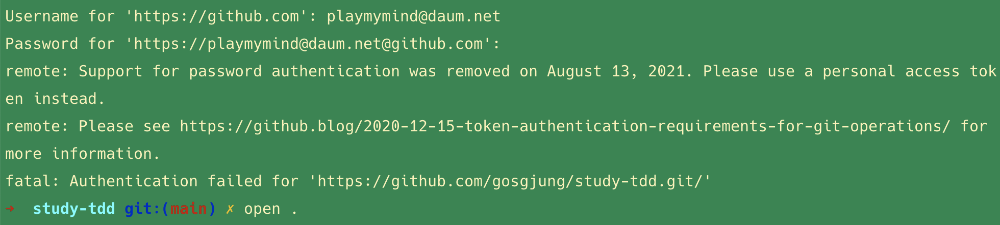
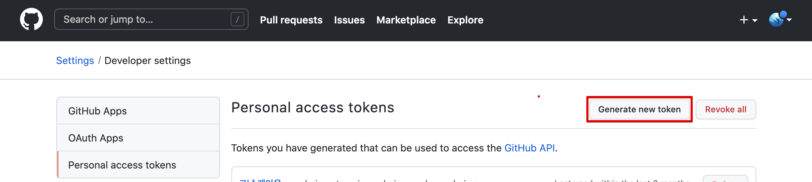
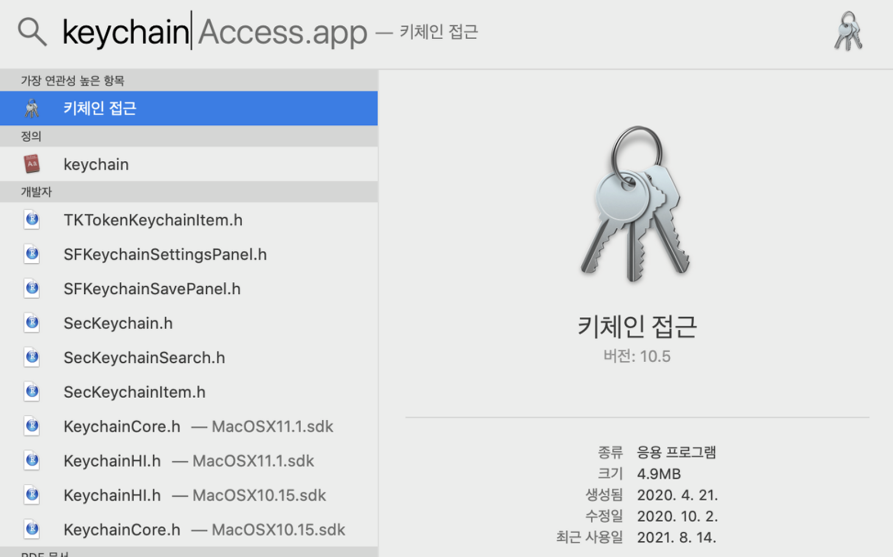
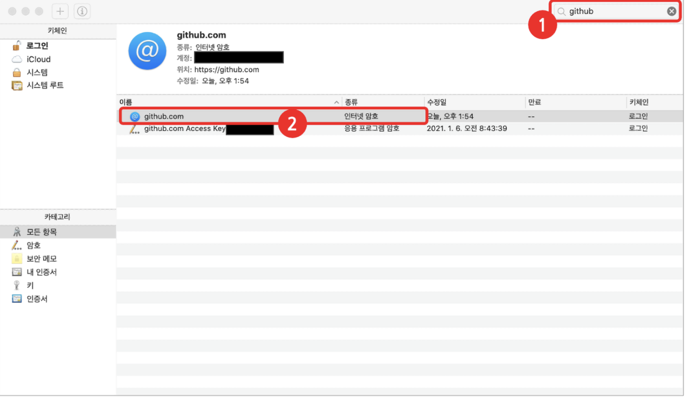
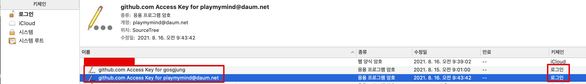
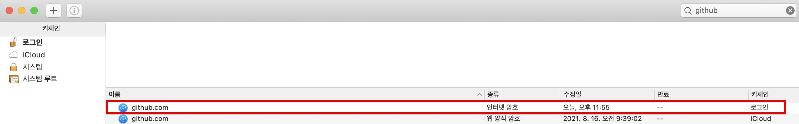

# github access token

깃헙의 password 인증 방식은 이제 없어지고 액세스 토큰 방식이 이것을 대체하게 되었다.

> Support for password authentication was removed on August 13, 2021. Please use a personal access token instead.

 

내 경우는 두 달 전쯤 두달 정도 기한의 액세스 토큰을 생성했었고, 이것이 만료되었는데, 오늘 또 두달짜리 액세스 토큰을 만들었다. 앞으로도 계속 60일 짜리 액세스토큰만 사용할 예정이다.  

 

## access token 생성

> 키체인 복사 : Settings > Developer settings > personal access tokens > generate new token
>
> 

 

## 키체인 설정 

키체인을 연다

> 키체인 업데이트 : https://curryyou.tistory.com/403

 

 

github 을 검색해서 인터넷 암호로 되어 있는 것을 선택 (나는 싹다 지우고 다시 했다. 이게 제일 마음이 편하다.)

로그인이라고 되어 있는 것을 삭제하면 된다.  

로그인으로 된 항목들을 모두 제거해주자. 기한이 만료된 것이므로 삭제하고 다시 생성해야 한다. 

 

## 로그인 

키체인을 삭제한 후에는 아래와 같이 로그인을 해준다. 

이때 `Password for '계정명'`  에 대한 값은 방금전 생성한 access token 이다. Cmd +V 또는 Ctrl + v 를 해주면 된다. 

keychain 메뉴에서 생성된 키 체인을 확인해보면 아래와 같이 새롭게 추가된 것을 확인 가능하다. 

