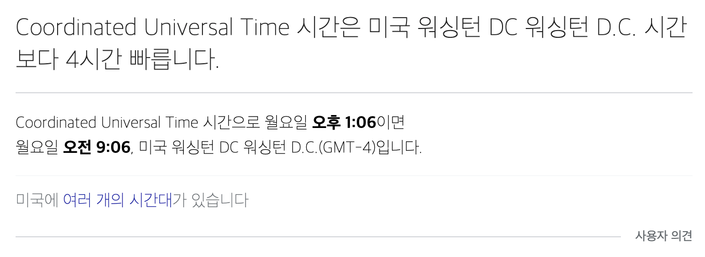

# 날짜 관련 자료형들 총정리

> 일단, Calendar 타입의 자료형들을 정리하는 것은 Pass 했다. Calendar 클래스는 Java 버전이 올라가면서 싱글턴 사용으로 인한 문제점들이 많이 보완되었지만, 서버 애플리케이션을 구현하는 데에는 적합하지 않다는 생각이 들어서이다. 실제로 소스를 열어보면 프록시를 이용해서 어느 정도는 보완했다는 생각은 들었는데, 역시나 처음 배울 때 부터 편견을 가지게 되어서 인지 선뜻 서버 애플리케이션에 사용하기에는 주저하게 되는 것 같다. <br>
>
> (10년 이상 된 레거시 코드에서는 아직도 Calendar 클래스를 사용하는 경우도 있기는 하다. 나의 경우는 전 직장에서 팀장님이 캘린더 클래스를 Mocking 하는 테스트 환경을 꼭 만들어야 한다며 1주일의 시간을 주고 이것만 일을 시키신 적이 있었는데, 다른 JIRA 이슈를 받아와서 2주일 뒤에야 해당 이슈를 보류 시키는 식으로 잘(?) 넘어간 기억이 있다.)

<br>

ZonedDateTime, LocalDateTime 에 대해서도 정리하면 좋겠지만, OffsetDateTime 으로 모든 예제를 통일해서 정리해볼 예정이다. 사실 제공되는 API 는 ZonedDateTime, LocalDateTime, OffsetDateTime 모두 거의 비슷한 기능들을 제공해주고 있고, 타임존 관련해서만 상이한 면이 있다.<br>

<br>

## DateTimeFormatter - 포맷 문자열

언뜻 보기에 쉬운 내용일수도 있겠다. 하지만, 글로벌 서비스시에는 자세히 파악해야 하는 내용이어서 정리 시작하기로 함. 최대한 각 포맷의 의미를 요약하는 식으로 정리 필요.<br>

<br>

## OffsetDateTime 타입을 long 타입으로 변환

<br>

## Long 타입을 OffsetDateTime 으로 변환

<br>

## java.util.Date 타입을 OffsetDateTime 으로 변환

<br>

## 월 단위로 날짜 타입 순회하기

<br>

## 일 단위로 날짜 타입 순회하기

<br>

## OffsetDateTime Serialization 에러

객체를 Serialization 하는 것은 Disk 에 객체의 내용을 저장해두거나 이종의 기기(원격지 서버, 원격지 클라이언트 등)에 데이터를 전달해줄 때에 필요하다. 객체 자체에 Serialization 을 했다고 해도 OffsetDateTime, LocalDateTime 관련해서는 또 별도의 작업이 필요하다. (차주 정리 시작 예정)

### 참고자료

- Stack Over Flow - [serialize / deserialize java 8 java.time with Jackson JSON mapper](https://stackoverflow.com/questions/27952472/serialize-deserialize-java-8-java-time-with-jackson-json-mapper)
- jackson Faster XML GitHub - [github.com/FasterXML/jackson-modules/java8](https://github.com/FasterXML/jackson-modules-java8)
  - jackson 모듈을 fasterXML 에서 사용하는 것에 관련자료 깃헙


**스택오버플로우 원문**

There's no need to use custom serializers/deserializers here. Use [jackson-modules-java8's datetime module](https://github.com/FasterXML/jackson-modules-java8):

Datatype module to make Jackson recognize Java 8 Date & Time API data types (JSR-310).

[This module adds support for quite a few classes:](https://fasterxml.github.io/jackson-modules-java8/javadoc/datetime/2.9/com/fasterxml/jackson/datatype/jsr310/JavaTimeModule.html)

- Duration
- Instant
- LocalDateTime
- LocalDate
- LocalTime
- MonthDay
- OffsetDateTime
- OffsetTime
- Period
- Year
- YearMonth
- ZonedDateTime
- ZoneId
- ZoneOffset


## 다른 국가의 해당국가의 타임존으로 UTC 현재 시간 구하기

예를 들면 미국의 현지 시간을 UTC 로 구하고 싶다고 해보자. 미국의 경우 UTC로 시간을 표시할 때 `-4:00` 이라는 표현식이 붙는다. UTC와 비교했을 때 4 시간 늦는다는 의미인 것 같다. 영국까지 4시간 걸리는 것인가 하는 생각이 들었었다.<br>

> 참고)  직접 구글에서 **미국 UTC 시간** 이라는 검색어로 검색하면 아래와 같은 결과가 나타난다. 자세한 내용은 [여기](https://time.is/ko/United_States) 를 참고하자<br>
>
> 

<br>

사실 OffsetDateTime, ZonedDateTime 이런 것들은 세계 표준 시간 표현에 관련된 ISO 관련 표준에 따라 JAVA 라이브러리 개발자들이 고맙게도 만들어준 라이브러리다. 다른 Javascript, C# 과 같은 언어에서도 아마도... 지원하는 기능일 것으로 보인다. Java 여서 가능한 API라는 자바우월적인 사고방식을 나도 모르게 탈피하려고 한번 적어봤다.<br>

이 외에도 "Europe/Berlin" 과 같은 지역 표기법 역시 있는데, 이것도 이것 저것 자료를 조사하다보니 세계 표준으로 부르는 용어가 있는걸로 보였는데, 기억이 안난다. 찾게되면 여기에 정리해야 할 것 같다.<br>

<br>

### ZoneId 의 개념

만약 원하는 도시의 ZoneOffset 을 구하려면 아래와 같이 구한다.

```java
ZoneId zone = ZoneId.of("Europe/Berlin");
```

그리고 이 ZoneId를 이용하면 ZonedDateTime.now() 내에 ZoneId를 전달해서 ZoneDateTime 기반의 해당 Zone의 현지시각을 구할 수 있다. 예를 들면 아래와 같은 방식이다.

```java
ZoneId zone = ZoneId.of("Europe/Berlin");
ZonedDateTime date = ZonedDateTime.now(zone);
```

<br>

### ZoneOffset 의 개념

ZoneOffset은 UTC 기반으로 시간의 시차(Offset)을 나타내는 자바에서 제공하는 클래스다.<br>

만약 서버가 한국에 있을때 UTC 시간을 구하게 된다면 `+9:00` 라는 오프셋이 나타난다. <br>

만약 서버가 미국에 있을때 UTC 시간을 구하게 된다면 `-4:00` 이라는 오프셋이 나타난다.<br>

ZoneOffset 을 구하는 방법은 두가지가 있다.

- 시차를 직접 입력해서 구하는 방법
- ZoneId로 특정 도시를 찾아서 Offset을 구하는 방법

<br>

#### 시차를 직접 입력해서 UTC 시간 구하기

```java
@Test
@DisplayName("시차를_직접_입력해서_UTC_시간을_구하기")
void 시차를_직접_입력해서_UTC_시간을_구하기(){
  ZoneOffset zoneOffSet= ZoneOffset.of("+02:00");
  OffsetDateTime date = OffsetDateTime.now(zoneOffSet);
  System.out.println(date);
}
```

<br>

출력결과

```plain
2021-09-27T15:31:29.372066+02:00
```

<br>

#### ZoneId 로 특정 도시를 찾아서 Offset을 구하는 방법

```java
ZoneOffset zoneOffset = ZoneId.of("America/New_York").getRules().getOffset(Instant.now());
```

<br>

출력결과

```plain
2021-09-27T16:32:48.049584+03:00
```

<br>

### LocalDate, LocalTime 을 이용해서 미국 현지의 UTC 시간 구하기

아래는 미국의 현지시각을 미국 기준의 UTC 시간으로 구하는 예제다.

```java
@Test
void 현재시간_현재날짜에_맞는_미국현지의_UTC_현재시간_구하기(){
  LocalDate localDate = LocalDate.now();
  LocalTime localTime = LocalTime.now();

  ZoneOffset zoneOffset = ZoneId.of("America/New_York").getRules().getOffset(Instant.now());
  OffsetDateTime offsetDt = OffsetDateTime.of(localDate, localTime, zoneOffset);
  System.out.println("offsetDt = " + offsetDt);
}
```

<br>

LocalTime, LocalDate는 시차에 상관없이 날짜 또는 시간자체를 표현하는 시간표현법이다. 따라서 OffsetDateTime, ZonedDateTime과 결합해서 사용하는 것이 가능하다. 즉, 단순 시간단위를 결합해서 시차가 적용된 시간으로 변환할 때 ZonedDateTime, OffsetDateTime 을 사용가능하다.<br>

오늘은 여기까지만 일단 써야 겠다. 단순히 사용법만 정리하는건 쉽겠다고 생각했는데, 뭔가 어떤 식으로 글을 전개해나갈지 까지 고려하면서 쓰다보니 몇줄 안되지만 30분이나 걸려버렸다. 프로젝트. 기간이라 30분 이상은 글을 쓰지 못한다. 그래도 내일도 30분 정도 투자해서 정리할 예정이다. 정리하다보니 느꼈다. 어느 정도의 루틴을 갖고 강제성을 갖고 정리를 하게 되면 꾸준히 하게 된다. 머릿속에 기억하는 것보다는 정리를 하다보면 나중에 다시 학습할수도 있고 반복학습이 되기에 강박적인 학습이 아닌, 자연스러운 반복학습으로 이어지는 것 같다.<br>


# 날짜 관련 자료형들 총정리

> 일단, Calendar 타입의 자료형들을 정리하는 것은 Pass 했다. Calendar 클래스는 Java 버전이 올라가면서 싱글턴 사용으로 인한 문제점들이 많이 보완되었지만, 서버 애플리케이션을 구현하는 데에는 적합하지 않다는 생각이 들어서이다. 실제로 소스를 열어보면 프록시를 이용해서 어느 정도는 보완했다는 생각은 들었는데, 역시나 처음 배울 때 부터 편견을 가지게 되어서 인지 선뜻 서버 애플리케이션에 사용하기에는 주저하게 되는 것 같다. <br>
>
> (10년 이상 된 레거시 코드에서는 아직도 Calendar 클래스를 사용하는 경우도 있기는 하다. 나의 경우는 전 직장에서 팀장님이 캘린더 클래스를 Mocking 하는 테스트 환경을 꼭 만들어야 한다며 1주일의 시간을 주고 이것만 일을 시키신 적이 있었는데, 다른 JIRA 이슈를 받아와서 2주일 뒤에야 해당 이슈를 보류 시키는 식으로 잘(?) 넘어간 기억이 있다.)

<br>

ZonedDateTime, LocalDateTime 에 대해서도 정리하면 좋겠지만, OffsetDateTime 으로 모든 예제를 통일해서 정리해볼 예정이다. 사실 제공되는 API 는 ZonedDateTime, LocalDateTime, OffsetDateTime 모두 거의 비슷한 기능들을 제공해주고 있고, 타임존 관련해서만 상이한 면이 있다.<br>

<br>

## DateTimeFormatter - 포맷 문자열

언뜻 보기에 쉬운 내용일수도 있겠다. 하지만, 글로벌 서비스시에는 자세히 파악해야 하는 내용이어서 정리 시작하기로 함. 최대한 각 포맷의 의미를 요약하는 식으로 정리 필요.<br>

<br>

## OffsetDateTime 타입을 long 타입으로 변환

<br>

## Long 타입을 OffsetDateTime 으로 변환

<br>

## java.util.Date 타입을 OffsetDateTime 으로 변환

<br>

## 월 단위로 날짜 타입 순회하기

<br>

## 일 단위로 날짜 타입 순회하기

<br>

## OffsetDateTime Serialization 에러

객체를 Serialization 하는 것은 Disk 에 객체의 내용을 저장해두거나 이종의 기기(원격지 서버, 원격지 클라이언트 등)에 데이터를 전달해줄 때에 필요하다. 객체 자체에 Serialization 을 했다고 해도 OffsetDateTime, LocalDateTime 관련해서는 또 별도의 작업이 필요하다. (차주 정리 시작 예정)

### 참고자료

- Stack Over Flow - [serialize / deserialize java 8 java.time with Jackson JSON mapper](https://stackoverflow.com/questions/27952472/serialize-deserialize-java-8-java-time-with-jackson-json-mapper)
- jackson Faster XML GitHub - [github.com/FasterXML/jackson-modules/java8](https://github.com/FasterXML/jackson-modules-java8)
  - jackson 모듈을 fasterXML 에서 사용하는 것에 관련자료 깃헙


**스택오버플로우 원문**

There's no need to use custom serializers/deserializers here. Use [jackson-modules-java8's datetime module](https://github.com/FasterXML/jackson-modules-java8):

Datatype module to make Jackson recognize Java 8 Date & Time API data types (JSR-310).

[This module adds support for quite a few classes:](https://fasterxml.github.io/jackson-modules-java8/javadoc/datetime/2.9/com/fasterxml/jackson/datatype/jsr310/JavaTimeModule.html)

- Duration
- Instant
- LocalDateTime
- LocalDate
- LocalTime
- MonthDay
- OffsetDateTime
- OffsetTime
- Period
- Year
- YearMonth
- ZonedDateTime
- ZoneId
- ZoneOffset


## 다른 국가의 해당국가의 타임존으로 UTC 현재 시간 구하기

예를 들면 미국의 현지 시간을 UTC 로 구하고 싶다고 해보자. 미국의 경우 UTC로 시간을 표시할 때 `-4:00` 이라는 표현식이 붙는다. UTC와 비교했을 때 4 시간 늦는다는 의미인 것 같다. 영국까지 4시간 걸리는 것인가 하는 생각이 들었었다.<br>

> 참고)  직접 구글에서 **미국 UTC 시간** 이라는 검색어로 검색하면 아래와 같은 결과가 나타난다. 자세한 내용은 [여기](https://time.is/ko/United_States) 를 참고하자<br>
>
> 

<br>

사실 OffsetDateTime, ZonedDateTime 이런 것들은 세계 표준 시간 표현에 관련된 ISO 관련 표준에 따라 JAVA 라이브러리 개발자들이 고맙게도 만들어준 라이브러리다. 다른 Javascript, C# 과 같은 언어에서도 아마도... 지원하는 기능일 것으로 보인다. Java 여서 가능한 API라는 자바우월적인 사고방식을 나도 모르게 탈피하려고 한번 적어봤다.<br>

이 외에도 "Europe/Berlin" 과 같은 지역 표기법 역시 있는데, 이것도 이것 저것 자료를 조사하다보니 세계 표준으로 부르는 용어가 있는걸로 보였는데, 기억이 안난다. 찾게되면 여기에 정리해야 할 것 같다.<br>

<br>

### ZoneId 의 개념

만약 원하는 도시의 ZoneOffset 을 구하려면 아래와 같이 구한다.

```java
ZoneId zone = ZoneId.of("Europe/Berlin");
```

그리고 이 ZoneId를 이용하면 ZonedDateTime.now() 내에 ZoneId를 전달해서 ZoneDateTime 기반의 해당 Zone의 현지시각을 구할 수 있다. 예를 들면 아래와 같은 방식이다.

```java
ZoneId zone = ZoneId.of("Europe/Berlin");
ZonedDateTime date = ZonedDateTime.now(zone);
```

<br>

### ZoneOffset 의 개념

ZoneOffset은 UTC 기반으로 시간의 시차(Offset)을 나타내는 자바에서 제공하는 클래스다.<br>

만약 서버가 한국에 있을때 UTC 시간을 구하게 된다면 `+9:00` 라는 오프셋이 나타난다. <br>

만약 서버가 미국에 있을때 UTC 시간을 구하게 된다면 `-4:00` 이라는 오프셋이 나타난다.<br>

ZoneOffset 을 구하는 방법은 두가지가 있다.

- 시차를 직접 입력해서 구하는 방법
- ZoneId로 특정 도시를 찾아서 Offset을 구하는 방법

<br>

#### 시차를 직접 입력해서 UTC 시간 구하기

```java
@Test
@DisplayName("시차를_직접_입력해서_UTC_시간을_구하기")
void 시차를_직접_입력해서_UTC_시간을_구하기(){
  ZoneOffset zoneOffSet= ZoneOffset.of("+02:00");
  OffsetDateTime date = OffsetDateTime.now(zoneOffSet);
  System.out.println(date);
}
```

<br>

출력결과

```plain
2021-09-27T15:31:29.372066+02:00
```

<br>

#### ZoneId 로 특정 도시를 찾아서 Offset을 구하는 방법

```java
ZoneOffset zoneOffset = ZoneId.of("America/New_York").getRules().getOffset(Instant.now());
```

<br>

출력결과

```plain
2021-09-27T16:32:48.049584+03:00
```

<br>

### LocalDate, LocalTime 을 이용해서 미국 현지의 UTC 시간 구하기

아래는 미국의 현지시각을 미국 기준의 UTC 시간으로 구하는 예제다.

```java
@Test
void 현재시간_현재날짜에_맞는_미국현지의_UTC_현재시간_구하기(){
  LocalDate localDate = LocalDate.now();
  LocalTime localTime = LocalTime.now();

  ZoneOffset zoneOffset = ZoneId.of("America/New_York").getRules().getOffset(Instant.now());
  OffsetDateTime offsetDt = OffsetDateTime.of(localDate, localTime, zoneOffset);
  System.out.println("offsetDt = " + offsetDt);
}
```

<br>

LocalTime, LocalDate는 시차에 상관없이 날짜 또는 시간자체를 표현하는 시간표현법이다. 따라서 OffsetDateTime, ZonedDateTime과 결합해서 사용하는 것이 가능하다. 즉, 단순 시간단위를 결합해서 시차가 적용된 시간으로 변환할 때 ZonedDateTime, OffsetDateTime 을 사용가능하다.<br>

오늘은 여기까지만 일단 써야 겠다. 단순히 사용법만 정리하는건 쉽겠다고 생각했는데, 뭔가 어떤 식으로 글을 전개해나갈지 까지 고려하면서 쓰다보니 몇줄 안되지만 30분이나 걸려버렸다. 프로젝트. 기간이라 30분 이상은 글을 쓰지 못한다. 그래도 내일도 30분 정도 투자해서 정리할 예정이다. 정리하다보니 느꼈다. 어느 정도의 루틴을 갖고 강제성을 갖고 정리를 하게 되면 꾸준히 하게 된다. 머릿속에 기억하는 것보다는 정리를 하다보면 나중에 다시 학습할수도 있고 반복학습이 되기에 강박적인 학습이 아닌, 자연스러운 반복학습으로 이어지는 것 같다.<br>


## 미국 현지의 주식 개장시간 구하기

아래 코드를 만들고 나서 "테스트 주도 개발 - 켄트벡" 에 나온 것처럼 차례대로 리팩토링과 중복코드 정리하는 방식으로 해나갔는데 의도와 목적이 분명해졌었다. Study-tdd 에도 아래 예제를 일기처럼 작성해볼까 하는 생각이 들었었다... 부가적으로 목업방식 테스트, 객체테스트 등에 대해서도 이번기회에 한번더 테스트해야 할 것 같다.

```java
	@Test
	public void 미국의_오늘날짜_개장시간을_서버타임존_기반의_시간으로_변환하기(){
		ZoneId of = ZoneId.of("Etc/UTC");
		System.out.println(" ======= ");
		System.out.println("ServerTimeZone = " + of);

		ZonedDateTime serverZonedDt = ZonedDateTime.now(ZoneId.of("America/New_York"));
		System.out.println("server current (local) date = " + serverZonedDt.toLocalDate());
		LocalDate serverLocalDate = serverZonedDt.toLocalDate();

		ZonedDateTime dt = ZonedDateTime.of(serverLocalDate, US_LOCAL_START_TIME, ZoneId.of("America/New_York"));
		System.out.println("us stock start time (zone date time) = " + dt);
		System.out.println("us stock start time (UTC) = " + dt.withZoneSameInstant(ZoneId.of("Etc/UTC")).toOffsetDateTime());
	}
```


---

아래 글은 개인 블로그로 옮기려하는데 요즘 디지털 치매라 잠시 남겨둠

요즘 매일 밤샘 모니터링 중이다. 뭐 하나 고쳐달ㄹ라고 하면 고쳐서 바로 생으로 배포해야 하는데, 디벨럽 서버가 없다. 디벨럽 서버 없이 사람을 밀어넣어서 테스트를 하는데, 이렇게 하면 현재 서비스가 주식 분석 서비스여서 데이터가 누실된다.이때 뭐가 안되면 다 내탓으로 돌아온다. 모르겠다.. 다른 회사였으면 벌써 테스트 서버 만들었는데, 사람 하나를 갈아넣어서 이렇게 쓰는건 좀 문제가 심하지 않나 싶다. 무사안일주의가 아닌가 싶기도 하고, 알면서 모른척 넘어가는 마인드가 좀 썩은 마인드인것 같아서 씁쓸하다. 건설현장마인드도 아니고, 감성 드리븐으로 될수있다식 판단도 이젠 지긋지긋허다. 그렇다고 현 상황이 어떻게 돌아가는지 사실대로 이야기도 안한다. 그래야 대책을 세우던지 하는데... 그냥 모르는 대로 이용당해라 이런식이라... 나도 이회사는... 1년 채우고 떠나야 겠다고 마음속으로 매일같이 이를 갈고 있다. 어쩌다 이렇게 사람을 갈아넣는 회사에 온건지 이해가 안간다. 그 전에 사람 하나가 못버티고 어떻게 되거나, 관두거나 그렇게 될지도 모르겠다. 일단 체력적으로는 이미 한계다.
