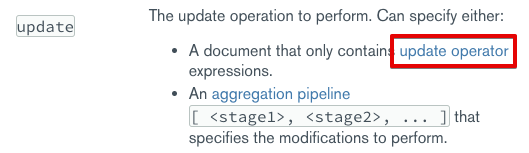
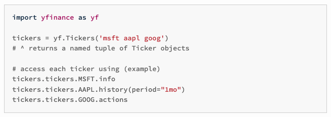

# pymongo bulk upsert

현재 yfinance를 사용하고 있다. 주식 데이터가 유실되었을 때 yfinance로 복구해야 해서다. yfinance는 불행하게도 python 에서 제일 잘 지원된다. 이런 이유로 yfinance 크롤링 코드는 왠만하면 python 으로 작업하는게 낫다. 다른 언어로 모두 크롤링을 시도해봤는데, 제대로 정확하게 동작하는 것은 python의 yfinance 라이브러리 였다. <br>

처음에는 귀찮아서 단건 upsert 로 로직을 작성했는데, 코드를 작성하면서 조금씩 욕심이 많아져서 최대 7일 기간 내의 모든 자료를 다운 받는 기능까지 구현하기에 이르렀다. 이 다운로드 받은 데이터를 MongoDB 에 upsert 해줘야 한다. 그런데 이것을 기존에 하던 방식으로 하루치 데이터를 넣을때처럼 단건으로 인서트하면 성능이 도저히 나오지를 않는다. 이런 이유로 MongoDB의 bulk insert/update 기능을 찾아봤는데, 마침 `bulk_write` 라는 메서드가 있어서 활용하게 되었다.<br>

<br>

## 참고자료

- 힌트를 얻은 자료
  - [Fast or Bulk Upsert in pymongo - stackoverflow](https://stackoverflow.com/questions/5292370/fast-or-bulk-upsert-in-pymongo)

- 위의 자료를 보고 `bulk_write([Operation1, Operation2, ...])` 을 사용해야 한다는 사실을 추측으로 알아냈다.
  - [Ordered Bulk Write Operations - pymongo.readthedocs.io](https://pymongo.readthedocs.io/en/stable/examples/bulk.html)
  - 이 자료에서 bulk_write 의 형식을 알아냈다.
- [docs.mongodb.com - db.collection.bulkWrite](https://docs.mongodb.com/manual/reference/method/db.collection.bulkWrite/)
  - pymongo 의 bulk_write 메서드는 mongodb 의 bulkWrite 메서드를 파이썬 함수로 추상화한 메서드다.
  - 이 bulkWrite 의 명세에 대해 자세히 설명되어 있다.
  - bulkWrite () 메서드 내에 전달되는 배열의 각 요소에는 updateOne(), updateMany() 를 지정할 수 있다.
- [docs.mongodb.com - updateOne, updateMany](https://docs.mongodb.com/manual/reference/method/db.collection.bulkWrite/#updateone-and-updatemany)
  - updateMany, updateOne 메서드의 명세가 정리된 문서다.
  - 여기서는 아래 첨부 이미지의 링크를 따라 들어가면 update operator 의 형식을 확인할 수 있다.
  - 
- [docs.mongodb.com - Update Operators](https://docs.mongodb.com/manual/reference/operator/update/#std-label-update-operators)
  - updateMany, updateOne 에 지정할 수 있는 파라미터에 대해 설명해주고 있다.

<br>

## 예제

AAPL 티커의 `2021-11-01 ~ 2021-11-09` 사이의 데이터들을 다운로드해서 Mongodb에 upsert

```python
host = "[아이피주소]"
port = 27017
mongo_client = MongoClient(host=host, port=int(port))

yfinance_hour_collection = yfinance_db['yfinance_hour']
operations = []

column_datetime = u'datetime'
column_open = u'open'
column_high = u'high'
column_low = u'low'
column_close = u'close'
column_volume = u'volume'
column_ticker = u'ticker'

data = yf.download('AAPL', start='2021-11-01', end='2021-11-09', interval="1h")

for row in data.itertuples():
  dateTime = pd.to_datetime(row.Index, unit='s')
  open = data.Open.loc[row.Index]
  high = data.High.loc[row.Index]
  low = data.Low.loc[row.Index]
  close = data.Close.loc[row.Index]
  adjClose = data['Adj Close'].loc[row.Index]
  volume = str(data.Volume.loc[row.Index])

  dict_buffer = {
    column_datetime: dateTime,
    column_open: open,
    column_high: high,
    column_low: low,
    column_close: close,
    column_volume: volume,
    column_ticker: ticker
  }

  operations.append(
    UpdateOne({column_datetime: dateTime}, {'$set': dict_buffer}, upsert=True)
  )

yfinance_hour_collection.bulk_write(operations)
```

<br>

## 전체 코드

함수로 분리했다. 실제 소스에서는 500개 주식의 데이터를 모두 들고오는데, 네트워크 속도에 문제가 있다...

```python
import datetime
import pytz
from pymongo import MongoClient
from pymongo import UpdateOne
import yfinance as yf
import pandas as pd
from datetime import timezone, timedelta

host = "[아이피주소]"
port = 27017
mongo_client = MongoClient(host=host, port=int(port))

yfinance_db = mongo_client['yfinance']
yfinance_hour_collection = yfinance_db['yfinance_hour']
yfinance_minute_collection = yfinance_db['yfinance_minute']
yfinance_day_collection = yfinance_db['yfinance_day']

operations = []

def download_hour_and_save_mongo(start, end, ticker):
    column_datetime = u'datetime'
    column_open = u'open'
    column_high = u'high'
    column_low = u'low'
    column_close = u'close'
    column_volume = u'volume'
    column_ticker = u'ticker'

    data = yf.download(ticker, start=start, end=end, interval="1h")

    for row in data.itertuples():
        dateTime = pd.to_datetime(row.Index, unit='s')
        open = data.Open.loc[row.Index]
        high = data.High.loc[row.Index]
        low = data.Low.loc[row.Index]
        close = data.Close.loc[row.Index]
        adjClose = data['Adj Close'].loc[row.Index]
        volume = str(data.Volume.loc[row.Index])

        dict_buffer = {
            column_datetime: dateTime,
            column_open: open,
            column_high: high,
            column_low: low,
            column_close: close,
            column_volume: volume,
            column_ticker: ticker
        }

        operations.append(
            UpdateOne({column_datetime: dateTime}, {'$set': dict_buffer}, upsert=True)
        )


if __name__ == '__main__':
    yfinance_hour_collection = yfinance_db['yfinance_hour']

    for ticker in list:
        download_hour_and_save_mongo(start="2021-11-09", end="2021-11-16", ticker=ticker)
        yfinance_hour_collection.bulk_write(operations)

```

위의 방식은 아래와 같은 구조다.

- 티커1의 기간 별 데이터 조회 후 쓰기 버퍼에 append
- 티커2의 기간 별 데이터 조회 후 쓰기 버퍼에 append
- 티커3의 기간 별 데이터 조회 후 쓰기 버퍼에 append
- ...
- 티커n의 기간 별 데이터 조회 후 쓰기 버퍼에 append
- 위의 버퍼 append 작업이 모두 완료되면, 버퍼에 있는 데이터를 한번에 MongoDB에 upsert 한다.

<br>

이렇게 해서 성능을 어느 정도는 개선했는데, 티커 여러개에 대해서는 yfinance에 단건으로 조회를 해오기 때문에 네트워크 I/O 로 인한 지연이 심각해지게 된다.<br>

<br>

## yfinance 데이터를 한 번에 여러 개의 티커로 가져오는 방식으로 개선해보기

yfinance 공식 문서를 보면 아래와 같이 같은 기간 조건으로 여러 개의 티커를 한번에 다운로드 받는 것에 관한 설명이 있다.



위와 같은 방식을 적용해서 MongoDB Bulk Insert 성능을 개선한 실제 코드는 아래와 같다.<br>

<br>

```python
import datetime
import pytz
from pymongo import MongoClient
from pymongo import UpdateOne
import yfinance as yf
import pandas as pd
from datetime import timezone, timedelta

host = "[아이피주소]"
port = 27017
mongo_client = MongoClient(host=host, port=int(port))

list = ["DHR","HSBC","BUD","VALE","SPOT","PANW","CCMP","DEO","BNTX","SAP","NVO","TXN","HDB","ABT","UL","TM","GSK","IDXX","TWLO","CMCSA","TMO","CSCO","AZN","MRNA","NVS","TTE","BX","PM","LIN","SONY","RY","BHP","SNY","TD","RIO","SNAP","UPS","SPGI","INFY","SNOW","DASH","UBER","DELL","UBS","WM","TRI","EMR","HMC","VMW","NET","CRWD","TSM","RBLX","TT","ROKU","RACE","ALC","APH","WELL","RSG","IFF","EPAM","TDG","ROK","CAJ","MDB","MSCI","TEL","AEP","DDOG","STZ","AIG","ALGN","SBAC","HOOD","NOK","GLW","HPQ","ADM","XLNX","EQR","DHI","WMB","IQV","VFC","ARE","STT","WLTW","ANET","ZBRA","SYF","ZS","VEEV","BAX","PINS","PATH","SRE","VRSN","WY","MAA","DB","VIAC","AFRM","AMC","CLX","EXR","PAYC","EIX","TSCO","BKR","ON","FE","BIO","COO","TECH","BR","CRL","MKC","AKAM","MGM","RCL","TFX","HPE","RJF","OKE","MPWR","J","LYV","OMC","PTC","ENTG","TDY","NLOK","LKQ","CNP","LNT","FANG","LLY","MPC","PXD","LH","HON","JCI","ORLY","NWSA","HWM","XRAY","IVZ","LNC","AOS","TAP","PENN","NLSN","LSCC","MKSI","ZION","ALK","PBCT","BRKS","IIVI","SLAB","PRGO","VSCO","PNW","FBHS","UHS","AAL","CBOE","PWR","WU","KIM","JNPR","FIS","OXY","EXPD","DRI","WAB","FRT","PSA","GD","F","TWTR","DG","NXPI","VRTX","CDNS","MNST","BIIB","NEM","FCX","LULU","KHC","COIN","KMB","EBAY","TROW","LHX","INFO","A","KLAC","DOW","DLR","MRVL","MAR","CMG","MTCH","DXCM","BK","EOG","ROST","CARR","CNC","FTNT","SNPS","SPG","EXC","EA","CTAS","DD","APTV","PPG","KMI","WBA","TRV","SLB","PRU","PH","CTSH","MSFT","ADSK","AON","MET","ROP","DFS","MSI","SYY","XEL","RMD","MCHP","LVS","GIS","AFL","CMI","MTD","HLT","PTON","ALL","HSY","LYB","ZBH","CHWY","SIVB","AVB","AME","OKTA","PEG","SWKS","EFX","CTVA","FAST","AWK","ANSS","PCAR","VRSK","WEC","LUV","ODFL","KR","NDAQ","LEN","MCK","GRMN","AJG","AMP","KEYS","BLL","SWK","SBUX","MA","UNH","TSLA","NVDA","NFLX","JPM","HD","PYPL","PG","INTC","FB","BAC","AAPL","ADBE","V","ORCL","CVX","ASML","PFE","ACN","WMT","VZ","CRM","AVGO","PEP","ABBV","T","MRK","MCD","CHTR","KO","TMUS","WFC","COST","NEE","SHOP","MS","MDT","QCOM","BMY","AMGN","UNP","JNJ","XOM","DIS","AMZN","NKE","GOOGL","APD","PAYX","DE","AMAT","IBM","GS","EL","MMM","LMT","SQ","CAT","SYK","ANTM","CCI","TJX","CI","FISV","ITW","ICE","OTIS","GOOG","INTU","AMT","AMD","AXP","CVS","LOW","SCHW","C","GE","ISRG","BLK","TGT","BA","NOW","GILD","MU","LRCX","ABNB","DUK","GM","PNC","FDX","MELI","CME","ZTS","SHW","CB","EQIX","HCA","PLD","ADP","TFC","BDX","MMC","CSX","ATVI","COF","MCO","CPNG","MDLZ","ILMN","SO","EW","NSC","TEAM","D","REGN","ECL","ETN","HUM","ADI","NOC","GPN","BKNG","PGR","WDAY","DOCU","USB","MO","CBRE","BBY","WST","NUE","GNRC","PSX","O","SGEN","VLO","ED","HRL","SIRI","TSN","U","FITB","AZO","CDW","KSU","DAL","FTV","GWW","HES","NTRS","ETSY","CERN","VMC","ABC","EXPE","IP","WAT","DLTR","DTE","HIG","VTR","DOV","ENPH","URI","SPLK","PPL","MLM","K","IT","AEE","XYL","CCL","MGA","YUM","FRC","CPRT","ALB","ETR","QRVO","DISH","HBAN","IR","FOX","FOXA","TER","TRMB","TTWO","WDC","STX","TYL","PEAK","CINF","DRE","KEY","CZR","DPZ","CTLT","GPC","POOL","CFG","RF","ULTA","BXP","CMS","HAL","HOLX","STE","ROL","AMCR","MTB","DGX","NVR","DVN","MKTX","JBHT","PKI","NTAP","INCY","IEX","CHD","ESS","KMX","FLT","PFG","CAH","AES","CHKP","CE","LDOS","MAS","TXT","EMN","UAL","BEN","EVRG","PLUG","CTXS","SJM","ABMD","L","LUMN","NWS","WHR","DISCA","DISCK","CPB","WRB","FMC","AAP","PHM","ATO","WRK","MHK","UDR","PKG","JKHY","DVA","IRM","ALLE","CHRW","IPG","GME","WYNN","SNA","NWL","HAS","AVY","CAG","VTRS","APA","VNT","SNDL","NNOX","PVH","LCID","BLDE","PNR","LW","HST","FFIV","IPGP","MOS","BBWI","BWA","REG","TPR","GPS","HSIC","CF","NI","NRG","RE","DXC","RHI","GL","RUN","AIZ","CMA","QS","MRO","FSLR","VNO","NCLH","SEE","UA","UAA","HII","RL","OGN","SPCE","LEG","HBI","FSLY","BB","UNM","NOV","ZM","BSX","KDP","RTX"]

operations = []

def download_hour_and_save_mongo(start, end, ticker):
    column_datetime = u'datetime'
    column_open = u'open'
    column_high = u'high'
    column_low = u'low'
    column_close = u'close'
    column_volume = u'volume'
    column_ticker = u'ticker'

    data = yf.download(ticker, start=start, end=end, interval="1h")

    list_buffer = []
    ticker_map = {}

    for row in data.itertuples():
        dateTime = pd.to_datetime(row.Index, unit='s')
        open = data.Open.loc[row.Index]
        high = data.High.loc[row.Index]
        low = data.Low.loc[row.Index]
        close = data.Close.loc[row.Index]
        adjClose = data['Adj Close'].loc[row.Index]
        volume = data.Volume.loc[row.Index]

        # index = ticker, value = 실제 숫자값
        for index, value in open.items():
            ticker_map[index] = {}
            ticker_map[index][column_open] = value
            ticker_map[index][column_datetime] = dateTime

        # index = ticker, value = 실제 숫자값
        for index, value in high.items():
            ticker_map[index][column_high] = value

        # index = ticker, value = 실제 숫자값
        for index, value in low.items():
            ticker_map[index][column_low] = value

        # index = ticker, value = 실제 숫자값
        for index, value in close.items():
            ticker_map[index][column_close] = value

        # index = ticker, value = 실제 숫자값
        for index, value in volume.items():
            ticker_map[index][column_volume] = value

    # 업데이트 할 UpdateOne 의 리스트 생성
    for key, value in ticker_map.items():
        operations.append(
            UpdateOne({column_datetime: dateTime}, {'$set': value}, upsert=True)
        )

if __name__ == '__main__':
    yfinance_db = mongo_client['yfinance']
    yfinance_hour_collection = yfinance_db['yfinance_hour']
    download_hour_and_save_mongo(start="2021-11-09", end="2021-11-16", ticker=" ".join(list))

```

