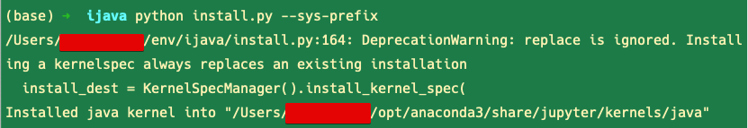
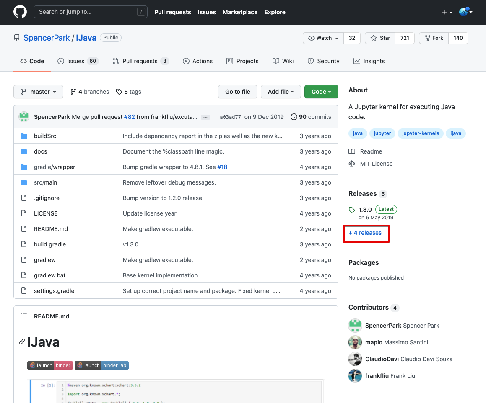
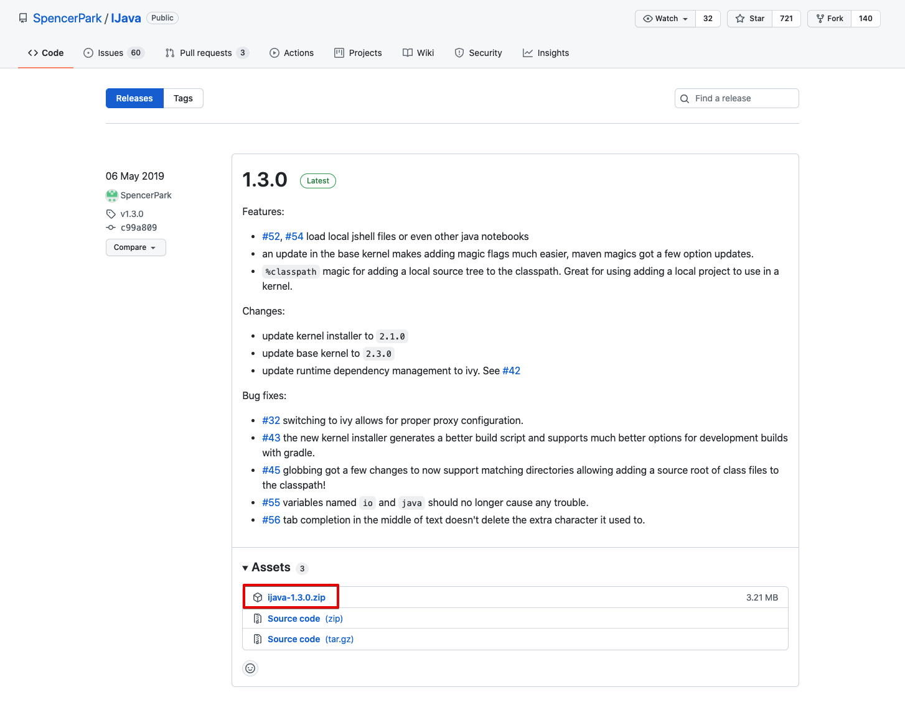

# IJava 설치

Java 를 JShell 로 terminal 에서도 실행할 수 있다. 하지만, 주피터 노트북에서도 사용할 수 있다. 주피터 노트북은 JShell 기반으로 주피터 노트북에서 Java 9+ 를 사용할 수 있도록 도와준다. 나는 로컬에 이미 JDK 16 이 깔려있으니 이미 조건은 충족되어 있다.<br>

<br>

## 참고자료

참고자료는 [여기](https://waikato.github.io/weka-wiki/jupyter_notebooks/) 의 내용을 참고했다. 

<br>

## 시스템 전역 설치

시스템 전역에 Jupyter notebook, iJava 를 설치하는 방식이다.<br>

나같은 경우는 python 을 개발환경 전역적으로 사용하지 않기에 굳이 가상환경을 사용할 필요가 없다. 만약 개발을 한다고 하더라도 개발 디렉터리 내에서는 가상환경으로 독립적인 개발환경을 사용하기 때문에 시스템 전역에 jupyter notebook, iJava 를 설치했다. jupyter notebook, iJava 정도는 개발환경이 아닌 개인환경에서도 사용할 수 있는 거지 뭐...ㅋㅋ<br>

<br>

### Jupyter notebook 설치

```bash
$ pip install jupyter
```

<br>

### iJava 설치

**zip 파일을 다운로드 받을 디렉터리로 이동**<br>

```java
$ mkdir -p ~/env/ijava
$ cd ~/env/ijava
```

<br>

**zip 파일 다운로드 & 압축 해제**<br>

```java
$ wget https://github.com/SpencerPark/IJava/releases/download/v1.3.0/ijava-1.3.0.zip
$ unzip ijava-1.3.0.zip
```

<br>

**install.py 파일 실행**<br>

iJava 프로그램에서 제공하는 인스톨 파일인 install.py 를 실행하면 된다. 프로그램 인자로 `--sys-prefix` 를 넘겨주자.<br>

```bash
$ python install.py --sys-prefix
```

나의 경우는 이미 아나콘다를 설치한 이력이 있어서 아나콘다가 python과 관련된 대부분의 실행환경들을 관리해주고 있는 것으로 보인다. 아래 그램과 같이 anaconda 내의 jupyter 커널 아래에 java 커널이 설치되었다는 문구를 확인 가능하다.



<br>

## 참고) iJava 릴리즈 확인 방법

[iJava](https://github.com/SpencerPark/IJava) 깃헙 리포지터리를 방문해서 아래 그림에서 보이듯이 [releases](https://github.com/SpencerPark/IJava/releases) 링크를 클릭한다.



<br>

릴리즈 페이지에서는 망설임 없이 최신버전을 설치했다.

